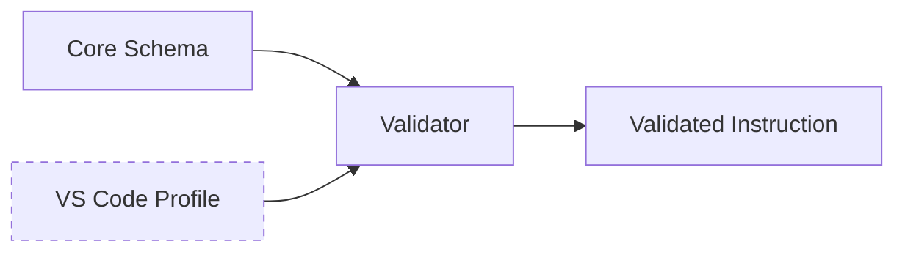

# 05 - Feature: VS Code Platform Profiles

> Part of [Instruction System Optimization Blueprint](./00_index.md)

---

## 📖 The Story

### 😤 The Pain

```
Current Reality:
┌───────────────────────────────────────────────────────────────┐
│  Export to JetBrains?  ──────►  💥 VS CODE SYNTAX 💥          │
│                                                               │
│  Because: agents, model, #tool:, agent in prompts baked in    │
└───────────────────────────────────────────────────────────────┘
```

| Who Hurts | Pain Level | Frequency |
|-----------|------------|-----------|
| Framework (portability) | 🔥🔥 Medium | On export |
| External adopters | 🔥🔥 Medium | On adoption |

### ✨ The Vision

```
After This Feature:
┌───────────────────────────────────────────────────────────────┐
│  CORE SCHEMA (portable)  +  VSCODE PROFILE (optional)         │
│                                                               │
│  Export: include profile → VS Code, omit → platform-agnostic  │
└───────────────────────────────────────────────────────────────┘
```

### 🎯 One-Liner

> Split the instruction schema into a portable core and VS Code-specific extensions loaded as optional profiles.

### 📊 Impact

| Metric | Before | After |
|--------|--------|-------|
| VS Code assumptions in core | ❌ ~12 references | ✅ 0 |
| Export portability | ❌ Manual cleanup | ✅ Profile toggle |

---

## 🔧 The Spec

---

## 🎯 Overview

The current instruction schema assumes VS Code as the target IDE. We extract VS Code-specific features (`agents` block, `model` declarations, `#tool:` syntax, `agent` in prompts) into an optional profile. The core schema becomes platform-agnostic.

**Priority:** P0  
**Difficulty:** `[KNOWN]`

---

## 📚 Prior Art

| Solution | Type | Relevance | Status |
|----------|------|-----------|--------|
| JSON Schema `$ref` | Standard | High | ✅ Adopt |
| VS Code settings profiles | Pattern | High | 🔧 Adapt concept |
| ESLint extends | Pattern | Medium | 🔧 Adapt concept |

**Using:** JSON Schema `$ref` + additionalProperties  
**Why:** Standard, well-tooled, IDE-supported

---

## 🗺️ System Context



---

## 📊 Data Flow


| Stage | Format | Example |
|-------|--------|---------|
| Input | YAML instruction | `hyper_architect.yaml` |
| Profile | JSON schema extension | `vscode.profile.json` |
| Output | Validated structure | Platform-appropriate |

---

## [Custom] 🎨 Schema Split

### Core Schema (Portable)

```yaml
# core.schema.yaml - ALWAYS included
instruction:
  name: string
  description: string
  rules: list[string]
  skills: list[string]
  # NO: agents, model, #tool:, agent
```

### VS Code Profile Extension

```yaml
# vscode.profile.yaml - OPTIONAL
vscode_extensions:
  agents:
    enabled: true
    syntax: "@agent"
  model:
    enabled: true
    syntax: "model: claude-3.5-sonnet"
  tool_references:
    enabled: true
    syntax: "#tool:"
  participant_syntax:
    enabled: true
    syntax: "@participant"
```

### Feature Mapping

| Feature | Core Schema | VS Code Profile |
|---------|-------------|-----------------|
| Rules | ✅ | - |
| Skills | ✅ | - |
| Instructions | ✅ | - |
| `agents` block | ❌ | ✅ |
| `model` declaration | ❌ | ✅ |
| `#tool:` syntax | ❌ | ✅ |
| `@agent` participant | ❌ | ✅ |

---

## [Custom] 📁 File Organization

```
data/schemas/
├── core.schema.json          # Platform-agnostic base
├── profiles/
│   ├── vscode.profile.json   # VS Code extensions
│   ├── jetbrains.profile.json # Future: JetBrains
│   └── generic.profile.json  # Minimal/CLI-only
```

### Profile Selection

| Target | Profile Used |
|--------|--------------|
| VS Code Copilot | `vscode.profile.json` |
| JetBrains AI | `jetbrains.profile.json` (future) |
| CLI/MCP only | `generic.profile.json` |
| Expedition export | Depends on target project |

---

## 👥 User Stories

### US-05.1: Platform-Agnostic Core

> **As a** framework developer  
> **I want** the core schema free of VS Code assumptions  
> **So that** instructions are portable

**Acceptance Criteria:**
- [ ] Core schema validates without VS Code features
- [ ] VS Code features moved to profile

### US-05.2: Profile Application

> **As a** developer targeting VS Code  
> **I want** to apply the VS Code profile  
> **So that** I get full IDE integration

**Acceptance Criteria:**
- [ ] `--profile vscode` flag enables VS Code features
- [ ] Profile merges cleanly with core schema

---

## ✅ Acceptance Criteria

| ID | Criterion | Testable |
|----|-----------|----------|
| AC-05.1 | Core schema has 0 VS Code-specific fields | ✅ |
| AC-05.2 | VS Code profile adds `agents`, `model`, `tool`, `participant` | ✅ |
| AC-05.3 | Validation passes with core-only | ✅ |
| AC-05.4 | Validation passes with core + vscode profile | ✅ |
| AC-05.5 | Profile selection via config/CLI | ✅ |

---

## ⚠️ Edge Cases

| Case | Handling |
|------|----------|
| Missing profile file | Error with clear message |
| Unknown profile name | Error, list available profiles |
| Profile conflicts with core | Profile takes precedence |
| Multiple profiles | Merge in order specified |

---

## ❌ Out of Scope

| Exclusion | Reason |
|-----------|--------|
| JetBrains profile implementation | P1+ when demand exists |
| Auto-detection of target IDE | Manual selection sufficient |
| Runtime profile switching | Compile-time only |

---

## 🔗 Dependencies

| Dependency | Type | Required For |
|------------|------|--------------|
| `instruction_controller.py` | Modification | Schema loading |
| `config_manager` | Read | Profile selection |
| `flow_core` | Read | Agent compilation |

---

**← Back to:** [Index](./00_index.md) | **Next:** [Skill Discovery Index](./06_feature_skill_discovery_index.md)
