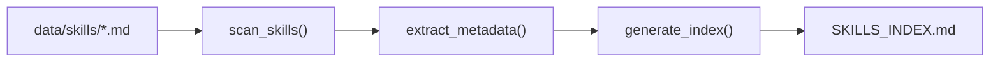

# 06 - Feature: Skill Discovery Index

> Part of [Instruction System Optimization Blueprint](./00_index.md)

---

## 📖 The Story

### 😤 The Pain

```
Current Reality:
┌───────────────────────────────────────────────────────────────┐
│  "What skills exist?"  ──────►  💥 MANUAL SEARCH 💥           │
│                                                               │
│  Because: No index, grep through files, hope for the best     │
└───────────────────────────────────────────────────────────────┘
```

| Who Hurts | Pain Level | Frequency |
|-----------|------------|-----------|
| Agent (skill selection) | 🔥🔥🔥 High | Every task |
| Developer (discovery) | 🔥🔥 Medium | Weekly |

### ✨ The Vision

```
After This Feature:
┌───────────────────────────────────────────────────────────────┐
│  SKILLS_INDEX.md  ──────►  📚 ALL SKILLS AT A GLANCE          │
│                                                               │
│  Name | Description | When to Use | When NOT to Use | Tokens  │
└───────────────────────────────────────────────────────────────┘
```

### 🎯 One-Liner

> Auto-generated `SKILLS_INDEX.md` manifest during instruction sync with descriptions, usage hints, and anti-patterns.

### 📊 Impact

| Metric | Before | After |
|--------|--------|-------|
| Skill discovery | ❌ Manual grep | ✅ Single index file |
| "When not to use" guidance | ❌ None | ✅ Anti-patterns documented |
| Skill token cost visibility | ❌ Unknown | ✅ Per-skill estimate |

---

## 🔧 The Spec

---

## 🎯 Overview

During `instruction sync`, scan all skill files and generate a compiled `SKILLS_INDEX.md` containing metadata: name, description, when to use, **when NOT to use**, and token budget. Agents reference this index for skill selection.

**Priority:** P0  
**Difficulty:** `[KNOWN]`

---

## 📚 Prior Art

| Solution | Type | Relevance | Status |
|----------|------|-----------|--------|
| Python package `__all__` | Pattern | Medium | 🔧 Adapt concept |
| agentskills.io SKILL.md | Standard | High | ✅ Already adopted |
| Documentation generators | Tool | Medium | 🔧 Adapt pattern |

**Using:** YAML frontmatter extraction + markdown generation  
**Why:** Consistent with existing SKILL.md format

---

## 🗺️ System Context


---

## 📊 Data Flow



| Stage | Format | Example |
|-------|--------|---------|
| Input | Skill YAML frontmatter | `name: day-dream\ndescription: ...` |
| Output | Markdown table | See Output Format below |

---

## [Custom] 🎨 Index Format

### Output: SKILLS_INDEX.md

```markdown
# 📚 Skills Index

> Auto-generated during instruction sync. DO NOT EDIT MANUALLY.
> Last updated: 2026-02-09T12:00:00Z

## Available Skills

| Skill | Description | When to Use | When NOT to Use | ~Tokens |
|-------|-------------|-------------|-----------------|---------|
| [day-dream](./skills/day-dream/SKILL.md) | Vision planning | Creating blueprints | Bug fixes, implementation | ~800 |
| [testing](./skills/testing/SKILL.md) | Test workflows | Writing tests | Production code | ~450 |

## Quick Reference

### By Category

| Category | Skills |
|----------|--------|
| Planning | day-dream, orch-routing |
| Implementation | orch-implementation, testing |
| Export | expedition, orch-expedition |
```

### Metadata Extraction

From SKILL.md YAML frontmatter:

```yaml
---
name: day-dream
description: "Vision and planning workflows..."
---
```

From SKILL.md body:

```markdown
## When to Use
- Creating a new blueprint...

## When NOT to Use
- Implementing code
- Bug fixes
```

---

## [Custom] 📋 "When NOT to Use" Guidelines

### Required Anti-Pattern Section

Every skill MUST document when it should NOT be used:

```markdown
## When NOT to Use
- {Anti-pattern 1}: {Why it's wrong for this skill}
- {Anti-pattern 2}: {Why it's wrong for this skill}
```

### Common Anti-Patterns by Category

| Category | Skill Type | Common Anti-Patterns |
|----------|------------|---------------------|
| Planning | Vision/Blueprint | Bug fixes, implementation, refactoring |
| Implementation | Code writing | Architecture decisions, planning |
| Testing | Validation | Production code, user-facing features |
| Export | Expedition | Internal-only modules |

---

## 👥 User Stories

### US-06.1: Auto-Generate Index

> **As a** developer running instruction sync  
> **I want** SKILLS_INDEX.md auto-generated  
> **So that** the index stays current

**Acceptance Criteria:**
- [ ] `instruction sync` regenerates index
- [ ] Timestamp updated on each regeneration
- [ ] Manual edits overwritten (with warning)

### US-06.2: Anti-Pattern Guidance

> **As an** AI agent selecting skills  
> **I want** "When NOT to use" hints  
> **So that** I avoid misapplying skills

**Acceptance Criteria:**
- [ ] Index includes "When NOT to Use" column
- [ ] Missing anti-patterns trigger warning during sync

---

## ✅ Acceptance Criteria

| ID | Criterion | Testable |
|----|-----------|----------|
| AC-06.1 | Index generated at `instruction sync` | ✅ |
| AC-06.2 | All skills listed with name, description | ✅ |
| AC-06.3 | "When NOT to Use" extracted and displayed | ✅ |
| AC-06.4 | Token estimate per skill | ✅ |
| AC-06.5 | Links to original SKILL.md files | ✅ |
| AC-06.6 | Warning for skills missing anti-patterns | ✅ |

---

## ⚠️ Edge Cases

| Case | Handling |
|------|----------|
| Skill missing frontmatter | Error, require fix |
| Skill missing "When NOT to Use" | Warning, include placeholder |
| Duplicate skill names | Error, require unique names |
| Empty skills directory | Generate empty index with note |

---

## ❌ Out of Scope

| Exclusion | Reason |
|-----------|--------|
| Skill categorization taxonomy | Manual for now |
| Skill usage analytics | P2+ observability work |
| Auto-suggesting skills to agent | MCP layer concern |

---

## 🔗 Dependencies

| Dependency | Type | Required For |
|------------|------|--------------|
| `instruction_controller.py` | Modification | Index generation hook |
| SKILL.md schema | Read | Metadata extraction |
| `data/compiled/` directory | Write | Index output location |

---

**← Back to:** [Index](./00_index.md) | **Next:** [Instruction Audit Tool](./07_feature_instruction_audit_tool.md)
