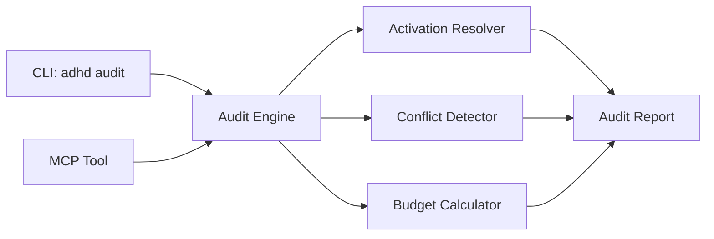
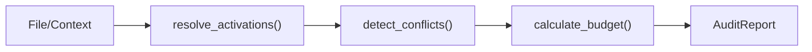

# 07 - Feature: Instruction Layering Audit Tool

> Part of [Instruction System Optimization Blueprint](./00_index.md)

---

## 📖 The Story

### 😤 The Pain

```
Current Reality:
┌───────────────────────────────────────────────────────────────┐
│  "Why is the agent confused?"  ──────►  💥 INVISIBLE 💥       │
│                                                               │
│  Because: Can't see which instructions co-activate or clash  │
└───────────────────────────────────────────────────────────────┘
```

| Who Hurts | Pain Level | Frequency |
|-----------|------------|-----------|
| Developer (debugging) | 🔥🔥🔥 High | On agent misbehavior |
| Agent (conflicting rules) | 🔥🔥🔥 High | Every conflict |

### ✨ The Vision

```
After This Feature:
┌───────────────────────────────────────────────────────────────┐
│  adhd audit instructions  ──────►  📊 FULL VISIBILITY         │
│                                                               │
│  Shows: active instructions, conflicts, total tokens, layers │
└───────────────────────────────────────────────────────────────┘
```

### 🎯 One-Liner

> MCP/CLI tool showing all co-activating instructions, detected conflicts, and total token cost for any file or context.

### 📊 Impact

| Metric | Before | After |
|--------|--------|-------|
| Conflict visibility | ❌ None | ✅ Detected and reported |
| Co-activation inspection | ❌ Guess/grep | ✅ Single command |
| Token cost per context | ❌ Unknown | ✅ Calculated and shown |

---

## 🔧 The Spec

---

## 🎯 Overview

Build an audit tool exposed via both CLI (`adhd audit`) and MCP that:
1. Lists all instructions that activate for a given file/context
2. Detects conflicts between co-activating instructions
3. Calculates total token cost from budgets
4. Shows instruction layering order (specificity)

**Priority:** P0  
**Difficulty:** `[KNOWN]`

---

## 📚 Prior Art

| Solution | Type | Relevance | Status |
|----------|------|-----------|--------|
| ESLint `--print-config` | Pattern | High | 🔧 Adapt concept |
| VS Code "Inspect Editor Tokens" | Pattern | Medium | 🔧 Adapt UI concept |
| Git merge conflict detection | Pattern | Medium | 🔧 Adapt algorithm |

**Using:** Pattern matching on `applyTo` globs + key comparison  
**Why:** Matches existing instruction application logic

---

## 🗺️ System Context



---

## 📊 Data Flow



| Stage | Format | Example |
|-------|--------|---------|
| Input | File path or context name | `modules/dev/adhd_mcp/adhd_mcp.py` |
| Output | `AuditReport` | JSON/Table (see below) |

---

## [Custom] 🎨 CLI Interface

### Commands

```bash
# Audit a specific file
adhd audit instructions path/to/file.py

# Audit by glob pattern
adhd audit instructions "modules/**/*.py"

# Audit a named context (agent mode)
adhd audit instructions --context hyper_architect

# Output formats
adhd audit instructions path/to/file.py --format json
adhd audit instructions path/to/file.py --format table
```

### Output Format (Table)

```
📋 Instruction Audit: modules/dev/adhd_mcp/adhd_mcp.py
═══════════════════════════════════════════════════════

📚 Active Instructions (4):
┌─────────────────────────────────────┬───────────────┬─────────┐
│ Instruction                         │ Source        │ ~Tokens │
├─────────────────────────────────────┼───────────────┼─────────┤
│ adhd_framework_context              │ global        │    ~200 │
│ module_development                  │ modules/**    │    ~150 │
│ mcp_development                     │ *_mcp.py      │    ~180 │
│ logger_util                         │ *.py          │     ~80 │
└─────────────────────────────────────┴───────────────┴─────────┘

⚠️ Conflicts Detected (1):
┌─────────────────────────────────────┬──────────────────────────┐
│ Conflict                            │ Resolution               │
├─────────────────────────────────────┼──────────────────────────┤
│ mcp_dev.style vs module_dev.style   │ More specific wins       │
└─────────────────────────────────────┴──────────────────────────┘

📊 Budget Summary:
   Total: ~610 tokens
   Status: ✅ OK (3% of 200K limit)
```

### Output Format (JSON)

```json
{
  "target": "modules/dev/adhd_mcp/adhd_mcp.py",
  "active_instructions": [
    {"name": "adhd_framework_context", "source": "global", "tokens": 200},
    {"name": "module_development", "source": "modules/**", "tokens": 150}
  ],
  "conflicts": [
    {"a": "mcp_dev.style", "b": "module_dev.style", "resolution": "more_specific_wins"}
  ],
  "budget": {
    "total": 610,
    "limit": 200000,
    "percentage": 0.3,
    "status": "ok"
  }
}
```

---

## [Custom] 📊 Conflict Detection Rules

### Conflict Types

| Type | Detection | Severity |
|------|-----------|----------|
| **Key Overlap** | Same config key set by different instructions | Warning |
| **Contradictory Rules** | Opposite guidance (e.g., "always X" vs "never X") | Error |
| **Scope Ambiguity** | Overlapping `applyTo` with different values | Warning |

### Resolution Strategy

| Principle | Meaning |
|-----------|---------|
| **Most Specific Wins** | `*_mcp.py` > `*.py` > `**/*` |
| **Last Loaded Wins** | Tie-breaker: later instruction takes precedence |
| **Explicit > Implicit** | Direct file match > glob pattern |

---

## 👥 User Stories

### US-07.1: Audit File Context

> **As a** developer debugging agent behavior  
> **I want** to see all instructions active for a file  
> **So that** I understand what rules apply

**Acceptance Criteria:**
- [ ] `adhd audit instructions <file>` lists active instructions
- [ ] Shows source pattern that triggered activation

### US-07.2: Detect Conflicts

> **As a** developer  
> **I want** conflicts between instructions detected  
> **So that** I can resolve contradictions

**Acceptance Criteria:**
- [ ] Conflicting keys identified and reported
- [ ] Resolution strategy shown

### US-07.3: Budget Calculation

> **As a** developer  
> **I want** total token cost for active instructions  
> **So that** I can optimize context usage

**Acceptance Criteria:**
- [ ] Sum of all active instruction budgets displayed
- [ ] Percentage of model limit shown

---

## ✅ Acceptance Criteria

| ID | Criterion | Testable |
|----|-----------|----------|
| AC-07.1 | CLI `adhd audit instructions <path>` works | ✅ |
| AC-07.2 | MCP tool `audit_instructions` exposed | ✅ |
| AC-07.3 | Active instructions listed with source | ✅ |
| AC-07.4 | Conflicts detected and reported | ✅ |
| AC-07.5 | Total token budget calculated | ✅ |
| AC-07.6 | JSON and table output formats | ✅ |

---

## ⚠️ Edge Cases

| Case | Handling |
|------|----------|
| No instructions match | Report "no active instructions" |
| File doesn't exist | Error with suggestion to check path |
| Instruction file missing budget | Assume `~0`, warn |
| Circular instruction references | Detect and error |

---

## ❌ Out of Scope

| Exclusion | Reason |
|-----------|--------|
| Auto-resolving conflicts | Human judgment required |
| Live/watch mode | P1+ enhancement |
| Integration with VS Code problems panel | P1+ IDE integration |

---

## 🔗 Dependencies

| Dependency | Type | Required For |
|------------|------|--------------|
| `instruction_controller.py` | Read | Activation resolution |
| `adhd_mcp` | Modification | MCP tool exposure |
| `cli_manager` | Modification | CLI command registration |
| Token Budget Engine (F04) | Read | Budget calculation |

---

**← Back to:** [Index](./00_index.md) | **Next:** [Implementation Plan](./80_implementation.md)
