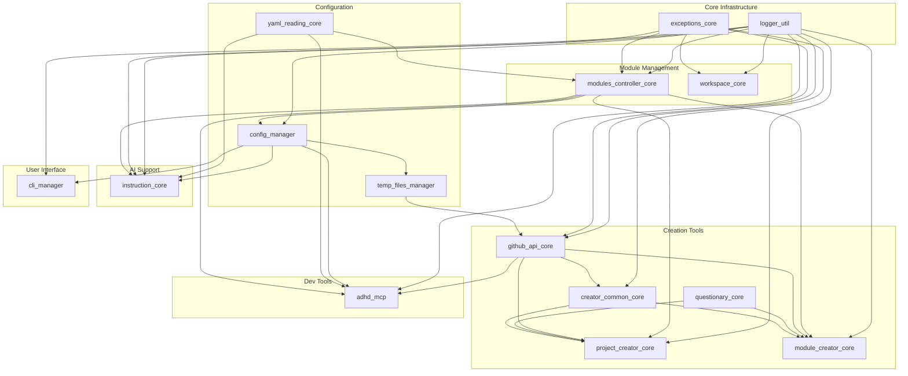

# 02 - Module Audit

> Part of [Code Quality Audit Blueprint](./00_index.md)

---

## 📖 The Story

### 😤 The Pain

```
┌─────────────────────────────────────────────────────────────┐
│  16 modules exist. Do we know what each actually does?      │
│  Are there redundancies? Legacy code from v2?               │
│  Which modules are heavily used? Which are orphaned?        │
│                                                             │
│  💥 "What does creator_common_core do vs project_creator?"  │
│  💥 "Is questionary_core just a wrapper? Do we need it?"    │
└─────────────────────────────────────────────────────────────┘
```

### ✨ The Vision

```
┌─────────────────────────────────────────────────────────────┐
│  Every module has a clear purpose documented.               │
│  Redundancies identified and marked for consolidation.      │
│  Each module knows its dependents and dependencies.         │
└─────────────────────────────────────────────────────────────┘
```

---

## 🔧 The Spec

## 🏗️ Foundation Layer Modules

### Core Infrastructure (Standalone)

| Module | Purpose | Deps | Dependents | Status |
|--------|---------|------|------------|--------|
| **logger_util** | Centralized logging with Rich | `rich` | ALL modules | ✅ Essential |
| **exceptions_core** | Framework exception hierarchy | None | Most modules | ✅ Essential |

#### logger_util
- **What it provides**: `Logger` class wrapping Python logging with Rich formatting
- **LOC**: 299 lines
- **Still needed?**: ✅ Yes - foundational, used by every module
- **Smells to check**: Long file, potential dead code in formatting helpers

#### exceptions_core
- **What it provides**: `ADHDError` base class, framework exception types
- **LOC**: ~50 lines (estimated)
- **Still needed?**: ✅ Yes - standard exception handling
- **Smells to check**: None expected (simple module)

---

### Configuration & State

| Module | Purpose | Deps | Dependents | Status |
|--------|---------|------|------------|--------|
| **config_manager** | Singleton config loading from `.config` | logger, modules_controller | Most modules | ✅ Essential |
| **temp_files_manager** | Temp file lifecycle management | config, logger | github_api | ✅ Keep (reusable) |

#### config_manager
- **What it provides**: 
  - `ConfigManager` singleton for `.config` file access
  - `ConfigKeysGenerator` for dynamic config class generation
  - Auto-generates `config_keys.py` from config file
- **LOC**: 296 (config_manager.py) + 1011 (config_keys.py) + 271 (config_template.py)
- **Still needed?**: ✅ Yes - core config system
- **Smells to check**:
  - ✅ `config_keys.py` is 1011 lines — **ACCEPTABLE** (auto-generated, doesn't add cognitive complexity)
  - ⚠️ Dynamic class generation is complex but necessary
- **Note**: Edit-time type hints without auto-gen is OUT OF SCOPE for this audit

#### temp_files_manager
- **What it provides**: Create/cleanup temp files with lifecycle management
- **LOC**: ~100 lines (estimated)
- **Still needed?**: ✅ **KEEP** — Devs may use it in their projects (reusability value)
- **Smells to check**: Verify actual usage
- **Decision**: Keep as standalone module for reuse in external projects

---

### Module Discovery & Management

| Module | Purpose | Deps | Dependents | Status |
|--------|---------|------|------------|--------|
| **modules_controller_core** | Module discovery, metadata, workspace generation | logger, exceptions, yaml_reading | config, instruction, creators | ✅ Essential |
| **workspace_core** | VS Code workspace file builder | logger, exceptions | modules_controller | ✅ Essential |
| **yaml_reading_core** | YAML parsing utilities | `pyyaml` | modules_controller, instruction | ✅ Essential |

#### modules_controller_core
- **What it provides**:
  - `ModulesController` for discovering modules in `modules/` structure
  - Module metadata reading from `pyproject.toml`
  - Workspace file generation
  - Module filtering (`ModuleFilter`)
  - Layer detection (`ModuleLayer`, `MODULES_DIR`, `LAYER_SUBFOLDERS`)
- **LOC**: 465 (modules_controller.py) + 334 (module_filter.py) + 320 (dependency_walker.py)
- **Still needed?**: ✅ Yes - core framework functionality
- **Smells to check**:
  - ⚠️ Main file (465 LOC) approaching limit
  - Check if `deferred/dependency_walker.py` is actually used

#### workspace_core
- **What it provides**: `WorkspaceBuilder` for VS Code `.code-workspace` files
- **LOC**: 203 lines
- **Still needed?**: ✅ Yes - workspace management
- **Smells to check**: None expected, clean module

#### yaml_reading_core
- **What it provides**: YAML file reading utilities
- **LOC**: ~156 lines
- **Still needed?**: 🚫 **RECOMMEND REMOVAL** — See usage analysis below
- **Usage Analysis** (post-init.yaml removal):
  - **project_creator_core**: Reads `module_preload_sets.yaml` (only 36 lines of YAML)
  - **adhd_mcp**: Was reading `init.yaml` — NOW OBSOLETE after UV migration
- **Remaining YAML files**:
  - `project_creator_core/data/module_preload_sets.yaml` — Only production YAML left
  - `cli_manager/init.yaml` — Legacy, should be deleted
- **Recommendation**: **Option B** — Read YAML inline in `project_creator_core`
  - PyYAML is already a dependency
  - One `yaml.safe_load()` call doesn't justify a separate module
  - Reduces module count and dependency complexity

---

### Project & Module Creation

| Module | Purpose | Deps | Dependents | Status |
|--------|---------|------|------------|--------|
| **project_creator_core** | Create new ADHD projects | logger, creator_common, github_api, modules_controller, questionary, yaml_reading | admin_cli | ✅ Essential |
| **module_creator_core** | Create new modules in projects | config, creator_common, github_api, modules_controller, questionary | admin_cli | ✅ Essential |
| **creator_common_core** | Shared creation utilities | exceptions, github_api | project_creator, module_creator | ⚠️ Review overlap |
| **github_api_core** | GitHub repo operations | logger, exceptions, temp_files | creators | ✅ Essential |

#### project_creator_core
- **What it provides**:
  - `ProjectCreator` class for new ADHD project scaffolding
  - `ProjectParams` dataclass
  - Template loading from `data/templates/`
- **LOC**: 436 (project_creator.py) + 294 (project_creation_wizard.py)
- **Still needed?**: ✅ Yes - project creation workflow
- **Smells to check**:
  - 🔴 **PATH HACK**: Line 32 `FRAMEWORK_ROOT = Path(__file__).parent.parent.parent`
  - ⚠️ Main file approaching 500 LOC

#### module_creator_core
- **What it provides**: `ModuleCreator` for adding modules to projects
- **LOC**: 268 lines
- **Still needed?**: ✅ Yes - module creation workflow
- **Smells to check**: Check for similar path patterns

#### creator_common_core
- **What it provides**:
  - `RepoCreationOptions` dataclass
  - `create_remote_repo` function
  - Shared utilities between creators
- **LOC**: ~100 lines (estimated)
- **Still needed?**: ✅ Yes - prevents duplication between creators
- **Smells to check**: Verify it's actually reducing duplication

#### github_api_core
- **What it provides**:
  - GitHub REST API wrapper
  - Repo creation, cloning
  - Auth handling
- **LOC**: 453 lines
- **Still needed?**: ✅ Yes - GitHub integration
- **Smells to check**: ⚠️ Approaching 500 LOC, check for dead endpoints

---

### User Interface

| Module | Purpose | Deps | Dependents | Status |
|--------|---------|------|------------|--------|
| **cli_manager** | CLI command registration & routing | logger, config | admin_cli, adhd_mcp | ✅ Essential |
| **questionary_core** | Interactive prompts wrapper | `questionary` | creators | ⚠️ Review necessity |

#### cli_manager
- **What it provides**:
  - `CLIRegistry` for command registration
  - Command routing and dispatch
  - Help generation
- **LOC**: 349 lines
- **Still needed?**: ✅ Yes - CLI infrastructure
- **Smells to check**: None expected

#### questionary_core
- **What it provides**: Thin wrapper around `questionary` library
- **LOC**: ~50 lines (estimated)
- **Still needed?**: 🔄 **MERGE INTO creator_common_core**
- **Decision**: User confirmed this module should be consolidated
  - Both `project_creator_core` and `module_creator_core` use questionary
  - Both already depend on `creator_common_core`
  - Merge questionary wrapper into `creator_common_core`, delete `questionary_core`
- **Task**: Add to P3 as module consolidation task

---

### AI/Agent Support

| Module | Purpose | Deps | Dependents | Status |
|--------|---------|------|------------|--------|
| **instruction_core** | AI instruction file management | config, exceptions, logger, modules_controller, pyyaml | admin_cli | ✅ Essential |

#### instruction_core
- **What it provides**:
  - Sync `.instructions.md` files to `.github/instructions/`
  - Agent and prompt file discovery
  - AI context management
- **LOC**: 349 lines
- **Still needed?**: ✅ Yes - AI-native context system
- **Smells to check**: None expected

---

### Migration Tools

| Module | Purpose | Deps | Dependents | Status |
|--------|---------|------|------------|--------|
| **uv_migrator_core** | Migrate projects to UV package manager | logger, yaml_reading, modules_controller | admin_cli | ⚠️ Lifecycle check |

#### uv_migrator_core
- **What it provides**: Migration utilities for UV adoption
- **LOC**: 309 lines
- **Still needed?**: ⚠️ Review - may be one-time use
- **Question**: Should this be in `dev/` layer since it's a migration tool?

---

## 🛠️ Dev Layer Modules

### adhd_mcp
- **What it provides**:
  - MCP server for AI agent integration
  - Project introspection tools
  - Module management commands
  - Git operations
- **LOC**: 745 (adhd_controller.py) + 455 (helpers.py) + 255 (adhd_cli.py)
- **Still needed?**: ✅ Yes - AI tooling
- **Smells to check**:
  - 🔴 **LONG FILE**: adhd_controller.py (745 LOC) exceeds 600 limit
  - ⚠️ helpers.py (455 LOC) approaching limit
  - Check for function duplication between files

---

## 📊 Summary: Action Items by Priority

### 🔴 High Priority (Must Fix)

| Module | Issue | Fix |
|--------|-------|-----|
| project_creator_core | Path hack L32 | Use workspace_core for path resolution |
| adhd_mcp/adhd_controller.py | 745 LOC | Split into focused files |
| config_manager/config_keys.py | 1011 LOC | Verify auto-generated, document if acceptable |

### ⚠️ Medium Priority (Should Review)

| Module | Question | Action |
|--------|----------|--------|
| questionary_core | Too thin | ✅ DECISION: Merge into `creator_common_core` |
| yaml_reading_core | Obsolete | ✅ DECISION: Remove, inline YAML read in `project_creator_core` |
| uv_migrator_core | Wrong layer? | Consider moving to dev/ |

### ✅ Low Priority (Cleanup)

| Module | Issue | Action |
|--------|-------|--------|
| github_api_core | 453 LOC | Check for dead code |
| modules_controller_core | 465 LOC | Check for extractable logic |
| logger_util | 299 LOC | Check for unused helpers |

---

## 🔗 Dependency Graph


