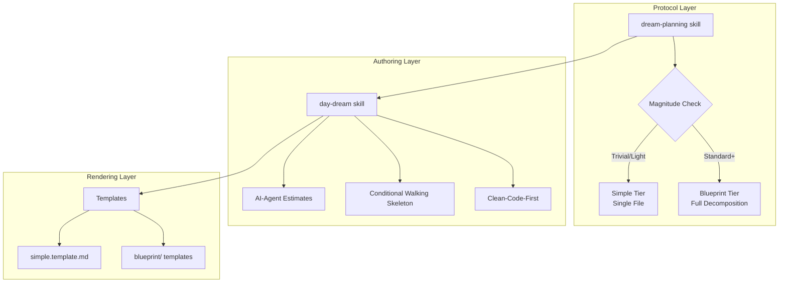

# Architecture

> Part of [DREAM Upgrade](./_overview.md) · ✅ [DONE]

---

## 📖 The Story

### 😤 The Pain

```
Current Reality:
┌──────────────────────────────────────────────────────────────────┐
│  day-dream skill  ──►  Templates  ──►  Blueprint files           │
│                                                                  │
│  Problem: Skill has ONE path (always Blueprint tier)             │
│  Problem: No decomposition protocol for complex plans            │
│  Problem: Templates echo same data across multiple files         │
│  Problem: No isolation rules for parallel agent work             │
└──────────────────────────────────────────────────────────────────┘
```

### ✨ The Vision

```
After DREAM Upgrade:
┌──────────────────────────────────────────────────────────────────┐
│  dream-planning skill (protocol)                                 │
│       │                                                          │
│       ├── Magnitude check → Simple tier OR Blueprint tier        │
│       ├── Decomposition rules (plan/task hierarchy)              │
│       └── Context isolation (sibling firewall)                   │
│                                                                  │
│  day-dream skill (authoring)                                     │
│       │                                                          │
│       ├── Fixed estimates (AI-agent time)                        │
│       ├── Conditional walking skeleton                           │
│       └── Clean-code-first directive                             │
│                                                                  │
│  Templates (passive scaffolds)                                   │
│       └── Render plans/tasks, don't define protocol              │
└──────────────────────────────────────────────────────────────────┘
```

### 🎯 One-Liner

> Two skills (protocol + authoring) backed by passive templates, with magnitude-gated structure and context isolation.

---

## 🔧 The Spec

---

## 🏗️ System Overview



---

## 📊 Data Flow

| Stage | Input | Transformation | Output | Owner |
|-------|-------|----------------|--------|-------|
| Magnitude assessment | Task description | Classify complexity | Tier decision | `dream-planning` skill |
| Decomposition | Complex task | Break into plan/task tree | Structured hierarchy | `dream-planning` skill |
| Context isolation | Plan tree | Apply sibling firewall rules | Isolated work units | `dream-planning` skill |
| Authoring | Isolated units | Apply estimation + directives | Blueprint docs | `day-dream` skill |
| Rendering | Authored content | Fill template sections | Final .md files | Templates |

---

## 🧩 Logical Components

### `dream-planning` Skill

| Attribute | Value |
|-----------|-------|
| **Purpose** | Decomposition protocol — magnitude routing, plan/task hierarchy, context isolation |
| **Boundary** | Owns: magnitude routing, plan/task terminology, sibling firewall. Does NOT own: file formatting, template structure, status syntax |
| **Implemented By** | `.github/skills/dream-planning/SKILL.md` |

### `day-dream` Skill

| Attribute | Value |
|-----------|-------|
| **Purpose** | Blueprint authoring rules — how to write planning documents |
| **Boundary** | Owns: template selection, Story/Spec pattern, status markers, line limits, estimation defaults, walking skeleton policy, backward compat directive. Does NOT own: decomposition protocol |
| **Implemented By** | `.github/skills/day-dream/SKILL.md` |

### Templates

| Attribute | Value |
|-----------|-------|
| **Purpose** | Passive rendering scaffolds — provide structure for plan/task documents |
| **Boundary** | Owns: section layout, placeholder text. Does NOT own: any protocol rules |
| **Implemented By** | `instruction_core/data/.agent_plan/day_dream/templates/` |

---

## 🔑 Key Design Principles

| # | Principle | Implication |
|---|-----------|-------------|
| 1 | **Skill is authority, template is scaffold** | Protocol rules live in skills, never in template comments |
| 2 | **Single source of truth** | Each fact lives in one place; no echo across files |
| 3 | **Magnitude gates structure** | Complexity determines tier automatically |
| 4 | **Context isolation enables parallelism** | Sibling firewall means subagents can work without coordination |
| 5 | **AI-agent time is the default** | Estimates assume agent speed; human tasks get explicit `human_only` flag |
| 6 | **Directory = plan, file = task** | Hierarchy via filesystem; mandatory `_overview.md` at every plan directory |

---

## [Custom] ⚖️ Skill Boundary Contract

| Concern | Owner | NOT Owned By |
|---------|-------|-------------|
| "Should I decompose this?" | `dream-planning` | `day-dream` |
| "How do I write this document?" | `day-dream` | `dream-planning` |
| "Which template do I use?" | `day-dream` | `dream-planning` |
| "How do I isolate subagent work?" | `dream-planning` | `day-dream` |
| "What time estimate format?" | `day-dream` | `dream-planning` |
| "What's the plan/task hierarchy?" | `dream-planning` | `day-dream` |

---

**← Back to:** [DREAM Upgrade Overview](./_overview.md)
