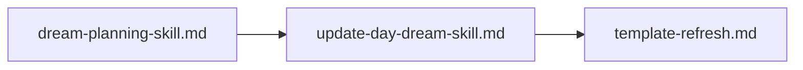

# P2: DREAM Integration

> ✅ **[DONE]** — Created the dream-planning skill, updated day-dream skill, refreshed templates.

---

## Purpose

Integrate DREAM v3 concepts (decomposition protocol, magnitude routing, context isolation) into the ADHD Framework's planning system via a new skill, an updated skill, and refreshed templates.

## Children

| Name | Type | Status | Description |
|------|------|--------|-------------|
| [dream-planning-skill.md](./dream-planning-skill.md) | Task | ✅ [DONE] | New `dream-planning` skill for decomposition protocol |
| [update-day-dream-skill.md](./update-day-dream-skill.md) | Task | ✅ [DONE] | Apply P0 fixes + magnitude awareness to `day-dream` skill |
| [template-refresh.md](./template-refresh.md) | Task | ✅ [DONE] | Align templates with updated skill rules |

## Integration Map

Sequential dependency: `dream-planning` skill must exist before `day-dream` can reference it, and both must be stable before templates are refreshed.

## Reading Order

1. [dream-planning-skill.md](./dream-planning-skill.md) — The new decomposition protocol skill
2. [update-day-dream-skill.md](./update-day-dream-skill.md) — Updates to the existing authoring skill
3. [template-refresh.md](./template-refresh.md) — Template alignment
