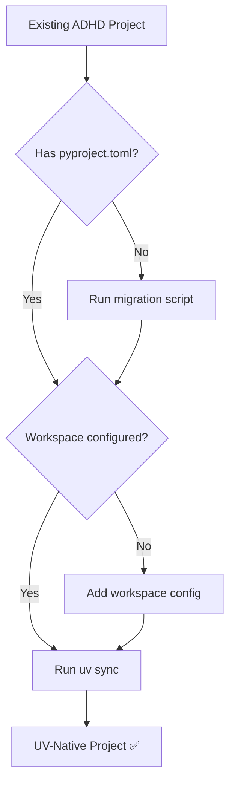
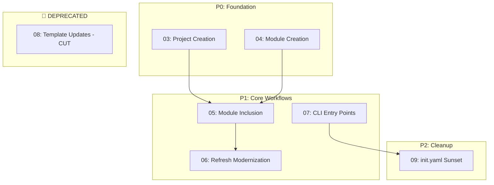

# 01 - Executive Summary

> Part of [Framework Modernization Blueprint](./00_index.md)

---

## 📖 The Story

### 😤 The Pain

```
Current Reality:
┌────────────────────────────────────────────────────────────────────────────┐
│                     FRAMEWORK WORKFLOWS: SCHIZOPHRENIC                     │
├────────────────────────────────────────────────────────────────────────────┤
│                                                                            │
│  Project Creation:                                                         │
│    adhd new-project  →  Creates init.yaml with GitHub URLs                 │
│                      →  Uses OLD requirements: format                      │
│                      →  Generates requirements.txt per module              │
│                      →  💥 IGNORES the new pyproject.toml we just added    │
│                                                                            │
│  Module Creation:                                                          │
│    adhd create-module  →  Creates init.yaml (deprecated format)            │
│                        →  Creates requirements.txt (should be uv add)      │
│                        →  NO pyproject.toml generation                     │
│                        →  💥 NEW MODULES CAN'T BE UV WORKSPACE MEMBERS     │
│                                                                            │
│  Init/Bootstrap:                                                           │
│    adhd init  →  Reads init.yaml GitHub URLs                               │
│              →  Clones modules via custom cloner                           │
│              →  Installs requirements.txt per module                       │
│              →  💥 WHEN UV SYNC DOES ALL THIS IN ONE COMMAND               │
│                                                                            │
│  Refresh:                                                                  │
│    adhd refresh  →  Runs refresh.py scripts (STILL NEEDED)                 │
│                  →  But doesn't sync workspace (UV should)                 │
│                                                                            │
│  Dependency Management:                                                    │
│    "Edit requirements.txt manually"  →  💥 SHOULD BE `uv add`              │
│                                                                            │
└────────────────────────────────────────────────────────────────────────────┘
```

| Who Hurts | Pain Level | Frequency |
|-----------|------------|-----------|
| Developer creating new projects | 🔥🔥🔥 High | Every new project |
| Developer adding modules | 🔥🔥🔥 High | Several times/week |
| Developer managing dependencies | 🔥🔥 Medium | Daily |
| Framework maintainer | 🔥🔥🔥 High | Maintaining two paradigms |

### ✨ The Vision

```
After Framework Modernization:
┌────────────────────────────────────────────────────────────────────────────┐
│                      UV-NATIVE WORKFLOWS                                   │
├────────────────────────────────────────────────────────────────────────────┤
│                                                                            │
│  Project Creation:                                                         │
│    adhd new-project  →  Creates pyproject.toml with UV workspace           │
│                      →  NO init.yaml, NO requirements.txt                  │
│                      →  `uv sync` works immediately                        │
│                                                                            │
│  Module Creation:                                                          │
│    adhd create-module  →  Creates pyproject.toml (workspace member)        │
│                        →  Adds to root pyproject.toml workspace            │
│                        →  `uv sync` pulls dependencies automatically       │
│                                                                            │
│  Init/Bootstrap:                                                           │
│    adhd init  →  Just runs `uv sync`                                       │
│              →  ONE command, standard Python tooling                       │
│                                                                            │
│  Refresh:                                                                  │
│    adhd refresh  →  Runs refresh.py scripts (unchanged)                    │
│                  →  May also run `uv sync` if needed                       │
│                                                                            │
│  Dependency Management:                                                    │
│    adhd add <package>  →  Wraps `uv add` with module context               │
│    OR just: `uv add <package>`  →  Standard tooling works!                 │
│                                                                            │
└────────────────────────────────────────────────────────────────────────────┘
```

### 🎯 One-Liner

> Migrate all ADHD Framework workflows to leverage UV properly—making the framework feel like standard Python while keeping modular architecture benefits.

---

## 🔧 The Spec

---

## 🌟 TL;DR

UV migration gave us the infrastructure (workspaces, unified dependencies). Now we update the **workflows** (project creation, module creation, init, refresh) to actually use that infrastructure. The goal: developers use standard Python tooling (`uv add`, `uv sync`) while ADHD provides structure and organization.

---

## 🎯 Problem Statement

The UV migration ([06_impact_analysis.md](../uv_migration/06_impact_analysis.md)) identified ~1,500 LOC to eliminate and documented what becomes unnecessary. However, the **workflows themselves** haven't been updated:

1. **Project creation** still generates init.yaml and requirements.txt
2. **Module creation** doesn't create pyproject.toml for new modules
3. **Init** still uses custom cloning logic instead of `uv sync`
4. **Templates** embed old patterns that don't work with UV

This creates a **split-brain situation** where the infrastructure supports UV but the tooling doesn't use it.

---

## 🔍 Prior Art & Existing Solutions

| Tool | What It Does | Decision | License | Rationale |
|------|--------------|----------|---------|-----------|
| **UV** | Package/project management | ADOPT | MIT | Already migrated to UV |
| **Poetry** | pyproject.toml generation | PARTIAL | MIT | pyproject.toml format inspiration |
| **Hatch** | Project scaffolding | REJECT | MIT | UV handles this natively |
| **Copier/Cookiecutter** | Template-based scaffolding | CONSIDER | MIT | Could simplify template logic |

**Summary:** UV is our foundation. We adapt our workflow code to emit UV-compatible artifacts (pyproject.toml) and delegate to UV for operations it handles better (sync, add, etc.).

---

## 🔄 What CHANGES with UV

| Workflow | Before | After | Impact |
|----------|--------|-------|--------|
| **Project Creation** | Emit init.yaml + requirements.txt | Emit pyproject.toml with workspace (from embedded templates) | HIGH |
| **Module Creation** | Emit init.yaml + requirements.txt | Emit pyproject.toml (from embedded templates) | HIGH |
| **Init/Bootstrap** | Custom clone + install per module | `uv sync` | MASSIVE SIMPLIFICATION |
| **Refresh** | Run refresh.py scripts | Same + optional `uv sync` | LOW |
| **Add Dependency** | Edit requirements.txt manually | `uv add <package>` | MEDIUM |
| **Workspace File** | Generate dynamically from init.yaml | Static or from pyproject.toml | MEDIUM |
| **Templates** | External repos cloned from GitHub | **EMBEDDED in creator modules** | SIMPLIFICATION |

---

## 🗑️ What Becomes UNNECESSARY

From [Impact Analysis](../uv_migration/06_impact_analysis.md):

| Module/File | LOC | Why Unnecessary |
|-------------|-----|-----------------|
| project_init_core/modules_cloner.py | 226 | `uv sync` handles all cloning |
| project_init_core/requirements_installer.py | 65 | `uv sync` handles all installs |
| workspace_core | 122 | Static workspace OR infer from pyproject.toml |
| All init.yaml files (14) | ~70 | pyproject.toml replaces |
| Per-module requirements.txt (~14) | ~100 | pyproject.toml dependencies |
| adhd_framework.py bootstrap logic | ~200 | `uv sync` replaces |

**Total: ~783 LOC + 28 config files become redundant**

---

## ✨ What NEW Workflows Are Needed

| Workflow | Purpose | Difficulty |
|----------|---------|------------|
| **Module Addition** | Add existing module to workspace via `uv add --path` | `[KNOWN]` |
| **Workspace Sync** | Wrapper around `uv sync` with logging | `[KNOWN]` |
| **Template Migration** | Update all templates for UV-first | `[KNOWN]` |

---

## ❌ Non-Goals (Explicit Exclusions)

| Non-Goal | Rationale |
|----------|-----------|
| Support pip-only projects | UV is our standard; pip is legacy |
| Backwards compatibility forever | Time-limited transition (see 09_feature_init_yaml_sunset.md) |
| Replace UV with custom tooling | UV is excellent; we wrap, not replace |
| Migrate existing projects automatically | Manual migration with guidance |
| Support Python <3.10 | UV/ADHD require modern Python |

---

## ✅ Features Overview

| Priority | Feature | Difficulty | Description | Document |
|----------|---------|------------|-------------|----------|
| P0 | Project Creation UV-Native | `[KNOWN]` | Emit pyproject.toml with UV workspace | [03](./03_feature_project_creation.md) |
| P0 | Module Creation UV-Native | `[KNOWN]` | Create pyproject.toml for new modules | [04](./04_feature_module_creation.md) |
| P1 | Module Inclusion | `[KNOWN]` | Add existing modules via `uv add --path` | [05](./05_feature_module_inclusion.md) |
| P1 | Refresh Modernization | `[KNOWN]` | Update refresh to work with UV | [06](./06_feature_refresh_modernization.md) |
| P1 | CLI Entry Points | `[KNOWN]` | CLI via pyproject.toml entry points | [07](./07_feature_cli_entry_points.md) |
| 🚫 | ~~Template Updates~~ | `[CUT]` | **DEPRECATED** - Templates embedded in creators | ~~[08](./08_feature_template_updates.md)~~ |
| P2 | init.yaml Sunset | `[KNOWN]` | Deprecation plan with migration guide | [09](./09_feature_init_yaml_sunset.md) |

---

## 📊 Migration Path for Existing Projects



### Migration Script (Future)

```bash
adhd migrate-to-uv  # Potential future command
```

1. Generate pyproject.toml from init.yaml data
2. Add to workspace members in root pyproject.toml
3. Delete obsolete files (init.yaml, requirements.txt)
4. Run `uv sync` to verify

---

## 🎯 Priority Order & Dependencies



**Why this order:**
1. P0 features enable new UV-native projects immediately (templates embedded in creators)
2. P1 features make day-to-day workflows work with UV
3. P2 cleans up legacy (template updates no longer needed - YAGNI)

---

**← Back to:** [Index](./00_index.md)  
**Next:** [02 - Architecture](./02_architecture.md)
