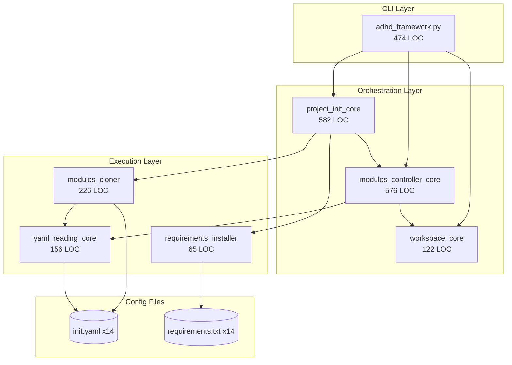
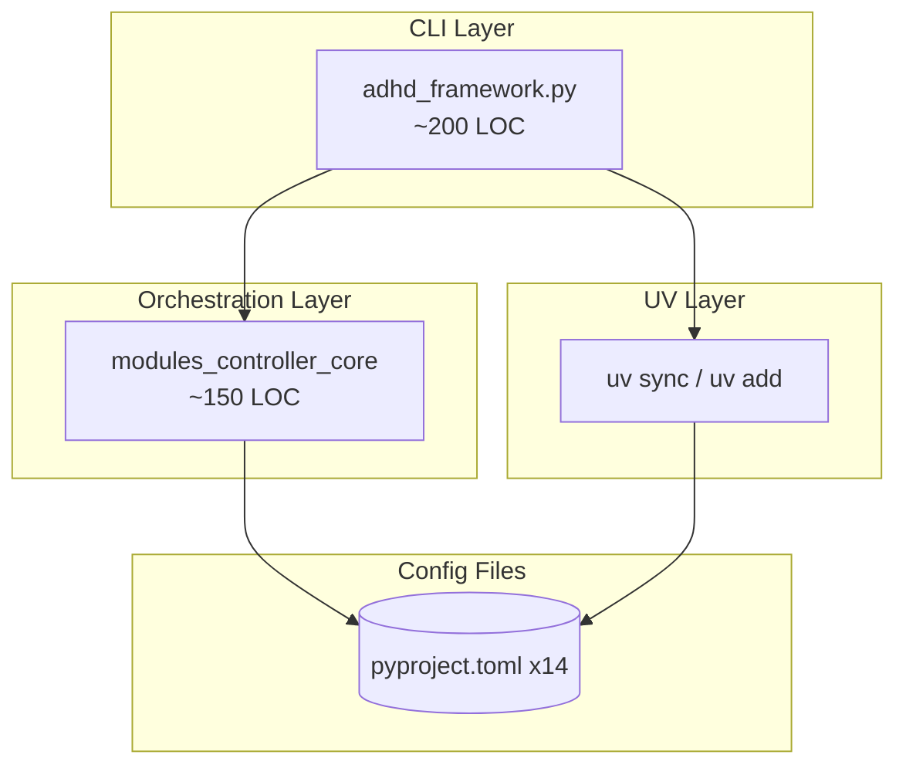
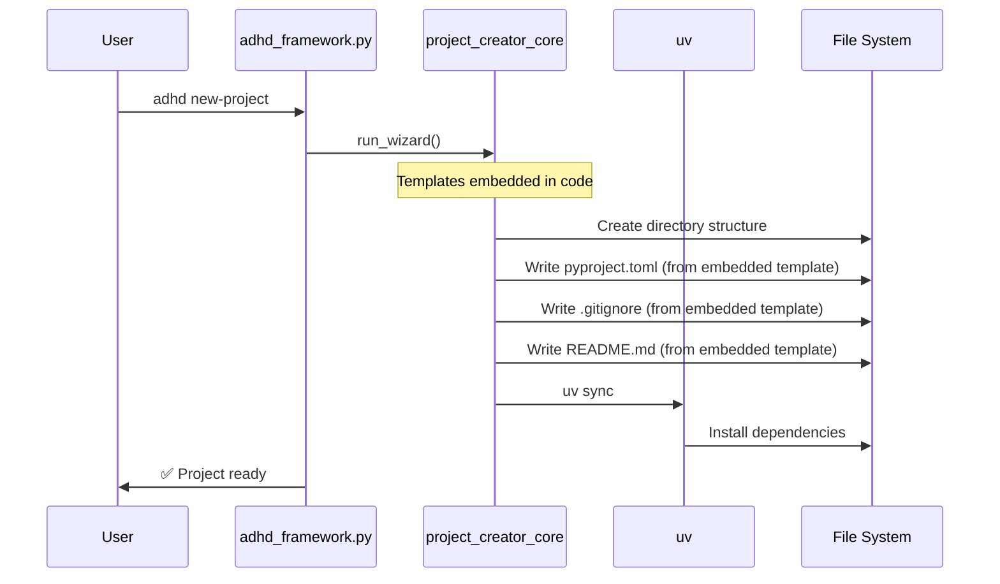
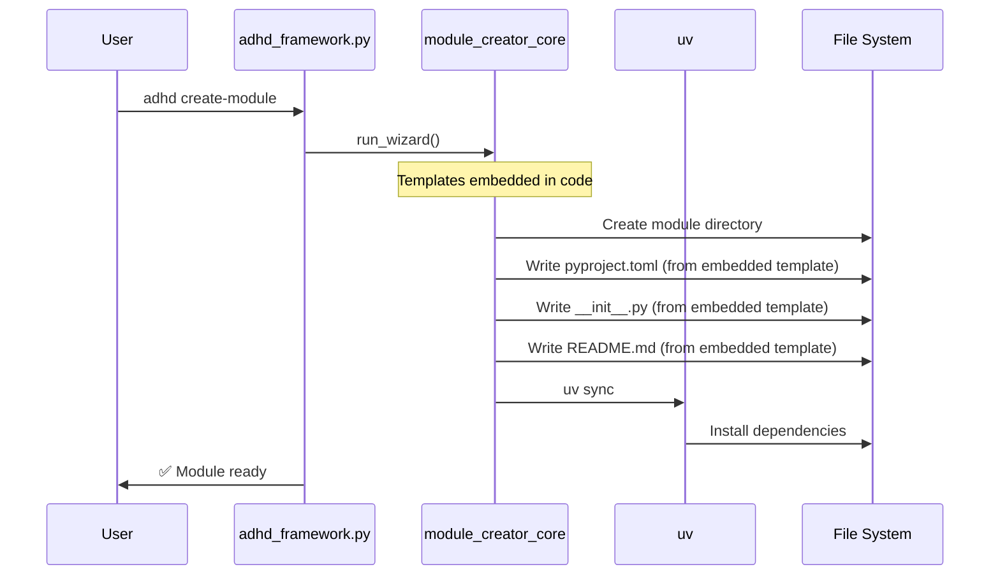
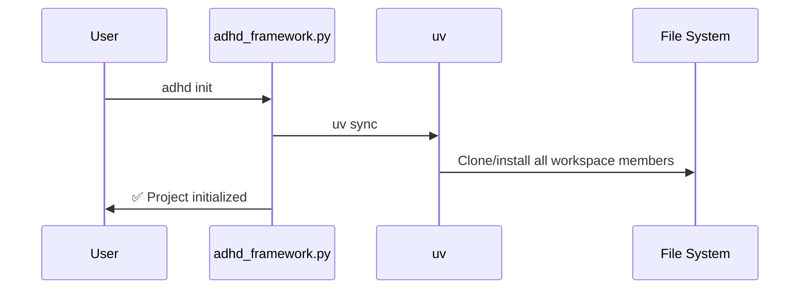

# 02 - Architecture

> Part of [Framework Modernization Blueprint](./00_index.md)

---

## 📖 The Story

### 😤 The Pain

```
Current Architecture: TWO PARALLEL UNIVERSES
┌─────────────────────────────────────────────────────────────────────────────┐
│                                                                             │
│   ┌─────────────────────┐         ┌─────────────────────┐                   │
│   │   OLD UNIVERSE      │         │   NEW UNIVERSE      │                   │
│   │   (init.yaml)       │         │   (pyproject.toml)  │                   │
│   ├─────────────────────┤         ├─────────────────────┤                   │
│   │ • modules_cloner    │         │ • UV workspace      │                   │
│   │ • requirements.txt  │  💥 VS  │ • uv sync           │                   │
│   │ • bootstrap magic   │         │ • uv add            │                   │
│   │ • workspace_core    │         │ • standard Python   │                   │
│   └─────────────────────┘         └─────────────────────┘                   │
│                                                                             │
│   BOTH EXIST SIMULTANEOUSLY → CONFUSION + MAINTENANCE BURDEN                │
│                                                                             │
└─────────────────────────────────────────────────────────────────────────────┘
```

| Who Hurts | Pain Level | Frequency |
|-----------|------------|-----------|
| Developer | 🔥🔥🔥 High | "Which system do I use?" |
| Maintainer | 🔥🔥🔥 High | Supporting two paradigms |

### ✨ The Vision

```
After Modernization: SINGLE UV-NATIVE UNIVERSE
┌─────────────────────────────────────────────────────────────────────────────┐
│                                                                             │
│   ┌──────────────────────────────────────────────────────────────────────┐  │
│   │                        UV-NATIVE FRAMEWORK                           │  │
│   ├──────────────────────────────────────────────────────────────────────┤  │
│   │                                                                      │  │
│   │  adhd_framework.py (~200 LOC)                                        │  │
│   │    └── CLI commands → delegate to UV where possible                  │  │
│   │                                                                      │  │
│   │  project_creator_core                                                │  │
│   │    └── Emit pyproject.toml + workspace config                        │  │
│   │                                                                      │  │
│   │  module_creator_core                                                 │  │
│   │    └── Emit pyproject.toml, update workspace members                 │  │
│   │                                                                      │  │
│   │  modules_controller_core (~150 LOC, simplified)                      │  │
│   │    └── Read pyproject.toml, run refresh scripts                      │  │
│   │                                                                      │  │
│   │  instruction_core (unchanged)                                        │  │
│   │    └── Sync instructions to .github/                                 │  │
│   │                                                                      │  │
│   └──────────────────────────────────────────────────────────────────────┘  │
│                                                                             │
│   ELIMINATED: project_init_core, workspace_core, all init.yaml              │
│                                                                             │
└─────────────────────────────────────────────────────────────────────────────┘
```

### 🎯 One-Liner

> Collapse from two parallel systems (init.yaml + pyproject.toml) into one UV-native architecture.

---

## 🔧 The Spec

---

## 🏗️ System Overview

### Before: Spaghetti Dependencies



### After: Clean Architecture



**Net change:** 1,725 LOC → ~350 LOC = **80% reduction in orchestration code**

---

## 📊 Data Flow

### Project Creation Flow



> **Simplification:** No external template repos. Templates are Python string constants in `project_creator_core`.

### Module Creation Flow



> **Simplification:** No external template repos. Module templates are Python string constants in `module_creator_core`.

### Init Flow (Simplified)



---

## 🗑️ Module Fate Matrix

| Module | Current LOC | Action | Final LOC | Notes |
|--------|-------------|--------|-----------|-------|
| **adhd_framework.py** | 474 | REDUCE | ~200 | Remove bootstrap logic |
| **modules_controller_core** | 576 | REDUCE | ~150 | Remove init.yaml parsing |
| **project_init_core** | 582 | ELIMINATE | 0 | `uv sync` replaces |
| **workspace_core** | 122 | ELIMINATE | 0 | Static workspace file |
| **yaml_reading_core** | 156 | AUDIT | 0 or 156 | Keep if used elsewhere |
| **project_creator_core** | ~200 | MODIFY | ~180 | Emit pyproject.toml |
| **module_creator_core** | ~300 | MODIFY | ~280 | Emit pyproject.toml |
| **instruction_core** | ~300 | UNCHANGED | ~300 | Pure business logic |
| **All others** | ~1,200 | UNCHANGED | ~1,200 | Pure business logic |

---

## 🧩 Logical Components

### CLI Component

| Attribute | Value |
|-----------|-------|
| **Purpose** | User-facing commands for project/module operations |
| **Boundary** | Parses args, delegates to cores, displays output |
| **Implemented By** | `adhd_framework.py` |
| **Depends On** | `modules_controller_core`, `project_creator_core`, `module_creator_core` |
| **Exposes** | CLI commands: `new-project`, `create-module`, `init`, `refresh`, `list` |

### Project Creator Component

| Attribute | Value |
|-----------|-------|
| **Purpose** | Scaffold new ADHD projects with UV workspace |
| **Boundary** | Project structure creation only, NOT dependency installation |
| **Implemented By** | `project_creator_core/` |
| **Depends On** | `questionary_core` (for wizard), optionally `github_api_core` (for remote repo) |
| **Exposes** | `ProjectCreator`, `run_project_creation_wizard()` |
| **Templates** | **Embedded in code** (no external template repos) |

### Module Creator Component

| Attribute | Value |
|-----------|-------|
| **Purpose** | Scaffold new modules with pyproject.toml |
| **Boundary** | Module structure creation (templates embedded in code) |
| **Implemented By** | `module_creator_core/` |
| **Depends On** | `github_api_core`, `questionary_core` |
| **Exposes** | `ModuleCreator`, `run_module_creation_wizard()` |

### Modules Controller Component

| Attribute | Value |
|-----------|-------|
| **Purpose** | Discover modules, run refresh scripts |
| **Boundary** | Module discovery and script execution, NOT installation |
| **Implemented By** | `modules_controller_core/` |
| **Depends On** | None (reads pyproject.toml directly) |
| **Exposes** | `ModulesController`, `ModuleInfo`, `list_all_modules()` |

---

## 🔑 Key Design Principles

| # | Principle | Implication |
|---|-----------|-------------|
| 1 | **UV is the source of truth** | pyproject.toml defines everything, no shadow configs |
| 2 | **Delegate to UV when possible** | Don't reimplement what UV does well |
| 3 | **Explicit over magic** | `uv sync` is explicit; auto-bootstrap is magic |
| 4 | **Standard Python first** | Use standard formats (pyproject.toml, PEP 621) |
| 5 | **Progressive enhancement** | Framework adds value on top of UV, doesn't replace it |

---

## 📁 Project Structure (Post-Modernization)

```
adhd_project/
├── pyproject.toml                # Root workspace config
├── uv.lock                       # Lockfile (auto-generated)
├── adhd_framework.py             # CLI entry (may become entry point)
├── cores/
│   ├── module_a/
│   │   └── pyproject.toml        # Workspace member
│   └── module_b/
│       └── pyproject.toml        # Workspace member
├── managers/
│   └── config_manager/
│       └── pyproject.toml        # Workspace member
├── utils/
│   └── logger_util/
│       └── pyproject.toml        # Workspace member
└── .github/
    └── instructions/             # Synced by instruction_core
```

**Files ELIMINATED:**
- ❌ `init.yaml` (project root)
- ❌ `*/init.yaml` (per module)
- ❌ `*/requirements.txt` (per module)
- ❌ `requirements.txt` (root)

---

## 🔌 Integration Points

### UV Commands Used

| Command | When Used | Wrapped By |
|---------|-----------|------------|
| `uv sync` | Project init, after adding modules | `adhd init` |
| `uv add` | Adding dependencies | Direct or `adhd add` |
| `uv add --path <module>` | Adding local module to workspace | `adhd include-module` |
| `uv run` | Running scripts/commands | `adhd refresh` (internally) |

### File Formats

| Format | Used For | Schema/Standard |
|--------|----------|-----------------|
| pyproject.toml | Project/module config | PEP 621, UV workspace spec |
| uv.lock | Dependency lockfile | UV format (auto-generated) |
| .code-workspace | VS Code workspace | VS Code standard |

---

## [Custom] 📊 Before/After Comparison

| Metric | Before | After | Change |
|--------|--------|-------|--------|
| Total core LOC | ~3,200 | ~2,100 | -34% |
| Config file types | 3 (yaml, txt, toml) | 1 (toml) | -67% |
| Per-module files | init.yaml + requirements.txt | pyproject.toml | -1 file |
| Bootstrap code | 200 LOC | 0 LOC | -100% |
| Path hacks | 14 files | 0 files | -100% |
| Custom dependency format | Yes (GitHub URLs) | No (pip format) | ✅ Standard |
| Custom metadata format | Yes (init.yaml) | No (pyproject.toml) | ✅ Standard |
| **External template repos** | Yes | **No** | ✅ **ELIMINATED** |
| **Template cloning** | At creation time | **None** | ✅ **ELIMINATED** |
| **`project/data/templates/`** | Folder exists | **Deleted** | ✅ **ELIMINATED** |

---

**← Back to:** [01 - Executive Summary](./01_executive_summary.md)  
**Next:** [03 - Feature: Project Creation](./03_feature_project_creation.md)
