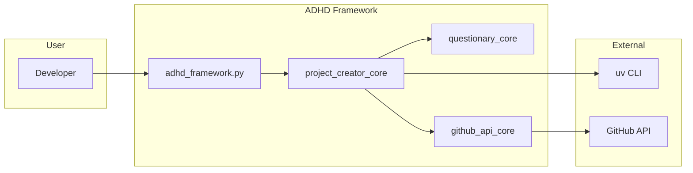

# 03 - Feature: Project Creation

> Part of [Framework Modernization Blueprint](./00_index.md)

---

## 📖 The Story

### 😤 The Pain

```
Current Project Creation:
┌────────────────────────────────────────────────────────────────────────────┐
│                                                                            │
│  adhd new-project "my-project"                                             │
│          │                                                                 │
│          ▼                                                                 │
│  ┌─────────────────────────────────────┐                                   │
│  │ project_creator_core                │                                   │
│  │                                     │                                   │
│  │  1. Clone template repo             │                                   │
│  │  2. Write init.yaml with:           │  ← GENERATES DEPRECATED FORMAT    │
│  │     - name: my-project              │                                   │
│  │     - modules: [GitHub URLs]        │  ← CUSTOM FORMAT, NOT PIP         │
│  │  3. Run ProjectInit (clone all)     │  ← CLONES VIA CUSTOM LOGIC        │
│  │  4. Optionally create remote repo   │                                   │
│  └─────────────────────────────────────┘                                   │
│          │                                                                 │
│          ▼                                                                 │
│  OUTPUT: Project with init.yaml + requirements.txt                         │
│          💥 CANNOT RUN `uv sync` IMMEDIATELY                               │
│                                                                            │
└────────────────────────────────────────────────────────────────────────────┘
```

| Who Hurts | Pain Level | Frequency |
|-----------|------------|-----------|
| Developer starting new project | 🔥🔥🔥 High | Every new project |
| Developer onboarding | 🔥🔥🔥 High | First experience with framework |

### ✨ The Vision

```
After Modernization:
┌────────────────────────────────────────────────────────────────────────────┐
│                                                                            │
│  adhd new-project "my-project"                                             │
│          │                                                                 │
│          ▼                                                                 │
│  ┌─────────────────────────────────────┐                                   │
│  │ project_creator_core                │                                   │
│  │                                     │                                   │
│  │  1. Generate from EMBEDDED templates│  ← NO EXTERNAL REPOS              │
│  │  2. Write pyproject.toml with:      │  ← STANDARD FORMAT                │
│  │     - [project] name, version       │                                   │
│  │     - [tool.uv.workspace] members   │  ← UV WORKSPACE CONFIG            │
│  │     - [tool.uv.sources] paths       │  ← LOCAL MODULE REFERENCES        │
│  │  3. Run `uv sync`                   │  ← STANDARD TOOLING               │
│  │  4. Optionally create remote repo   │                                   │
│  └─────────────────────────────────────┘                                   │
│          │                                                                 │
│          ▼                                                                 │
│  OUTPUT: Project ready for `uv sync`, standard Python project              │
│          ✅ IMMEDIATELY USABLE                                             │
│                                                                            │
└────────────────────────────────────────────────────────────────────────────┘
```

### 🎯 One-Liner

> Project creation emits pyproject.toml with UV workspace config, making new projects immediately `uv sync`-able.

### 📊 Impact

| Metric | Before | After |
|--------|--------|-------|
| Config format | ❌ Custom init.yaml | ✅ Standard pyproject.toml |
| Dependencies format | ❌ GitHub URLs in init.yaml | ✅ pip format in pyproject.toml |
| First command after creation | ❌ `adhd init` (custom) | ✅ `uv sync` (standard) |
| Onboarding friction | ❌ Learn ADHD conventions | ✅ Standard Python workflow |

---

## 🔧 The Spec

---

## 🎯 Overview

Modify `project_creator_core` to generate UV-native project structure:

1. **Generate pyproject.toml** instead of init.yaml
2. **Configure UV workspace** with members list
3. **Use standard dependency format** (pip packages, not GitHub URLs)
4. **Integrate `uv sync`** as final step (replaces ProjectInit)

**Priority:** P0  
**Difficulty:** `[KNOWN]`

---

## 📚 Prior Art

### Existing Solutions

| Solution | Type | Relevance | Status |
|----------|------|-----------|--------|
| UV init | Tool | High | ✅ Adopt |
| Poetry new | Tool | Medium | 🔧 Adapt patterns |
| Copier templates | Tool | Low | ❌ Reject (too heavy) |

### Usage Decision

**Using:** UV's pyproject.toml format + workspace configuration  
**How:** Emit pyproject.toml directly, configure workspace members, delegate install to `uv sync`  
**Why this over alternatives:** UV is already our standard; Poetry format differs slightly

---

## 👥 User Stories

| As a... | I want to... | So that... |
|---------|--------------|------------|
| Developer | Create new ADHD project | I can start building immediately |
| Developer | Have project work with `uv sync` | I use standard Python tooling |
| Developer | Specify initial modules | Core functionality is available |

---

## ✅ Acceptance Criteria

- [ ] `adhd new-project` creates pyproject.toml (not init.yaml)
- [ ] pyproject.toml includes `[tool.uv.workspace]` section
- [ ] `uv sync` works immediately after project creation
- [ ] Module dependencies use pip format (not GitHub URLs)
- [ ] ~~Template selection still works~~ **DEPRECATED** - Templates are embedded in creator
- [ ] Remote repo creation still works

---

## 🗺️ System Context



> **Note:** External template repos have been **ELIMINATED**. Templates are now embedded directly in `project_creator_core`.

---

## 📊 Data Flow

### Current Flow

```yaml
# init.yaml (CURRENT OUTPUT)
name: my-project
description: ''
modules:
  - https://github.com/AI-Driven-Highspeed-Development/Config-Manager.git
  - https://github.com/AI-Driven-Highspeed-Development/Logger-Util.git
```

### Target Flow

```toml
# pyproject.toml (TARGET OUTPUT)
[project]
name = "my-project"
version = "0.1.0"
description = ""
requires-python = ">=3.10"
dependencies = []

[tool.uv.workspace]
members = [
    "cores/*",
    "managers/*",
    "utils/*",
    "plugins/*",
    "mcps/*",
]

[tool.uv.sources]
config-manager = { workspace = true }
logger-util = { workspace = true }
```

---

## 🛠️ Technical Notes

### Key Changes to project_creator_core

| File | Change |
|------|--------|
| `project_creator.py` | Replace `_write_init_yaml()` with `_write_pyproject_toml()` |
| `project_creator.py` | Replace `_initialize_project()` call to ProjectInit with `uv sync` |
| `project_creator.py` | **REMOVE** template cloning logic - use embedded templates |
| `project_creator.py` | **ADD** embedded template constants (PYPROJECT_TEMPLATE, GITIGNORE_TEMPLATE, etc.) |
| `project_creation_wizard.py` | Update prompts for module selection (pip packages, not URLs) |
| `templates.py` | **DELETE** - templates now embedded in creator |

### Embedded Template Approach

```python
# project_creator.py - Templates embedded directly in code

PYPROJECT_TEMPLATE = '''[project]
name = "{project_name}"
version = "0.1.0"
description = "{description}"
readme = "README.md"
requires-python = ">=3.10"
dependencies = []

[build-system]
requires = ["hatchling"]
build-backend = "hatchling.build"

[tool.uv.workspace]
members = [
    "cores/*",
    "managers/*",
    "utils/*",
    "plugins/*",
    "mcps/*",
]
'''

GITIGNORE_TEMPLATE = '''.venv/
__pycache__/
*.py[cod]
*.egg-info/
dist/
uv.lock
.env
'''

README_TEMPLATE = '''# {project_name}

## Quick Start

```bash
uv sync
uv run adhd --help
```
'''

def _write_pyproject_toml(self, dest_path: Path) -> None:
    content = PYPROJECT_TEMPLATE.format(
        project_name=self.params.project_name,
        description=self.params.description or ""
    )
    (dest_path / "pyproject.toml").write_text(content)
```

> **YAGNI Note:** There has never been a need for non-default templates. Embedding templates eliminates:
> - External template repo management
> - Template cloning latency
> - Template version synchronization
> - `project/data/templates/` folder

### Module Selection Changes

**Before:** User selects from GitHub URL list  
**After:** 
- Project created with empty workspace (UV glob patterns ready)
- Core modules created via `adhd create-module --type core`
- External dependencies added via `uv add`

> **Simplification:** No pre-bundled modules. Fresh projects start empty. Users add what they need.

---

## ⚠️ Edge Cases

| Scenario | Handling |
|----------|----------|
| Template already has pyproject.toml | Merge/overwrite with workspace config |
| Template has init.yaml | Ignore/delete it |
| No UV installed | Error with clear message and install instructions |
| Offline creation | Allow, but `uv sync` will fail (user's responsibility) |

---

## ❌ Out of Scope

| Item | Rationale |
|------|-----------|
| Migrating existing init.yaml projects | Covered in 09_feature_init_yaml_sunset.md |
| Custom workspace member patterns | Default patterns sufficient for P0 |
| Interactive module selection from pip | Too complex for P0 |

---

## 🔗 Dependencies

| Depends On | For |
|------------|-----|
| UV installed | Running `uv sync` |
| Template updates | Templates must be UV-native (08_feature_template_updates.md) |

---

## ❓ Open Questions

| Question | Status | Decision |
|----------|--------|----------|
| Keep wizard module selection? | ✅ RESOLVED | Simplified: projects start empty |
| Template format (Copier vs custom)? | ✅ RESOLVED | **Embedded templates in code** - Copier is overkill (YAGNI) |

---

**← Back to:** [02 - Architecture](./02_architecture.md)  
**Next:** [04 - Feature: Module Creation](./04_feature_module_creation.md)
