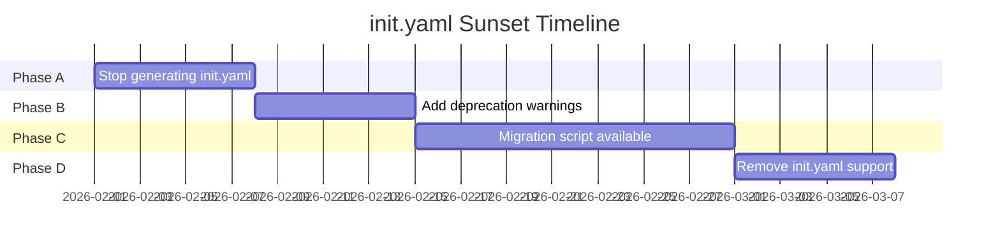

# 09 - Feature: init.yaml Sunset

> Part of [Framework Modernization Blueprint](./00_index.md)

---

## 📖 The Story

### 😤 The Pain

```
The init.yaml Situation:
┌────────────────────────────────────────────────────────────────────────────┐
│                                                                            │
│  14 init.yaml files exist across the codebase:                             │
│  ├── cores/instruction_core/init.yaml                                      │
│  ├── cores/github_api_core/init.yaml                                       │
│  ├── cores/project_creator_core/init.yaml                                  │
│  ├── ... (11 more)                                                         │
│  └── ./init.yaml (root project)                                            │
│                                                                            │
│  PROBLEMS:                                                                 │
│  ┌────────────────────────────────────────┐                                │
│  │ 1. Custom format nobody else uses      │                                │
│  │ 2. Duplicates info in pyproject.toml   │                                │
│  │ 3. Requires custom parsing code        │                                │
│  │ 4. Not understood by standard tools    │                                │
│  │ 5. GitHub URLs instead of pip format   │                                │
│  └────────────────────────────────────────┘                                │
│                                                                            │
│  CONSTRAINT: We can't delete them overnight - existing code depends on them│
│                                                                            │
└────────────────────────────────────────────────────────────────────────────┘
```

| Who Hurts | Pain Level | Frequency |
|-----------|------------|-----------|
| Developer | 🔥 Low (but chronic) | Confused by two config formats |
| Maintainer | 🔥🔥🔥 High | Keeping two systems in sync |
| New contributor | 🔥🔥 Medium | Learning curve |

### ✨ The Vision

```
After Sunset:
┌────────────────────────────────────────────────────────────────────────────┐
│                                                                            │
│  ZERO init.yaml files in the codebase                                      │
│                                                                            │
│  pyproject.toml is the ONLY configuration format:                          │
│  ├── Standard PEP 621 format                                               │
│  ├── Understood by all Python tools                                        │
│  ├── UV workspace configuration                                            │
│  └── Single source of truth                                                │
│                                                                            │
│  ✅ ONE FORMAT TO RULE THEM ALL                                            │
│                                                                            │
└────────────────────────────────────────────────────────────────────────────┘
```

### 🎯 One-Liner

> Deprecate and remove init.yaml files, with clear migration path and timeline.

### 📊 Impact

| Metric | Before | After |
|--------|--------|-------|
| Config formats | ❌ 2 (yaml + toml) | ✅ 1 (toml) |
| Custom parsing code | ❌ ~200 LOC | ✅ 0 LOC |
| Tool compatibility | ❌ Custom only | ✅ Standard Python |
| Cognitive load | ❌ "Which format?" | ✅ Always pyproject.toml |

---

## 🔧 The Spec

---

## 🎯 Overview

Structured deprecation of init.yaml:

1. **Phase A:** Stop generating new init.yaml files
2. **Phase B:** Add deprecation warnings when reading init.yaml
3. **Phase C:** Provide migration script
4. **Phase D:** Remove init.yaml support entirely

**Priority:** P2  
**Difficulty:** `[KNOWN]`

---

## 📚 Prior Art

### Deprecation Patterns

| Pattern | Example | Status |
|---------|---------|--------|
| Python deprecation warnings | `warnings.warn()` | ✅ Adopt |
| Grace period with docs | 2-3 release cycles | ✅ Adopt |
| Migration tooling | Auto-conversion scripts | ✅ Adopt |

---

## 👥 User Stories

| As a... | I want to... | So that... |
|---------|--------------|------------|
| Developer | Know init.yaml is deprecated | I don't create new ones |
| Developer | Migrate existing init.yaml | My project uses modern format |
| Maintainer | Remove init.yaml code | Less maintenance burden |

---

## ✅ Acceptance Criteria

- [ ] No new init.yaml files generated by any command
- [ ] Reading init.yaml shows deprecation warning
- [ ] Migration script converts init.yaml to pyproject.toml
- [ ] Documentation covers migration
- [ ] Final version removes all init.yaml support

---

## 📅 Deprecation Timeline



### Phase A: Stop Generating (Week 1)
- Update module_creator_core
- Update project_creator_core
- Update templates

### Phase B: Deprecation Warnings (Week 2)
- Add warnings to modules_controller_core
- Add warnings to yaml_reading_core
- Document migration in README

### Phase C: Migration Support (Weeks 3-4)
- Provide `adhd migrate-to-uv` command
- Test migration on all existing modules
- Document manual migration steps

### Phase D: Removal (Week 5)
- Delete init.yaml reading code
- Delete yaml_reading_core if orphaned
- Delete all init.yaml files
- Release as breaking change

---

## 🛠️ Technical Notes

### Migration Script: `adhd migrate-to-uv`

```python
def migrate_to_uv(self, args) -> None:
    """Migrate init.yaml to pyproject.toml."""
    controller = ModulesController()
    
    for module_path in controller.find_modules_with_init_yaml():
        init_yaml = module_path / "init.yaml"
        pyproject = module_path / "pyproject.toml"
        
        if pyproject.exists():
            self.logger.info(f"Skipping {module_path} - already has pyproject.toml")
            continue
        
        # Read init.yaml
        data = yaml.safe_load(init_yaml.read_text())
        
        # Convert to pyproject.toml
        pyproject_content = self._convert_init_to_pyproject(data, module_path)
        pyproject.write_text(pyproject_content)
        
        self.logger.info(f"✅ Migrated {module_path}")
        
        if not args.keep:
            init_yaml.unlink()
            self.logger.info(f"🗑️ Deleted {init_yaml}")
```

### init.yaml → pyproject.toml Mapping

| init.yaml Field | pyproject.toml Field |
|-----------------|----------------------|
| `version: 0.0.1` | `[project]version = "0.0.1"` |
| `type: core` | Inferred from path |
| `repo_url: ...` | Not needed (git remote) |
| `requirements: [...]` | `[project]dependencies = [...]` |
| `shows_in_workspace: true` | Not needed (workspace glob) |

### Deprecation Warning Implementation

```python
# In modules_controller_core
def _read_module_config(self, path: Path) -> ModuleConfig:
    pyproject = path / "pyproject.toml"
    init_yaml = path / "init.yaml"
    
    if pyproject.exists():
        return self._read_pyproject_toml(pyproject)
    elif init_yaml.exists():
        warnings.warn(
            f"init.yaml is deprecated and will be removed in v4.0. "
            f"Run 'adhd migrate-to-uv' to convert {path} to pyproject.toml",
            DeprecationWarning,
            stacklevel=2
        )
        return self._read_init_yaml(init_yaml)
    else:
        raise ModuleConfigNotFound(path)
```

---

## ⚠️ Edge Cases

| Scenario | Handling |
|----------|----------|
| init.yaml with custom fields | Log warning, ignore custom fields |
| init.yaml requirements are GitHub URLs | Convert to package names if possible |
| Both init.yaml and pyproject.toml exist | Use pyproject.toml, suggest deleting init.yaml |
| init.yaml with shows_in_workspace override | Log, but workspace globs handle this |

---

## ❌ Out of Scope

| Item | Rationale |
|------|-----------|
| Automatic GitHub URL → package mapping | Too complex, manual review better |
| Supporting init.yaml indefinitely | Defeats purpose of modernization |
| Backwards compatibility mode | Clean break is better than lingering |

---

## 🔗 Dependencies

| Depends On | For |
|------------|-----|
| All modules have pyproject.toml | Safe to remove init.yaml |
| Module discovery uses pyproject.toml (06) | Don't need init.yaml for discovery |

---

## [Custom] 🚧 Backwards Compatibility

### Question: Support Non-UV Projects During Transition?

**Option A: Hard cutoff**
- Remove init.yaml support immediately
- Breaking change, forces migration

**Option B: Grace period**
- Support both for 2-3 releases
- Deprecation warnings
- Eventual removal

**Recommendation:** Option B (grace period) because:
1. Existing projects need time to migrate
2. Third-party modules may use init.yaml
3. Clear timeline reduces panic

### Timeline

| Version | init.yaml Status |
|---------|------------------|
| v3.1 | Deprecated (warnings) |
| v3.2 | Migration tools available |
| v4.0 | Removed entirely |

---

## [Custom] 📋 Files to Delete (Final List)

After full migration:

```
DELETED:
├── ./init.yaml                           # Root project
├── cores/instruction_core/init.yaml
├── cores/github_api_core/init.yaml
├── cores/project_creator_core/init.yaml
├── cores/module_creator_core/init.yaml
├── cores/project_init_core/init.yaml     # Module also deleted
├── cores/workspace_core/init.yaml        # Module also deleted
├── cores/modules_controller_core/init.yaml
├── cores/creator_common_core/init.yaml
├── cores/questionary_core/init.yaml
├── cores/exceptions_core/init.yaml
├── cores/yaml_reading_core/init.yaml     # Module may be deleted
├── managers/config_manager/init.yaml
├── managers/temp_files_manager/init.yaml
└── utils/logger_util/init.yaml
```

**Total: 15 init.yaml files → 0**

---

**← Back to:** [08 - Feature: Template Updates](./08_feature_template_updates.md)  
**Next:** [80 - Implementation](./80_implementation.md)
