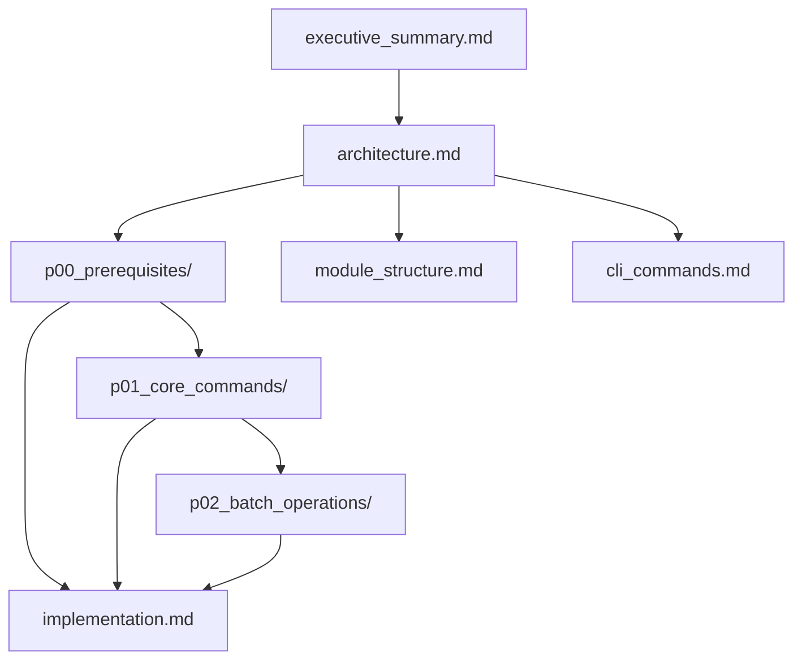

# Module Lifecycle — Remove & Update Commands

> ⏳ **[TODO]** — Add `adhd remove` and `adhd update` commands to complete the module lifecycle.

---

## Purpose

The ADHD CLI currently supports `adhd add` to bring external modules into a workspace, but has no way to remove or update them. This plan adds the reverse operations: `adhd remove <name>` to cleanly unregister and delete a module, and `adhd update <name>` to swap a module with its latest version using a safe atomic-swap pattern. Batch update via `--layer` is also included.

## Children

| Name | Type | Status | Description |
|------|------|--------|-------------|
| [executive_summary.md](./executive_summary.md) | Task | ⏳ [TODO] | Vision, goals, non-goals, prior art |
| [architecture.md](./architecture.md) | Task | ⏳ [TODO] | System design — module lifecycle data flow |
| [p00_prerequisites/](./p00_prerequisites/_overview.md) | Plan | ⏳ [TODO] | P0: Reverse dep lookup + pyproject_patcher remove |
| [p01_core_commands/](./p01_core_commands/_overview.md) | Plan | ⏳ [TODO] | P1: Remove, Update, Safety features |
| [p02_batch_operations/](./p02_batch_operations/_overview.md) | Plan | ⏳ [TODO] | P2: Batch update with `--layer` flag |
| [implementation.md](./implementation.md) | Task | ⏳ [TODO] | Phased task tracking |
| [module_structure.md](./module_structure.md) | Task | 🔄 [WIP] | Rename plan: `module_adder_core` → `module_lifecycle_core` + module organization |
| [cli_commands.md](./cli_commands.md) | Task | ⏳ [TODO] | CLI interface reference |

## Integration Map

Phases are sequential: P0 prerequisites → P1 core commands → P2 batch operations.

## Reading Order

1. [executive_summary.md](./executive_summary.md) — Understand the what/why
2. [architecture.md](./architecture.md) — System design and data flow
3. [cli_commands.md](./cli_commands.md) — CLI interface reference
4. [p00_prerequisites/](./p00_prerequisites/_overview.md) — Foundation work
5. [p01_core_commands/](./p01_core_commands/_overview.md) — Core remove + update
6. [p02_batch_operations/](./p02_batch_operations/_overview.md) — Batch update
7. [implementation.md](./implementation.md) — Task tracking
8. [module_structure.md](./module_structure.md) — Where code lives
