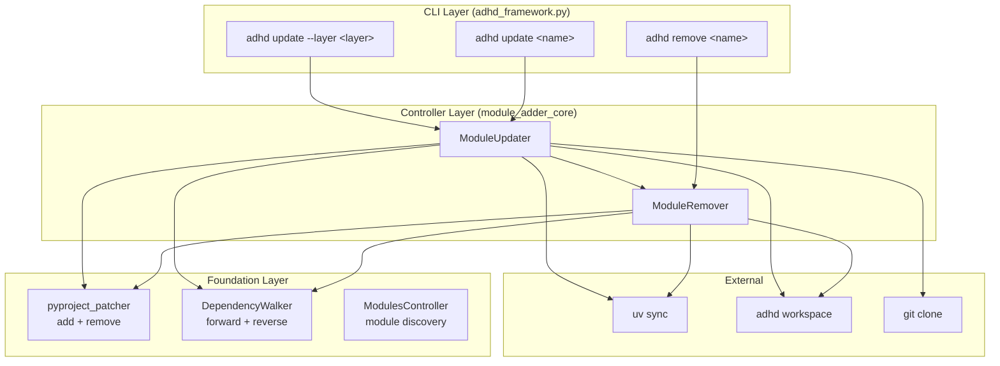
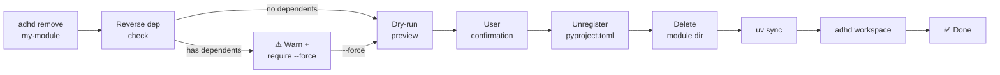
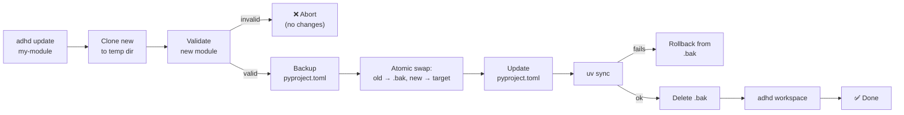

# Architecture

> Part of [Module Lifecycle](./_overview.md) · ⏳ [TODO]

---

## 📖 The Story

### 😤 The Pain

```
Current Reality:
┌──────────────────────────────────────────────────────────────────┐
│  module_adder_core  ──►  One-way street: ADD only                │
│                                                                  │
│  pyproject_patcher  ──►  Can add to pyproject.toml, can't remove │
│  DependencyWalker   ──►  Forward deps only, no reverse lookup    │
│  adhd_framework.py  ──►  'add' command exists, no 'remove'       │
└──────────────────────────────────────────────────────────────────┘
```

### ✨ The Vision

```
After Module Lifecycle:
┌──────────────────────────────────────────────────────────────────┐
│  CLI Layer                                                       │
│    adhd remove <name>  ──►  RemoveCommand                        │
│    adhd update <name>  ──►  UpdateCommand                        │
│    adhd update --layer ──►  BatchUpdateCommand                   │
│                                                                  │
│  Controller Layer (module_adder_core — extended)                 │
│    ModuleRemover  ──►  reverse-dep check → unregister → delete   │
│    ModuleUpdater  ──►  clone temp → validate → atomic swap       │
│                                                                  │
│  Foundation Layer                                                │
│    pyproject_patcher  ──►  add + REMOVE                          │
│    DependencyWalker   ──►  forward + REVERSE dep lookup          │
└──────────────────────────────────────────────────────────────────┘
```

### 🎯 One-Liner

> Extend existing modules (patcher, walker, adder) with reverse operations; wire through new CLI commands with safety checks.

---

## 🔧 The Spec

---

## 🏗️ System Overview



---

## 📊 Data Flow

### Remove Flow



### Update Flow (Atomic Swap)



| Stage | Input | Output | Owner |
|-------|-------|--------|-------|
| Reverse dep check | Module name | Dependents list | `DependencyWalker` |
| Pyproject unregister | Package name | Modified pyproject.toml | `pyproject_patcher` |
| Directory cleanup | Module path | Deleted directory | `ModuleRemover` |
| Clone + validate | Git URL | Temp directory with validated module | `ModuleUpdater` |
| Atomic swap | Old path + new path | Swapped directories | `ModuleUpdater` |
| Workspace regen | (auto) | Updated .code-workspace | `workspace_core` |

---

## 🧩 Logical Components

### `ModuleRemover` (NEW — in `module_adder_core`)

| Attribute | Value |
|-----------|-------|
| **Purpose** | Safely remove a module: reverse-dep check → unregister → delete → sync |
| **Boundary** | Owns: removal orchestration. Does NOT own: dep analysis (DependencyWalker), pyproject patching (pyproject_patcher) |
| **Depends On** | `pyproject_patcher`, `DependencyWalker`, `ModulesController` |

### `ModuleUpdater` (NEW — in `module_adder_core`)

| Attribute | Value |
|-----------|-------|
| **Purpose** | Safely update a module via atomic swap: clone → validate → swap → sync |
| **Boundary** | Owns: update orchestration, atomic swap logic. Does NOT own: git cloning (reuse `ModuleAdder` patterns), dep analysis |
| **Depends On** | `ModuleRemover`, `ModuleAdder`, `pyproject_patcher`, `DependencyWalker` |

### `pyproject_patcher` (EXTENDED)

| Attribute | Value |
|-----------|-------|
| **Purpose** | Add/remove packages from root pyproject.toml deps and uv.sources |
| **Extension** | New `remove_from_root_pyproject()` — reverse of existing `add_to_root_pyproject()` |

### `DependencyWalker` (EXTENDED)

| Attribute | Value |
|-----------|-------|
| **Purpose** | Forward + reverse dependency analysis |
| **Extension** | New `get_reverse_deps(module_name)` — returns set of modules that depend on the given module |

---

## 🔑 Key Design Principles

| # | Principle | Implication |
|---|-----------|-------------|
| 1 | **Swap, don't remove+re-add** | Update uses atomic swap to avoid failure window |
| 2 | **Reverse-dep safety before remove** | Never silently break dependents |
| 3 | **Dry-run by default** | Show what would happen before doing it |
| 4 | **Rollback on failure** | Any failure during update reverts to previous state |
| 5 | **Controller-level enforcement** | `--layer runtime` rejected at controller, not just CLI |
| 6 | **init.yaml is legacy** | All operations ignore init.yaml |

---

## [Custom] 🔄 Cleanup Checklist (Remove)

Every remove operation MUST complete this checklist:

| Step | Component | Details |
|------|-----------|---------|
| 1 | `pyproject.toml` deps | Remove `"package-name"` from `[project.dependencies]` |
| 2 | `pyproject.toml` uv.sources | Remove `package-name = { workspace = true }` from `[tool.uv.sources]` |
| 3 | Module directory | Delete `modules/{layer}/{module_name}/` |
| 4 | `uv sync` | Regenerate lockfile |
| 5 | `adhd workspace` | Regenerate `.code-workspace` file |

---

**← Back to:** [Module Lifecycle Overview](./_overview.md)
