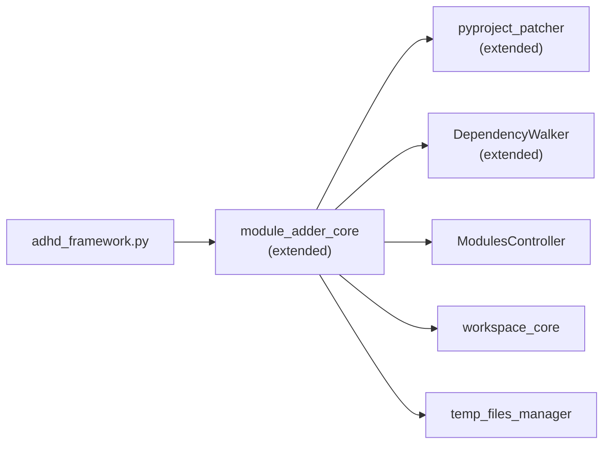

# Module Structure

> Part of [Module Lifecycle](./_overview.md) · ⏳ [TODO]

---

## 📖 The Story

### 🎯 One-Liner

> Extend `module_adder_core` with new classes (`ModuleRemover`, `ModuleUpdater`) and extend `pyproject_patcher` + `DependencyWalker` with reverse operations. No new modules.

---

## 🔧 The Spec

---

## 🏗️ ADHD Module Organization

### 📦 Reusable Modules (Extended)

| Module | Layer | Change | Phase |
|--------|-------|--------|-------|
| `module_adder_core` | dev | Add `ModuleRemover`, `ModuleUpdater` classes | P0-P1 |
| `modules_controller_core` | foundation | Extend `DependencyWalker` with reverse deps | P0 |

### 🎯 Project-Specific Modules

N/A — No new project-specific modules.

---

## 📄 Files Modified / Created

| Action | Path | Purpose | Phase |
|--------|------|---------|-------|
| EXTEND | `modules/foundation/modules_controller_core/dependency_walker.py` | Add `get_reverse_deps()` | P0 |
| EXTEND | `modules/dev/module_adder_core/pyproject_patcher.py` | Add `remove_from_root_pyproject()` | P0 |
| NEW | `modules/dev/module_adder_core/module_remover.py` | `ModuleRemover` class | P1 |
| NEW | `modules/dev/module_adder_core/module_updater.py` | `ModuleUpdater` class | P1 |
| EXTEND | `adhd_framework.py` | Wire `remove` + `update` commands | P1 |
| NEW | `modules/dev/module_adder_core/tests/test_module_remover.py` | Unit tests | P1 |
| NEW | `modules/dev/module_adder_core/tests/test_module_updater.py` | Unit tests | P1 |

---

## 📂 File Tree (Changes Only)

```text
modules/foundation/modules_controller_core/
└── dependency_walker.py              (P0 — EXTENDED: get_reverse_deps)

modules/dev/module_adder_core/
├── module_adder.py                   (existing — no changes)
├── module_remover.py                 (P1 — NEW)
├── module_updater.py                 (P1 — NEW)
├── pyproject_patcher.py              (P0 — EXTENDED: remove_from_root_pyproject)
├── pyproject_scaffolder.py           (existing — no changes)
├── __init__.py                       (P1 — UPDATED: export new classes)
└── tests/
    ├── test_module_remover.py        (P1 — NEW)
    └── test_module_updater.py        (P1 — NEW)

adhd_framework.py                     (P1 — EXTENDED: remove + update commands)
```

---

## 🔗 Module Dependencies



| Dependency | Direction | Purpose |
|------------|-----------|---------|
| `module_adder_core` → `pyproject_patcher` | Internal | Pyproject.toml manipulation |
| `module_adder_core` → `DependencyWalker` | Cross-module | Reverse dep safety checks |
| `module_adder_core` → `ModulesController` | Cross-module | Module discovery (find module path, layer, metadata) |
| `module_adder_core` → `workspace_core` | Cross-module | Workspace file regeneration |
| `module_adder_core` → `temp_files_manager` | Cross-module | Temp directory for clone during update |
| `adhd_framework.py` → `module_adder_core` | Entry point | CLI command wiring |

---

**← Back to:** [Module Lifecycle Overview](./_overview.md)
