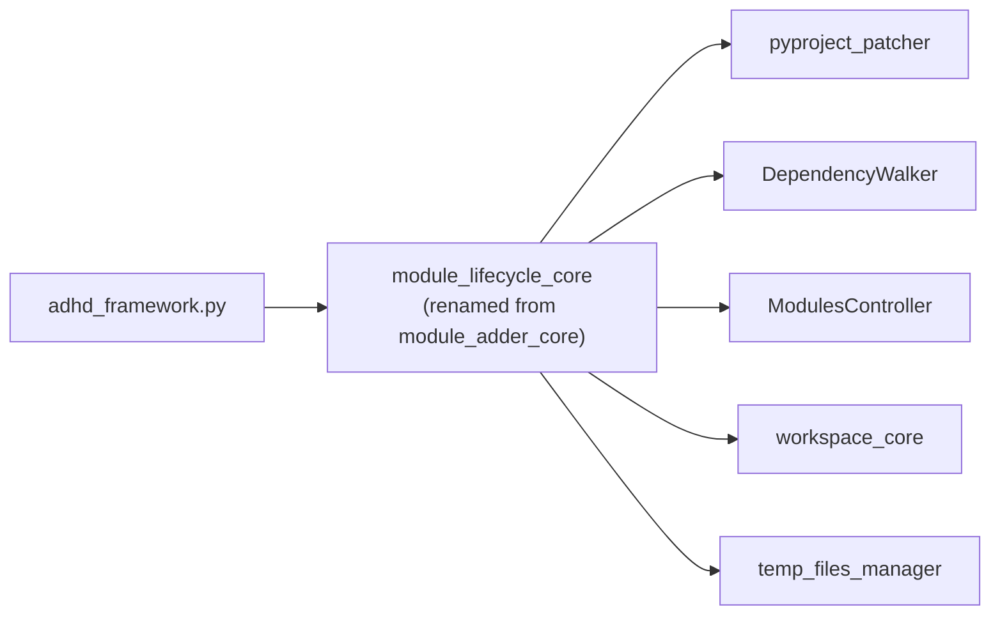

# Module Structure — Rename & Organization Plan

> Part of [Module Lifecycle](./_overview.md) · 🔄 [WIP]

---

## 📖 The Story

### 😤 The Pain

```
┌──────────────────────────────────────────────────────────────┐
│  Blueprint says:    module_lifecycle_core                     │
│  Filesystem says:   module_adder_core                        │
│  Result:            Confusion during implementation          │
│                     Files placed under wrong assumed name     │
│                     TODO comments scattered as workarounds    │
└──────────────────────────────────────────────────────────────┘
```

The blueprint was written using the future name `module_lifecycle_core` throughout, but the actual module is `module_adder_core`. Implementation had to work against the old name while reading docs that referenced the new name. Four files now contain `# TODO: rename module_adder_core to module_lifecycle_core` comments.

### ✨ The Vision

```
┌──────────────────────────────────────────────────────────────┐
│  module_adder_core/  ──► mv ──►  module_lifecycle_core/     │
│  module-adder-core   ──► sed ──► module-lifecycle-core      │
│  All imports         ──► sed ──► updated                    │
│  uv sync             ──► ✅  ──► working                   │
│  All tests           ──► ✅  ──► green                     │
└──────────────────────────────────────────────────────────────┘
```

### 🎯 One-Liner

> Safely rename `module_adder_core` → `module_lifecycle_core` across directory, package metadata, all imports, and documentation — then remove the TODO debt.

### 📊 Impact

| Aspect | Before | After |
|--------|--------|-------|
| Module name | `module_adder_core` (add-only legacy name) | `module_lifecycle_core` (reflects add/remove/update) |
| Blueprint accuracy | References non-existent name | References actual module |
| TODO comments | 4 scattered workarounds | 0 |
| New contributor clarity | "Where is module_lifecycle_core?" | Name matches function |

---

## 🔧 The Spec

---

## 🏷️ Rename Scope — `module_adder_core` → `module_lifecycle_core`

> **Difficulty: [KNOWN]** — Pure mechanical rename. No logic changes. All patterns are standard uv workspace operations.

### 📋 Complete Change Inventory

#### 1. Directory Rename

| What | Current | Target |
|------|---------|--------|
| Module directory | `modules/dev/module_adder_core/` | `modules/dev/module_lifecycle_core/` |

#### 2. Package Metadata (inside the module)

| File | Field | Current Value | Target Value |
|------|-------|---------------|--------------|
| `pyproject.toml` | `[project] name` | `module-adder-core` | `module-lifecycle-core` |
| `pyproject.toml` | `description` | "Module adder for ADHD Framework..." | "Module lifecycle management for ADHD Framework — add, remove, update modules" |
| `__init__.py` | docstring | `module_adder_core - Module lifecycle...` | `module_lifecycle_core - Module lifecycle...` |
| `__init__.py` | TODO comment | `# TODO: rename module_adder_core...` | (delete line) |

#### 3. Root Project Files

| File | What Changes |
|------|-------------|
| `pyproject.toml` | `dependencies`: `module-adder-core` → `module-lifecycle-core` |
| `pyproject.toml` | `[tool.uv.sources]`: key `module-adder-core` → `module-lifecycle-core` |
| `adhd_framework_v3.code-workspace` | `path`: `./modules/dev/module_adder_core` → `./modules/dev/module_lifecycle_core` |

#### 4. Import Statements — External Consumers

| File | Lines | Change |
|------|-------|--------|
| `adhd_framework.py` | L308 | `from module_adder_core import ModuleAdder` → `from module_lifecycle_core import ModuleAdder` |
| `adhd_framework.py` | L336 | `from module_adder_core import ModuleRemover` → `from module_lifecycle_core import ModuleRemover` |
| `adhd_framework.py` | L356 | `from module_adder_core import ModuleUpdater` → `from module_lifecycle_core import ModuleUpdater` |

#### 5. Import Statements — Internal Tests

All tests are inside the module's own `tests/` directory. They move with the directory rename, but their import strings must change:

| File | Occurrences | Pattern |
|------|-------------|---------|
| `tests/test_module_adder.py` | ~12 | `from module_adder_core import ModuleAdder` |
| `tests/test_module_lifecycle.py` | 5 | `from module_adder_core.module_remover import ...` etc. |
| `tests/test_pyproject_patcher.py` | ~6 | `from module_adder_core.pyproject_patcher import ...` |
| `tests/test_pyproject_remove.py` | ~11 | `from module_adder_core.pyproject_patcher import ...` |
| `tests/test_pyproject_scaffolder.py` | ~6 | `from module_adder_core.pyproject_scaffolder import ...` |

Also in test files: `patch("module_adder_core._git_utils.subprocess.run", ...)` mock paths (3 occurrences in `test_module_lifecycle.py`).

#### 6. Source File TODO Comments

| File | Change |
|------|--------|
| `module_remover.py` L1 | Delete `# TODO: rename module_adder_core to module_lifecycle_core` |
| `module_updater.py` L1 | Delete `# TODO: rename module_adder_core to module_lifecycle_core` |
| `tests/test_module_lifecycle.py` L1 | Delete `# TODO: rename module_adder_core to module_lifecycle_core` |
| `__init__.py` L8 | Delete `# TODO: rename module_adder_core to module_lifecycle_core` |

#### 7. Other Codebase References

| File | What Changes |
|------|-------------|
| `modules/dev/project_creator_core/data/module_preload_sets.yaml` L45 | `subdirectory: modules/dev/module_adder_core` → `modules/dev/module_lifecycle_core` |
| `modules/dev/creator_common_core/questionary_prompter.py` L4 | Comment mentions `module_adder_core` — update to `module_lifecycle_core` |

#### 8. Auto-Generated Files (do NOT hand-edit)

| File | How It Updates |
|------|---------------|
| `uv.lock` | Regenerated automatically by `uv sync` after pyproject changes |

#### 9. Blueprint Documentation (this plan)

| File | What Changes |
|------|-------------|
| `_overview.md` | Already uses `module_lifecycle_core` — add note about rename origin |
| `module_structure.md` | This file — records the rename plan |
| `executive_summary.md` L109 | Fix self-referential line: "Rename `module_lifecycle_core` → `module_lifecycle_core`" |
| `architecture.md` | Already uses target name — no changes needed |
| `discussion record` | Historical — do not edit |

---

## 🔄 Safe Rename Sequence

> **Estimated time:** 15-30 minutes (AI-agent time). One atomic operation if done in order.

### Pre-Flight Checks

```bash
# 1. Ensure clean git state
git status  # must be clean or stash first

# 2. Verify all tests pass BEFORE rename
cd /path/to/adhd_framework_v3
source .venv/bin/activate
python -m pytest modules/dev/module_adder_core/tests/ -v --tb=short

# 3. Verify uv sync is healthy
uv sync
```

### Step-by-Step Execution

| Order | Action | Command / Method | Rollback |
|-------|--------|-----------------|----------|
| **1** | Rename directory | `git mv modules/dev/module_adder_core modules/dev/module_lifecycle_core` | `git mv` back |
| **2** | Update module's `pyproject.toml` | Edit `name = "module-lifecycle-core"`, update description | git checkout |
| **3** | Update module's `__init__.py` | Fix docstring, remove TODO comment | git checkout |
| **4** | Remove TODO comments | Delete TODO line from `module_remover.py`, `module_updater.py`, `tests/test_module_lifecycle.py` | git checkout |
| **5** | Update root `pyproject.toml` | `module-adder-core` → `module-lifecycle-core` in `dependencies` and `[tool.uv.sources]` | git checkout |
| **6** | Update `.code-workspace` | Path entry for the module | git checkout |
| **7** | Find-and-replace imports | `module_adder_core` → `module_lifecycle_core` in all `.py` files | git checkout |
| **8** | Update YAML/comments | `module_preload_sets.yaml`, `questionary_prompter.py` comment | git checkout |
| **9** | Regenerate lock file | `uv sync` | `uv sync` again after revert |
| **10** | Regenerate workspace | `adhd workspace` (if applicable) | N/A |
| **11** | Run tests | `python -m pytest modules/dev/module_lifecycle_core/tests/ -v` | N/A |
| **12** | Fix blueprint doc | Update `executive_summary.md` L109 | git checkout |
| **13** | Commit | `git add -A && git commit -m "rename: module_adder_core → module_lifecycle_core"` | `git revert` |

### Why This Order Matters

1. **Directory first** (Step 1): `git mv` preserves history. Must happen before any import changes, otherwise Python can't find the module.
2. **Internal metadata** (Steps 2-4): Package identity must match directory name before `uv sync`.
3. **Root pyproject** (Step 5): Dependency resolution must reference the new name.
4. **Workspace file** (Step 6): VS Code needs the updated path.
5. **Imports last** (Step 7): All prior steps ensure the new name resolves correctly when Python loads imports.
6. **uv sync** (Step 9): Rebuilds the lock file with new package name. This is the critical validation — if `uv sync` fails, something was missed.
7. **Tests** (Step 11): Final proof that the rename is complete and nothing is broken.

---

## ⚠️ Risk Assessment

| Risk | Likelihood | Impact | Mitigation |
|------|-----------|--------|------------|
| Missed import reference | Low | Tests fail immediately | `grep -r "module_adder_core" .` after step 7 — must return 0 hits outside `.git/` and `uv.lock` |
| `uv sync` fails | Low | Can't resolve package | Check both `dependencies` and `[tool.uv.sources]` are updated |
| `__pycache__` stale bytecode | Medium | Import errors at runtime | `find . -name __pycache__ -exec rm -rf {} +` before step 11 |
| VS Code caches old name | Medium | Editor shows errors | Reload window after rename |
| External consumers (other ADHD projects) | Low | Other projects importing this module break | This module is internal to `adhd_framework_v3` — no external consumers exist |
| `uv.lock` hand-edit temptation | Low | Corrupted lock file | NEVER edit `uv.lock` — `uv sync` regenerates it |
| Git history loss | None | N/A | `git mv` preserves full history |

### Verification Checklist (Post-Rename)

```bash
# 1. No stale references remain
grep -r "module_adder_core" --include="*.py" --include="*.toml" --include="*.yaml" --include="*.jsonc" .
# Expected: 0 results (uv.lock excluded — it auto-regenerates)

# 2. uv sync succeeds
uv sync
# Expected: exit 0, no resolution errors

# 3. All tests pass
python -m pytest modules/dev/module_lifecycle_core/tests/ -v --tb=short
# Expected: all green

# 4. adhd CLI works
adhd --help
adhd add --help
adhd remove --help
adhd update --help
# Expected: all commands show help text

# 5. Module is discoverable
python -c "from module_lifecycle_core import ModuleAdder, ModuleRemover, ModuleUpdater; print('OK')"
# Expected: "OK"
```

---

## 🏗️ ADHD Module Organization (Post-Rename)

### 📦 Reusable Modules (Extended)

| Module | Layer | Current Name | Target Name | Change | Phase |
|--------|-------|-------------|-------------|--------|-------|
| `module_lifecycle_core` | dev | `module_adder_core` | `module_lifecycle_core` | Rename + add `ModuleRemover`, `ModuleUpdater` | P0-P1 |
| `modules_controller_core` | foundation | (same) | (same) | Extend `DependencyWalker` with reverse deps | P0 |

### 🎯 Project-Specific Modules

N/A — No new project-specific modules.

---

## 📂 File Tree (Post-Rename Steady State)

```text
modules/dev/module_lifecycle_core/      ← RENAMED from module_adder_core/
├── __init__.py                         (updated: docstring + exports)
├── _git_utils.py                       (no changes)
├── module_adder.py                     (no changes — file name stays)
├── module_remover.py                   (already exists, TODO removed)
├── module_updater.py                   (already exists, TODO removed)
├── pyproject.toml                      (name: module-lifecycle-core)
├── pyproject_patcher.py                (already extended with remove)
├── pyproject_scaffolder.py             (no changes)
└── tests/
    ├── test_module_adder.py            (imports updated)
    ├── test_module_lifecycle.py         (imports + patches updated, TODO removed)
    ├── test_pyproject_patcher.py        (imports updated)
    ├── test_pyproject_remove.py         (imports updated)
    └── test_pyproject_scaffolder.py     (imports updated)
```

> **Note:** `module_adder.py` keeps its filename. Renaming the file would require renaming the `ModuleAdder` class, which is out of scope — the class name accurately describes what it does (adds modules). The *module package* is `module_lifecycle_core` because it now handles the full lifecycle.

---

## 🔗 Module Dependencies (Unchanged by Rename)



The dependency graph is unchanged. Only the package name changes in import statements.

---

## 📝 Blueprint Acknowledgment

This blueprint originally used the name `module_lifecycle_core` as if it already existed. The actual module was `module_adder_core`, which was extended in-place with `ModuleRemover` and `ModuleUpdater` under the old name.

This document serves as the rename plan to resolve that naming debt. After execution:
- All blueprint references to `module_lifecycle_core` become accurate
- The discussion record's decision #8 ("rename deferred") is resolved
- The 4 TODO comments are eliminated

---

**← Back to:** [Module Lifecycle Overview](./_overview.md)
