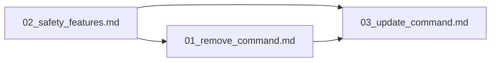

# P1: Core Commands

> ⏳ **[TODO]** — Implement `adhd remove` and `adhd update` commands with safety features.

---

## Purpose

Build the main remove and update commands that users interact with. Remove is the reverse of add — unregister, delete, sync. Update uses an atomic swap pattern to avoid the failure window of naive remove+re-add. Safety features (dry-run, backup, confirmation) are integrated from the start.

## Children

| Name | Type | Status | Description |
|------|------|--------|-------------|
| [01_remove_command.md](./01_remove_command.md) | Task | ⏳ [TODO] | `adhd remove <name>` — full cleanup with safety checks |
| [03_update_command.md](./03_update_command.md) | Task | ⏳ [TODO] | `adhd update <name>` — atomic swap pattern |
| [02_safety_features.md](./02_safety_features.md) | Task | ⏳ [TODO] | Dry-run preview, lightweight backup, confirmation |

## Integration Map

Safety features are consumed by both commands. Remove is a dependency of update (update uses remove's unregister logic internally for the old version swap-out).

## Reading Order

1. [02_safety_features.md](./02_safety_features.md) — Cross-cutting safety patterns
2. [01_remove_command.md](./01_remove_command.md) — Remove command
3. [03_update_command.md](./03_update_command.md) — Update command (builds on remove)
