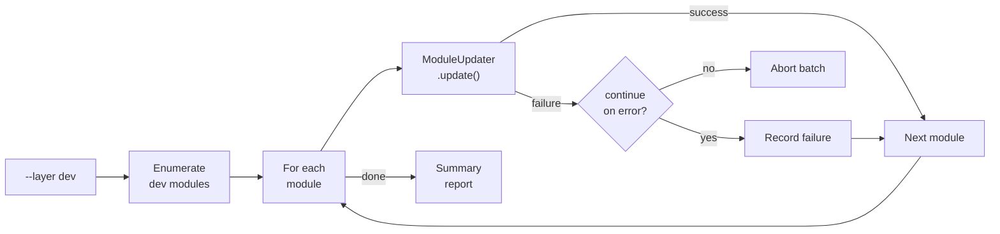

# Feature: Batch Update Operations

> Part of [P2: Batch Operations](./_overview.md) · ⏳ [TODO] · Priority: P2

---

## 📖 The Story

### 😤 The Pain → ✨ The Vision

```
┌─────────────────────────────────────────────────────────────────┐
│  BEFORE                        │  AFTER                         │
├────────────────────────────────┼────────────────────────────────┤
│  Update 8 dev modules:         │  Update 8 dev modules:         │
│  adhd update module-1          │  adhd update --layer dev       │
│  adhd update module-2          │     → ✅ All 8 updated         │
│  adhd update module-3          │                                │
│  adhd update module-4          │  Safety:                       │
│  ... (repeat 4 more times)     │  • --layer runtime rejected    │
│       ↓                        │  • --continue-on-error         │
│  💥 Tedious, one at a time     │  • Per-module dry-run          │
└────────────────────────────────┴────────────────────────────────┘
```

### 🎯 One-Liner

> `adhd update --layer dev|foundation` — batch update all modules in a layer, with explicit runtime exclusion and per-module error handling.

---

## 🔧 The Spec

**Priority:** P2 · **Difficulty:** `[KNOWN]`

**In Scope:**
- `--layer <name>` flag on the update command
- Enumerate all modules in the specified layer
- Call `ModuleUpdater.update()` for each module sequentially
- `--continue-on-error` flag to not stop on first failure
- Controller-level rejection of `--layer runtime`
- Per-module progress reporting
- Summary report at end

**Out of Scope:**
- `--all` flag (too dangerous without per-module validation)
- Parallel batch updates (sequential is safer)
- Selective batch (update only modules matching a pattern)
- Batch remove (too dangerous for batch)

---

## ✅ Acceptance Criteria

- [ ] `adhd update --layer dev` updates all dev-layer modules sequentially
- [ ] `adhd update --layer foundation` updates all foundation-layer modules
- [ ] `adhd update --layer runtime` is rejected with clear error message at controller level
- [ ] `--continue-on-error` skips failed modules and continues
- [ ] Summary report shows: N succeeded, M failed, K skipped
- [ ] `--dry-run` works with batch (shows preview for each module)
- [ ] Each module update uses the same atomic swap safety as single update

---

## 🛠️ Technical Notes

### Controller-Level Runtime Guard

```python
# In ModuleUpdater, NOT just in CLI arg parsing
def batch_update(self, layer: str, ...) -> BatchUpdateResult:
    if layer == "runtime":
        raise ADHDError(
            "Runtime modules are project-specific. "
            "Update them individually with 'adhd update <name>'."
        )
```

**Why controller-level:** Defense in depth. Even if someone calls the API directly (not through CLI), the guard applies.

### Batch Update Flow



### Summary Report Format

```
$ adhd update --layer dev

  Batch update: dev layer (8 modules)

  ✅ adhd-mcp           updated (abc123 → def456)
  ✅ flow-core           updated (abc123 → def456)
  ❌ module-adder-core   FAILED: git clone timeout
  ✅ workspace-core      updated (abc123 → def456)
  ⏭️ instruction-core    SKIPPED: no source_url
  ...

  Summary: 5 succeeded, 1 failed, 2 skipped
```

### Accepted Layers

| Layer | Batch Update? | Rationale |
|-------|--------------|-----------|
| `dev` | ✅ Yes | Development tools, safe to batch update |
| `foundation` | ✅ Yes | Core infra, usually few modules |
| `runtime` | ❌ No | Project-specific, update individually |

---

## 🔗 Dependencies

| Dependency | Status | Notes |
|------------|--------|-------|
| `ModuleUpdater.update()` | ⏳ P1 | Single-module update must work first |
| `ModulesController` | ✅ Done | Layer-based module enumeration |

---

**← Back to:** [P2 Overview](./_overview.md) · [Module Lifecycle](../_overview.md)
