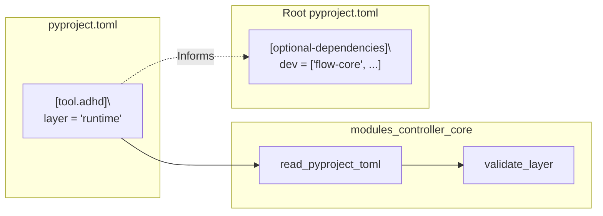

# 04 - Feature: Layer Taxonomy 🔄 IN PROGRESS

> Part of [Layer Taxonomy & Production Readiness Blueprint](./00_index.md)
>
> **Status:** 🔄 **IN PROGRESS** — 3/15 modules have `[tool.adhd].layer` field
>
> **Completed:** `instruction_core`, `config_manager`, `uv_migrator_core`
>
> **Remaining:** 12 modules need `layer` field added

---

## 📖 The Story

### 😤 The Pain

```
After P0 (uv migration), we have pyproject.toml for each module:
┌───────────────────────────────────────────────────────────────┐
│  pyproject.toml                                               │
│  ──────────────                                               │
│  [project]                                                    │
│  name = "session-manager"                                     │
│  dependencies = ["config-manager", "pydantic>=2.0"]           │
│                                                               │
│  [tool.adhd]                                                  │
│  type = "manager"                                             │
│                                                               │
│  💥 Still no way to indicate: "I'm dev-only, don't install"  │
│  💥 All modules installed by default                         │
└───────────────────────────────────────────────────────────────┘
```

| Who Hurts | Pain Level | Frequency |
|-----------|------------|-----------|
| Production deployers | 🔥🔥🔥 High | Every deploy |
| Module authors | 🔥🔥 Medium | Per module |

### ✨ The Vision

```
After This Feature:
┌───────────────────────────────────────────────────────────────┐
│  pyproject.toml                                               │
│  ──────────────                                               │
│  [project]                                                    │
│  name = "flow-core"                                           │
│  dependencies = [...]                                         │
│                                                               │
│  [tool.adhd]                                                  │
│  type = "core"                                                │
│  layer = "dev"           ◀── NEW: Semantic classification    │
│                                                               │
│  ✅ Clearly marked as dev-only                                │
│  ✅ `uv sync` excludes it, `uv sync --extra dev` includes it │
└───────────────────────────────────────────────────────────────┘
```

### 🎯 One-Liner

> A new `layer` field in `[tool.adhd]` classifies modules as foundation, runtime, or dev—enabling production-only installs via uv extras.

### 📊 Impact

| Metric | Before | After |
|--------|--------|-------|
| Way to mark dev-only | ❌ None | ✅ `layer = "dev"` |
| Production install | ❌ All modules | ✅ Only foundation + runtime |
| Layer validation | ❌ None | ✅ Closure tool catches violations |

---

## 🔧 The Spec

---

## 🎯 Overview

The `layer` field enables modules to self-declare their semantic classification. This is purely for agent/AI understanding and production-vs-dev decisions. **Dependencies are NOT here**—they're already in pyproject.toml from P0.

**Priority:** P1 (After uv migration)
**Difficulty:** `[KNOWN]`

---

## 📚 Prior Art

### Existing Solutions

| Solution | Type | Relevance | Status |
|----------|------|-----------|--------|
| npm devDependencies | Package manager | High | 🔧 Adapt pattern |
| Python extras_require | Package manager | High | ✅ Already in P0 |
| ADHD module type | Existing field | High | ✅ Extend with layer |

### Usage Decision

**Using:** Single string field in `[tool.adhd]`  
**How:** `layer = "foundation"` | `layer = "runtime"` | `layer = "dev"`  
**Why this over alternatives:** Simpler than array; modules have ONE primary layer

---

## 🗺️ System Context



---

## 👥 User Stories

| As a... | I want to... | So that... |
|---------|--------------|------------|
| Module author | Declare my module as dev-only | It's not installed in production |
| App deployer | Run `uv sync` without `--extra dev` | Only prod modules are installed |
| AI agent | Know the layer of a module | I understand its purpose and constraints |

---

## ✅ Acceptance Criteria

| # | Criterion | Verification |
|---|-----------|--------------|
| 1 | `layer` field parses from pyproject.toml `[tool.adhd]` | Unit test: parse toml with field |
| 2 | Missing field defaults to `runtime` | Unit test: parse toml without field |
| 3 | Invalid values rejected | Unit test: `layer = "banana"` raises error |
| 4 | All existing modules have `layer` added | Audit: count modules with valid layer |
| 5 | Cross-check: cores can only be foundation or dev | Validation hook test |

---

## 🛠️ Technical Notes

### Field Schema

```toml
# pyproject.toml [tool.adhd] section
[tool.adhd]
type = "core"
layer = "foundation"  # enum: foundation, runtime, dev
                      # default: runtime
                      # - foundation: Core bootstrap modules, always needed
                      # - runtime: Application modules, production use
                      # - dev: Development-only tools
```

### Full pyproject.toml Example

```toml
# cores/yaml_reading_core/pyproject.toml
[project]
name = "yaml-reading-core"
version = "0.0.1"
requires-python = ">=3.10"
dependencies = ["pyyaml>=6.0"]

[tool.adhd]
type = "core"
layer = "foundation"
repo_url = "https://github.com/org/yaml_reading_core.git"
feature = "config"  # Groups with other config-related modules
tags = []  # Expandable, normally empty

[tool.adhd.testing]
has_tests = true
threat_model = "internal"

[build-system]
requires = ["hatchling"]
build-backend = "hatchling.build"
```

### Validation Hook

```python
VALID_LAYERS = {"foundation", "runtime", "dev"}
CORE_ALLOWED_LAYERS = {"foundation", "dev"}  # cores can't be "runtime"

def validate_layer(module: ModuleInfo) -> list[str]:
    errors = []
    adhd_config = module.pyproject_toml.get("tool", {}).get("adhd", {})
    layer = adhd_config.get("layer", "runtime")
    
    if layer not in VALID_LAYERS:
        errors.append(f"Invalid layer '{layer}' in {module.name}")
    
    if module.type == "core" and layer not in CORE_ALLOWED_LAYERS:
        errors.append(f"Core module {module.name} cannot have layer '{layer}'")
    
    return errors
```

---

## ⚠️ Edge Cases

| Scenario | Handling |
|----------|----------|
| Field missing | Default to `runtime` |
| Unknown value `"banana"` | Error: invalid layer value |
| Array instead of string | Error: single value only |
| Core module with `layer = "runtime"` | Error: cores must be foundation or dev |
| Empty string `layer = ""` | Error: must have valid value |
| No `[tool.adhd]` section | Default to `runtime` |

---

## ❌ Out of Scope

| Excluded | Rationale |
|----------|-----------|
| Array of layers (`["foundation", "dev"]`) | Single primary layer is simpler |
| init.yaml layer field | Deprecated—all config in pyproject.toml |
| Dynamic layer based on env | Static classification only |

---

## 🔗 Dependencies

| Dependency | Type | Status |
|------------|------|--------|
| P0: uv migration | Internal | Prerequisite |
| modules_controller_core | Internal | Needs pyproject.toml reader |
| pyproject.toml schema docs | Documentation | Needs update |

---

## ❓ Open Questions

| Question | Status | Tentative Answer |
|----------|--------|------------------|
| Can plugins be foundation? | ✅ Resolved | No, plugins are runtime or dev |
| Case sensitive? | ✅ Resolved | Yes, lowercase only |
| What if pyproject.toml missing? | ✅ Resolved | Error: not a valid ADHD module (after P0) |

---

## 🖼️ Related Assets

N/A — No mockups needed for schema change.

---

## ✅ Feature Validation Checklist

### Narrative Completeness
- [x] The Story section clearly states user problem and value
- [x] Intent is unambiguous to a non-technical reader
- [x] Scope is explicitly bounded

### Technical Completeness
- [x] Schema fully specified
- [x] Edge cases enumerated
- [x] Acceptance criteria are testable

### Traceability
- [x] Links to architecture doc
- [x] Dependencies listed

---

**← Back to:** [Architecture](./02_architecture.md) | **Next:** [Feature: Dependency Closure Tool](./05_feature_dependency_closure_tool.md)
