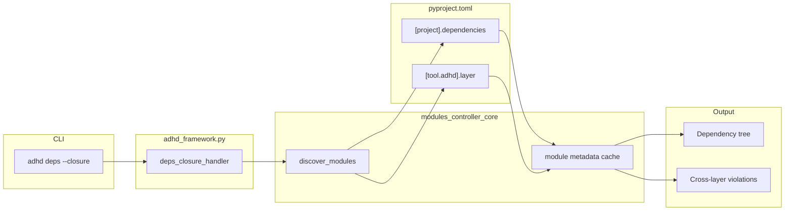
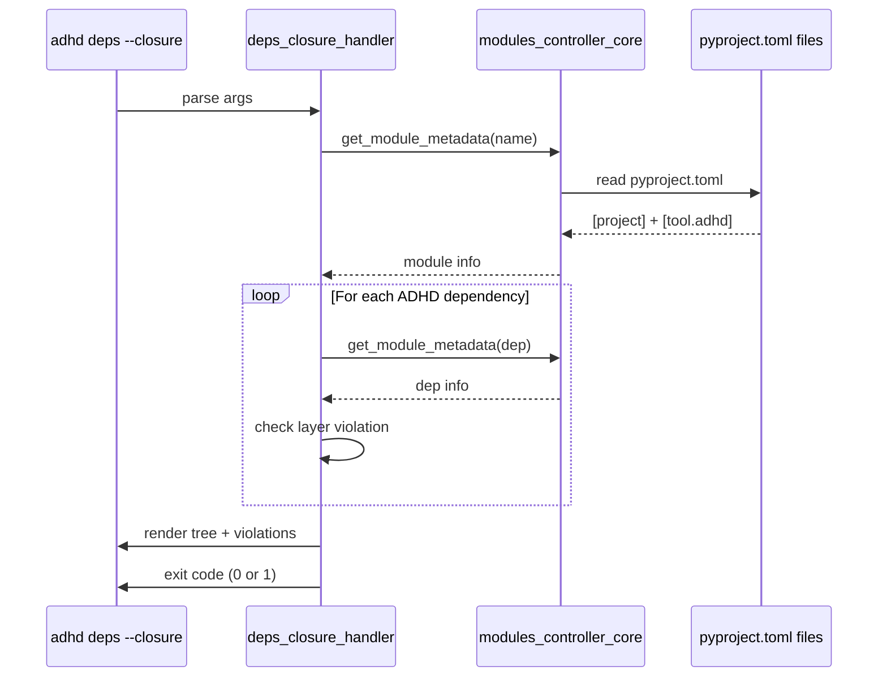

# 05 - Feature: Dependency Closure Tool ⏳ TODO

> Part of [Layer Taxonomy & Production Readiness Blueprint](./00_index.md)
>
> **Status:** ⏳ **REMAINING WORK** — This is the only feature left to implement in this blueprint

---

## 📖 The Story

### 😤 The Pain

```
Current Reality:
┌───────────────────────────────────────────────────────────────────┐
│  Developer classifies module as [runtime]                         │
│       ↓                                                           │
│  But module depends on questionary_core (dev-only)                │
│       ↓                                                           │
│  💥 PROD CRASH: Missing dependency at runtime                     │
│                                                                   │
│  Because: No tool to detect cross-layer violations                │
└───────────────────────────────────────────────────────────────────┘
```

| Who Hurts | Pain Level | Frequency |
|-----------|------------|-----------|
| Production apps | 🔥🔥🔥 High | At deploy time |
| Developers | 🔥🔥 Medium | When classifying |

### ✨ The Vision

```
After This Feature:
┌───────────────────────────────────────────────────────────────────┐
│  $ adhd deps --closure session_manager                            │
│                                                                   │
│  ✅ Dependency Closure Analysis                                   │
│  ──────────────────────────────                                   │
│  Module: session_manager [runtime]                                │
│  Dependencies:                                                    │
│    └── config_manager [foundation] ✅                             │
│    └── logger_util [foundation] ✅                                │
│    └── auth_manager [runtime] ✅                                  │
│                                                                   │
│  ❌ VIOLATION: module_creator_core [dev] cannot be                │
│               dependency of runtime module                        │
└───────────────────────────────────────────────────────────────────┘
```

### 🎯 One-Liner

> `adhd deps --closure <module>` shows the full dependency tree and fails fast on cross-layer violations (runtime → dev).

### 📊 Impact

| Metric | Before | After |
|--------|--------|-------|
| Cross-layer violation detection | ❌ None | ✅ CLI command |
| Time to find violation | ❌ Prod crash | ✅ Before deploy |
| Dependency visibility | Scattered | Single command |

---

## 🔧 The Spec

---

## 🎯 Overview

A validation tool that walks the transitive dependency graph of a module and validates that no runtime module depends on dev-only modules. Uses the `layer` field from `[tool.adhd]` in pyproject.toml and dependencies from `[project]`.

**Priority:** P1 (Same phase as layer taxonomy)
**Difficulty:** `[KNOWN]`

---

## 📚 Prior Art

### Existing Solutions

| Solution | Type | Relevance | Status |
|----------|------|-----------|--------|
| npm ls | Dep tree viewer | High | 🔧 Adapt output format |
| pipdeptree | Python dep tree | High | ✅ Now compatible (pyproject.toml) |
| cargo tree | Rust dep tree | Low | ❌ Too verbose |

### Usage Decision

**Using:** Custom implementation adapting npm ls pattern  
**How:** Walk pyproject.toml dependencies, resolve to modules, check layer  
**Why this over alternatives:** Need ADHD-specific layer validation

---

## 🗺️ System Context



---

## 👥 User Stories

| As a... | I want to... | So that... |
|---------|--------------|------------|
| Developer | See all dependencies of a module | I understand what it pulls in |
| Developer | Get warned about cross-layer deps | I fix violations before prod |
| CI pipeline | Fail on violations | Bad classifications don't ship |

---

## ✅ Acceptance Criteria

| # | Criterion | Verification |
|---|-----------|--------------|
| 1 | `adhd deps --closure <module>` prints tree | Run command, see output |
| 2 | Transitive deps shown | Module A → B → C all appear |
| 3 | Layer labels shown for each dep | Each line shows [foundation]/[runtime]/[dev] |
| 4 | Cross-layer violation detected | runtime → dev = error message |
| 5 | Exit code 1 on violation | `echo $?` returns 1 |
| 6 | Exit code 0 on clean | `echo $?` returns 0 |
| 7 | Missing module = helpful error | Unknown module name → error message |

---

## 🛠️ Technical Notes

### CLI Interface

```bash
# Show closure for a single module
adhd deps --closure <module_name>

# Optional: Show closures for all modules
adhd deps --closure-all

# Optional: Check without tree output (CI-friendly)
adhd deps --check <module_name>
```

### CLI Filter System

The `adhd list` and `adhd deps` commands support a powerful filter system for selecting modules.

> **Full Specification:** See [CLI Filter System](./06_feature_cli_migration.md) for complete documentation including layer inheritance, workspace integration, and tab completion.

#### Filter Flags (POSIX-style)

| Flag | Name | Logic | Description |
|------|------|-------|-------------|
| `-i <tag>` | Include/OR | OR between multiple `-i` | Candidates pool |
| `-r <tag>` | Require/AND | AND between multiple `-r` | Must have |
| `-x <tag>` | Exclude/NOT | NOT applied to each `-x` | Must not have |

#### Layer Inheritance (Special Case)

The `-i` flag has **inheritance semantics** when filtering by layer:

```
Layer Hierarchy:
  dev → includes runtime → includes foundation

┌──────────────────────────────────────────────────────────────────┐
│  -i foundation   = foundation ONLY                               │
│  -i runtime      = runtime + foundation                          │
│  -i dev          = dev + runtime + foundation (ALL)              │
└──────────────────────────────────────────────────────────────────┘
```

| Filter | Includes | Example Use Case |
|--------|----------|------------------|
| `-i foundation` | foundation only | Validate core dependencies |
| `-i runtime` | runtime + foundation | Production closure check |
| `-i dev` | dev + runtime + foundation | Full project analysis |

**Note:** This inheritance applies ONLY to the `layer` filter with `-i` (include). Other filters and `-r`/`-x` use exact matching.

#### Logic Formula

```
FINAL = (i1 OR i2 OR ...) AND (r1) AND (r2) AND ... AND (NOT x1) AND (NOT x2) AND ...
```

**Edge Cases:**
- No `-i` flags = include ALL (default behavior)
- Support comma separation: `-i a,b` equals `-i a -i b`

#### Filter Sources

Filters can match against these metadata fields:

| Source | Values | Location |
|--------|--------|----------|
| `type` | manager, util, core, plugin, mcp | `[tool.adhd].type` |
| `layer` | foundation, runtime, dev | `[tool.adhd].layer` |
| `feature` | auth, config, etc. | `[tool.adhd].feature` |
| `tags` | any custom tags | `[tool.adhd].tags` |

**Dynamic States** (not in pyproject.toml, computed at runtime):

| State | Description |
|-------|-------------|
| `dirty` | Has uncommitted changes (git status) |
| `unpushed` | Has commits not pushed to remote |
| `modified` | Either dirty OR unpushed |

#### Filter Examples

```bash
# All managers OR utils that are runtime layer
adhd list -i manager -i util -r runtime

# All modules except config_manager
adhd list -x config_manager

# All dirty modules (uncommitted changes)
adhd list -i dirty

# Foundation modules that are clean (not dirty)
adhd list -r foundation -x dirty

# All auth-feature modules
adhd list -r auth

# Managers that are dirty and have unpushed commits
adhd list -r manager -r dirty -r unpushed

# Closure check for all runtime modules
adhd deps --closure-all -r runtime
```

### Output Format

```
Module: session_manager [runtime]
Dependencies:
├── config_manager [foundation] ✅
├── logger_util [foundation] ✅  
├── auth_manager [runtime] ✅
│   ├── secret_manager [runtime] ✅
│   └── config_manager [foundation] ✅ (already listed)
└── questionary_core [dev] ❌ VIOLATION

❌ Cross-layer violation detected:
   session_manager [runtime] → questionary_core [dev]
   
   Runtime modules cannot depend on dev-only modules.
   Either:
   1. Remove the dependency
   2. Change session_manager to lifecycle: [dev]
   3. Change questionary_core to lifecycle: [runtime]
```

### Algorithm

```python
def closure_check(module_name: str) -> tuple[Tree, list[Violation]]:
    """
    1. Load module pyproject.toml
    2. Get layer from [tool.adhd].layer (default: runtime)
    3. Get deps from [project].dependencies
    4. Recursively resolve ADHD deps (match package name to module)
    5. For each dep, get its layer
    6. If module is [runtime] and dep is [dev]: VIOLATION
    7. Return (tree, violations)
    """
```

### Violation Rules

| Module Layer | Dep Layer | Result |
|--------------|-----------|--------|
| foundation | foundation | ✅ OK |
| foundation | runtime | ❌ Violation (foundation shouldn't need runtime) |
| foundation | dev | ❌ Violation |
| runtime | foundation | ✅ OK |
| runtime | runtime | ✅ OK |
| runtime | dev | ❌ Violation |
| dev | foundation | ✅ OK |
| dev | runtime | ✅ OK |
| dev | dev | ✅ OK |

---

## ⚠️ Edge Cases

| Scenario | Handling |
|----------|----------|
| Circular dependency | Detect and report as separate error |
| Missing module (not cloned) | Error: "Module not found, run adhd bootstrap first" |
| Module without layer field | Treat as `runtime` (default) |
| Self-referential dep | Ignore, don't double-count |
| Third-party PyPI dep | Skip (not an ADHD module) |

---

## 📊 Data Flow



---

## ❌ Out of Scope

| Excluded | Rationale |
|----------|-----------|
| Auto-fix violations | User must decide: remove dep or change layer |
| Suggest layer | Too opinionated for P1 |
| Graphical output | Text tree is sufficient |
| Per-environment closures | Single prod-focused check is enough |
| Third-party dep analysis | Only ADHD modules are checked |

---

## 🔗 Dependencies

| Dependency | Type | Status |
|------------|------|--------|
| P0: uv migration | Internal | Prerequisite |
| modules_controller_core | Internal | Needs pyproject.toml reader |
| adhd_framework.py CLI | Internal | Add subcommand |

---

## ❓ Open Questions

| Question | Status | Tentative Answer |
|----------|--------|------------------|
| Show all modules or require name? | ✅ Resolved | Require name, add --closure-all later |
| Cache module metadata? | ⏳ Open | For P1, re-read each time |
| Output format (JSON for CI)? | ⏳ Defer to P2 | Text only in P1 |

---

## 🖼️ Related Assets

N/A — CLI tool, no mockups needed.

---

## ✅ Feature Validation Checklist

### Narrative Completeness
- [x] The Story section clearly states user problem and value
- [x] Intent is unambiguous to a non-technical reader
- [x] Scope is explicitly bounded

### Technical Completeness
- [x] CLI interface specified
- [x] Algorithm described
- [x] Violation rules enumerated
- [x] Edge cases covered
- [x] Acceptance criteria are testable

### Traceability
- [x] Links to architecture doc
- [x] Dependencies listed

---

**← Back to:** [Feature: Layer Taxonomy](./04_feature_layer_taxonomy.md) | **Next:** [Feature: CLI Migration](./06_feature_cli_migration.md)
