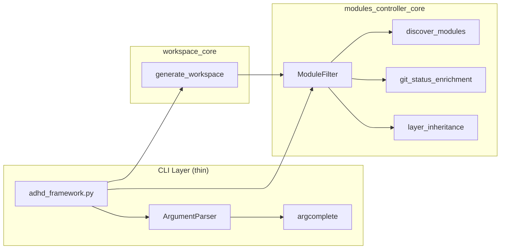

# 06 - Feature: CLI Filter System ⏳ TODO

> Part of [Layer Taxonomy & Production Readiness Blueprint](./00_index.md)
>
> **Status:** ⏳ **TODO** — Filter system design complete, implementation pending
>
> **Note:** CLI entry point migration is ✅ COMPLETE. See [Framework Modernization](../framework_modernization/07_feature_cli_entry_points.md) for those details.

---

## 📖 The Story

### 😤 The Pain

```
Current Reality:
┌───────────────────────────────────────────────────────────────────┐
│  $ adhd list                                                      │
│  # Shows ALL modules, no way to filter                            │
│                                                                   │
│  $ adhd workspace generate                                        │
│  # Uses STATEFUL show_in_workspace field in each pyproject.toml   │
│  # Can't generate workspace for just runtime modules              │
│                                                                   │
│  💥 No filtering capability                                       │
│  💥 Workspace generation is stateful (hard to change)             │
│  💥 No discovery of available filter values                       │
│  💥 No tab completion for module names                            │
└───────────────────────────────────────────────────────────────────┘
```

| Who Hurts | Pain Level | Frequency |
|-----------|------------|----------|
| All developers | 🔥🔥🔥 High | Every `adhd list` invocation |
| DevOps | 🔥🔥 Medium | CI scripts filtering modules |
| New contributors | 🔥🔥 Medium | Discovering module taxonomy |

### ✨ The Vision

```
After This Feature:
┌───────────────────────────────────────────────────────────────────┐
│  $ adhd list -i runtime                                           │
│  # Shows runtime + foundation modules (layer inheritance!)        │
│                                                                   │
│  $ adhd list -r manager -x dirty                                  │
│  # All managers that are NOT dirty                                │
│                                                                   │
│  $ adhd workspace generate -i runtime                             │
│  # Generates workspace with only runtime modules (STATELESS!)     │
│                                                                   │
│  $ adhd list --show-filters                                       │
│  # Discover all available filter values                           │
│                                                                   │
│  $ adhd list <TAB><TAB>                                           │
│  # Tab completion shows module names and filter values            │
│                                                                   │
│  ✅ Powerful filter system with -i/-r/-x flags                    │
│  ✅ Layer inheritance (dev includes runtime includes foundation)  │
│  ✅ Workspace generation is STATELESS (filter at query time)      │
│  ✅ Tab completion for discoverability                            │
└───────────────────────────────────────────────────────────────────┘
```

### 🎯 One-Liner

> A unified filter system (`-i`/`-r`/`-x` flags) for all CLI commands, with layer inheritance and stateless workspace generation.

### 📊 Impact

| Metric | Before | After |
|--------|--------|-------|
| Module filtering | ❌ None | ✅ Full filter DSL |
| Layer filtering | ❌ Exact match only | ✅ Inheritance (`-i runtime` includes foundation) |
| Workspace config | ❌ Stateful (`show_in_workspace` field) | ✅ Stateless (filter at query time) |
| Filter discovery | ❌ Read docs | ✅ `--show-filters` command |
| Tab completion | ❌ None | ✅ Module names + filter values |

---

## 🔧 The Spec

---

## 🎯 Overview

Implement a unified filter system for module selection across all CLI commands (`adhd list`, `adhd deps`, `adhd workspace`). The filter system uses `-i`/`-r`/`-x` flags with special layer inheritance semantics.

**Priority:** P1 (alongside Dependency Closure Tool)  
**Difficulty:** `[KNOWN]`

---

## 🏛️ Layer Inheritance (Special Case)

The layer filter has **inheritance semantics** that reflect the dependency hierarchy:

```
Layer Hierarchy:
  dev → includes runtime → includes foundation

┌──────────────────────────────────────────────────────────────────┐
│  -i foundation   = foundation ONLY                               │
│  -i runtime      = runtime + foundation                          │
│  -i dev          = dev + runtime + foundation (ALL)              │
└──────────────────────────────────────────────────────────────────┘
```

| Filter | Includes | Use Case |
|--------|----------|----------|
| `-i foundation` | foundation only | Core infrastructure |
| `-i runtime` | runtime + foundation | Production modules |
| `-i dev` | dev + runtime + foundation | All modules |

**Rationale:** Dev tools may need runtime modules. Runtime modules may need foundation. This reflects real dependency relationships.

### Examples

```bash
# Gets ALL modules (dev includes everything below it)
adhd list -i dev

# Gets runtime + foundation modules (excludes dev-only)
adhd list -i runtime

# Gets only foundation modules
adhd list -i foundation

# Foundation managers only
adhd list -i foundation -r manager
```

**Note:** This inheritance applies ONLY to the `layer` filter with `-i` (include). Other filters and `-r`/`-x` flags use exact matching.

---

## 🎚️ Filter Flags (POSIX-style)

| Flag | Name | Logic | Description |
|------|------|-------|-------------|
| `-i <tag>` | Include/OR | OR between multiple `-i` | Adds to candidates pool |
| `-r <tag>` | Require/AND | AND between multiple `-r` | Must have this attribute |
| `-x <tag>` | Exclude/NOT | NOT applied | Must NOT have this attribute |

### Logic Formula

```
FINAL = (i1 OR i2 OR ...) AND r1 AND r2 AND ... AND (NOT x1) AND (NOT x2) AND ...
```

**Default behavior:** No `-i` flags = include ALL modules.

**Comma shorthand:** `-i a,b` is equivalent to `-i a -i b`.

---

## 📊 Available Filters

Use `adhd list --show-filters` to see all filterable values:

```bash
$ adhd list --show-filters

Available Filters:
──────────────────
Types:    manager, util, core, plugin, mcp
Layers:   foundation, runtime, dev  (note: -i has inheritance)
Features: auth, config, media, ...  (project-defined)
Tags:     (none defined)

Dynamic States:
───────────────
dirty     - Uncommitted git changes
unpushed  - Commits not pushed to remote
modified  - Either dirty OR unpushed
```

### Filter Sources

| Category | Source | Example Values |
|----------|--------|----------------|
| `type` | `[tool.adhd].type` | manager, util, core, plugin, mcp |
| `layer` | `[tool.adhd].layer` | foundation, runtime, dev |
| `feature` | `[tool.adhd].feature` | auth, config, media (project-defined) |
| `tags` | `[tool.adhd].tags` | Any custom tags |
| (dynamic) | git status | dirty, unpushed, modified |

### Filter Examples

```bash
# All managers OR utils that are runtime layer
adhd list -i manager -i util -r runtime

# All modules except config_manager
adhd list -x config_manager

# All dirty modules (uncommitted changes)
adhd list -i dirty

# Foundation modules that are clean (not dirty)
adhd list -r foundation -x dirty

# All auth-feature modules
adhd list -r auth

# Managers that are dirty and have unpushed commits
adhd list -r manager -r dirty -r unpushed

# Closure check for all runtime modules
adhd deps --closure-all -r runtime
```

---

## 🖥️ Workspace CLI Integration

### Deprecation: `show_in_workspace` Field

```toml
# ❌ OLD WAY (DEPRECATED) - Stateful, stored in each module's pyproject.toml
[tool.adhd]
show_in_workspace = true  # ← REMOVED FROM SCHEMA
```

```bash
# ✅ NEW WAY - Stateless, filter at query time
adhd workspace generate -i runtime        # Only runtime modules in workspace
adhd workspace generate -x adhd_mcp       # Exclude specific module
adhd workspace generate -r foundation     # Only foundation in workspace
adhd workspace generate                   # All modules (default)
```

### Benefits of Stateless Approach

| Aspect | Stateful (old) | Stateless (new) |
|--------|----------------|------------------|
| Configuration | Each module's pyproject.toml | CLI flags |
| Flexibility | Fixed per-module | Per-use-case |
| Mental model | Different from `adhd list` | Same as `adhd list` |
| Maintenance | Update N files to change | One command |

---

## ⌨️ Tab Completion

### Research Findings

| Library | Type | Verdict | Notes |
|---------|------|---------|-------|
| `argcomplete` | Python/argparse | **✅ RECOMMENDED** | Native argparse support, dynamic completers |
| `shtab` | Shell generator | 🤔 Consider | Generates static completion scripts |
| Click/Typer built-in | CLI framework | 📋 Future | Only if we migrate CLI framework |
| uv completion | Tool | ❌ N/A | uv's completion doesn't expose our commands |

### Recommended Approach: `argcomplete`

**Why argcomplete:**
- Native argparse integration (no framework change)
- Dynamic completers for module names
- Lazy loading (doesn't slow down CLI startup)
- Battle-tested (used by Azure CLI, gcloud, etc.)

**Installation:**
```bash
# User installs globally (one-time)
pip install argcomplete
activate-global-python-argcomplete  # Adds to .bashrc/.zshrc

# OR: Per-shell activation
eval "$(register-python-argcomplete adhd)"
```

**Implementation Pattern:**
```python
# In CLI module
import argcomplete

def module_name_completer(prefix, **kwargs):
    """Dynamic completer for module names."""
    from modules_controller_core import discover_modules
    modules = discover_modules()
    return [m.name for m in modules if m.name.startswith(prefix)]

def filter_value_completer(prefix, **kwargs):
    """Dynamic completer for filter values."""
    values = ['foundation', 'runtime', 'dev',  # layers
              'manager', 'util', 'core',       # types
              'dirty', 'unpushed', 'modified'] # dynamic
    return [v for v in values if v.startswith(prefix)]

parser.add_argument('module').completer = module_name_completer
parser.add_argument('-i', '--include').completer = filter_value_completer

argcomplete.autocomplete(parser)
```

**New Command for Shell Setup:**
```bash
# User runs once to enable completion
adhd completion bash >> ~/.bashrc
adhd completion zsh >> ~/.zshrc
adhd completion fish >> ~/.config/fish/completions/adhd.fish
```

### Priority

| Feature | Priority | Rationale |
|---------|----------|----------|
| Filter flags (`-i/-r/-x`) | P1 | Core functionality |
| `--show-filters` | P1 | Discoverability |
| Tab completion | P2 | Nice-to-have, not blocking |

---

## 🏗️ Code Location Architecture

The filter logic should NOT live in `adhd_framework.py`. That file is a thin CLI wrapper.

| Logic | Location | Rationale |
|-------|----------|----------|
| Module discovery/listing | `modules_controller_core` | Already handles module metadata |
| Filter parsing (`-i`, `-r`, `-x`) | `modules_controller_core` | Part of module querying |
| `ModuleFilter` class | `modules_controller_core` | Encapsulates filter logic |
| Layer inheritance logic | `modules_controller_core` | Layer is module metadata |
| Workspace generation | `workspace_core` | Already handles workspace files |
| Git state detection (dirty/unpushed) | `modules_controller_core` | Module metadata enrichment |
| CLI entry point (thin wrapper) | `adhd_framework.py` | Just calls core functions |
| Tab completion setup | `adhd_framework.py` | argcomplete.autocomplete(parser) |

**Principle:** `adhd_framework.py` should be a thin CLI wrapper that delegates to core modules.

### Component Interaction



---

## 👥 User Stories

| As a... | I want to... | So that... |
|---------|--------------|------------|
| Developer | Filter modules by type and layer | I see only relevant modules |
| CI pipeline | List only dirty modules | I can run checks on changed code |
| DevOps | Generate workspace for runtime only | Production workspace is minimal |
| New contributor | Discover available filters | I learn the taxonomy quickly |
| Power user | Tab-complete module names | I work faster |

---

## ✅ Acceptance Criteria

| # | Criterion | Verification |
|---|-----------|--------------|
| 1 | `adhd list -i runtime` shows runtime + foundation | Run command, count layers |
| 2 | `adhd list -i foundation` shows foundation only | Verify exclusion of runtime/dev |
| 3 | `adhd list -r manager -x dirty` works | Combine filters |
| 4 | `adhd list --show-filters` prints available values | Check output |
| 5 | `adhd workspace generate -i runtime` works | Verify workspace file |
| 6 | Tab completion shows module names | Press TAB after command |
| 7 | Layer inheritance is documented | README/help text |

---

## ⚠️ Edge Cases

| Scenario | Handling |
|----------|----------|
| No modules match filter | Empty list, exit 0 |
| Invalid filter value | Error: "Unknown filter: X. Run --show-filters" |
| `-i` and `-r` with same value | Redundant but valid, no error |
| Module has no layer field | Treat as `runtime` (default) |
| Git not available | Dynamic states (dirty/unpushed) unavailable, warn |

---

## ❌ Out of Scope

| Excluded | Rationale |
|----------|-----------|
| Saved filter presets | YAGNI for now |
| Filter by dependency | Too complex, use closure tool |
| Regex in filter values | Keep it simple |
| GUI for filters | CLI-first |

---

## 🔗 Dependencies

| Dependency | Type | Status |
|------------|------|--------|
| modules_controller_core | Internal | Must add filter support |
| workspace_core | Internal | Must accept filter args |
| argcomplete | External | Optional, for tab completion |

---

## ❓ Open Questions

| Question | Status | Tentative Answer |
|----------|--------|------------------|
| Support `--json` output? | ⏳ Open | Defer to P2 |
| Filter by version range? | ✅ Resolved | No, out of scope |
| How to handle `show_in_workspace` migration? | ✅ Resolved | Remove field, workspace uses filters |

---

## 🖼️ Related Assets

N/A — CLI feature, no mockups needed.

---

## ✅ Feature Validation Checklist

### Narrative Completeness
- [x] The Story section clearly states user problem and value
- [x] Intent is unambiguous to a non-technical reader
- [x] Scope is explicitly bounded

### Technical Completeness
- [x] Filter flags specified
- [x] Layer inheritance documented
- [x] Code location architecture defined
- [x] Tab completion research complete
- [x] Edge cases enumerated

### Traceability
- [x] Links to architecture doc
- [x] Dependencies listed
- [x] Implementation tasks in 80_implementation.md

---

**← Back to:** [Feature: Dependency Closure Tool](./05_feature_dependency_closure_tool.md) | **Next:** [Feature: init.yaml Deprecation](./07_feature_init_yaml_deprecation.md)
