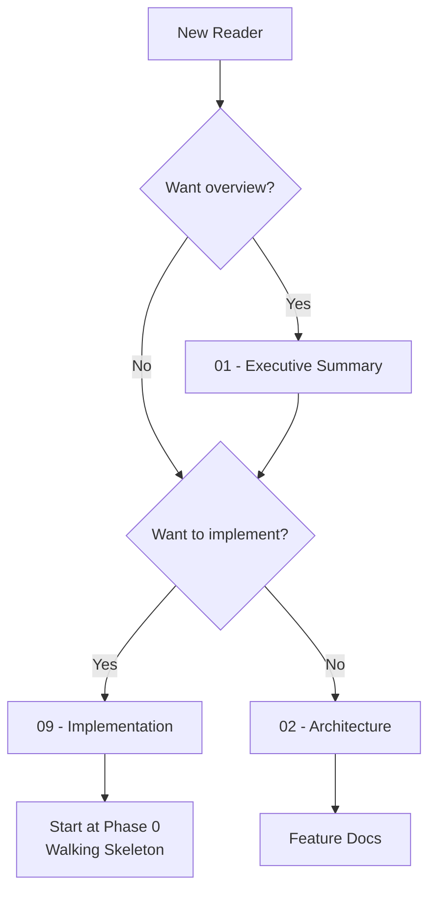

# 🎯 StockDataManager: Project Blueprint

> *Unified stock data pipeline: download, preprocess, visualize*

**Document Type:** Technical Design Document / Project Blueprint  
**Version:** 1.0  
**Created:** 2025-12-22  
**Status:** 📐 Planning

---

## 📐 Planning Standards

This blueprint follows **HyperDream phasing rules**:

| Principle | Meaning |
|-----------|---------|
| **Walking Skeleton First** | Phase 0 proves plumbing works with hardcoded stubs |
| **Difficulty Honesty** | Each item labeled `[KNOWN]`, `[EXPERIMENTAL]`, or `[RESEARCH]` |
| **Research ≠ Foundation** | `[RESEARCH]` items never in Phase 0 |
| **Incremental Value** | Each phase delivers usable functionality |

---

## 📑 Document Index

| # | Document | Description |
|---|----------|-------------|
| 00 | [Index](./00_index.md) | This file — overview and navigation |
| 01 | [Executive Summary](./01_executive_summary.md) | Goals, non-goals, success metrics |
| 02 | [Architecture](./02_architecture.md) | High-level system design |
| 03 | [Feature: Data Download](./03_feature_download.md) | Multi-source data acquisition |
| 04 | [Feature: Preprocessing](./04_feature_preprocessing.md) | Data cleaning and normalization |
| 05 | [Feature: Visualization](./05_feature_visualization.md) | Web-based data explorer |
| 09 | [Implementation](./09_implementation.md) | Phase roadmap and task tracking |
| 10 | [References](./10_references.md) | External links and documentation |

---

## 💭 Vision Statement

> *"A single command to fetch, clean, and visualize any stock data. No more juggling APIs, fighting data formats, or building one-off scripts. Just clean data, ready when you need it."*

---

## 🔗 Quick Links

- **Start Here:** [Executive Summary](./01_executive_summary.md)
- **Technical Deep Dive:** [Architecture](./02_architecture.md)
- **Implementation:** [Roadmap](./09_implementation.md)

---

## 🏁 Where to Start

---

**Last Updated:** 2025-12-22

---

**← Back to:** [Templates Index](../00_index.md)
