# 🎯 UV Migration Blueprint

> *Transform ADHD modules into proper Python packages via uv workspaces—eliminating path hacks, enabling standard imports, and unlocking lean production installs.*

**Document Type:** Technical Design Document / Project Blueprint  
**Version:** 1.0  
**Created:** 2026-02-01  
**Extracted From:** `production_time_module_cut` blueprint  
**Status:** 📐 Planning

---

## 📊 Progress Overview

| Phase | Status | Goal |
|-------|--------|------|
| P0: Core Migration | ⏳ [TODO] | Per-module pyproject.toml, root workspace, **eliminate path hacks** |
| P1: UV Migrator Tool | ⏳ [TODO] | Automated `adhd migrate` command for batch conversion |

### Status Legend

| Icon | Meaning |
|------|---------|
| ⏳ [TODO] | Not started |
| 🔄 [WIP] | In progress |
| ✅ [DONE] | Complete |
| 🚧 [BLOCKED:reason] | Stuck |
| 🚫 [CUT] | Removed from scope |

---

## 📐 Planning Standards

This blueprint follows **HyperDream phasing rules**:

| Principle | Meaning |
|-----------|---------|
| **Walking Skeleton First** | P0 proves plumbing works with a few modules first |
| **Difficulty Honesty** | Each item labeled `[KNOWN]`, `[EXPERIMENTAL]`, or `[RESEARCH]` |
| **Research ≠ Foundation** | `[RESEARCH]` items never in P0 |
| **No Side-by-Side Mess** | Transform ALL modules per phase, then remove old code |
| **Incremental Value** | Each phase delivers usable functionality |

---

## 📑 Document Index

| # | Document | Purpose |
|---|----------|---------|
| 00 | [Index](./00_index.md) | **Navigation hub** — You are here |
| 01 | [Executive Summary](./01_executive_summary.md) | **Vision & scope** — The four problems, transformation strategy |
| 02 | [Architecture](./02_architecture.md) | **System design** — pyproject.toml structure, import changes |
| 03 | [Feature: Core Migration](./03_feature_core_migration.md) | **P0 Feature** — uv workspace + path hack elimination |
| 04 | [Feature: UV Migrator Tool](./04_feature_uv_migrator_tool.md) | **P1 Feature** — Automated migration CLI |
| 05 | [UV Primer](./05_uv_primer.md) | **Educational** — Beginner's guide to uv concepts and commands |
| 06 | [Impact Analysis](./06_impact_analysis.md) | **Analysis** — What gets eliminated, reduced, or stays unchanged |
| 80 | [Implementation](./80_implementation.md) | **Task tracking** — Start/track work here |

---

## 💭 Vision Statement

> *"ADHD modules become real Python packages. The path hack nightmare (`sys.path.insert` in every file) dies. Imports work naturally (`from logger_util import Logger`). All this via standard tooling (`uv sync`), not custom magic."*

---

## 🔑 The Four Problems We're Solving

| # | Problem | Pain | Solution |
|---|---------|------|----------|
| 1 | **Path Hack** | 100+ files with `sys.path.insert()`, can't run standalone | uv editable installs = real packages |
| 2 | **Custom Deps** | `requirements:` with GitHub URLs, not pip-compatible | pyproject.toml dependencies |
| 3 | **Bootstrap Magic** | Auto-clone on missing module, unpredictable | Explicit `uv sync`, no magic |
| 4 | **No Layer Selection** | Dev modules load in prod | `uv sync` vs `uv sync --extra dev` |

---

## 🧭 How to Navigate This Blueprint

```mermaid
flowchart TD
    START[📚 You are here] --> Q1{What do you need?}
    
    Q1 -->|"Understand the project"| PATH_UNDERSTAND
    Q1 -->|"Implement something"| PATH_IMPL
    Q1 -->|"Review/approve"| PATH_REVIEW
    
    PATH_UNDERSTAND[🎯 Understanding Path]
    PATH_UNDERSTAND --> ES[01 - Executive Summary]
    ES --> ARCH[02 - Architecture]
    ARCH --> FEAT[Feature Docs 03-04]
    
    PATH_IMPL[🔧 Implementation Path]
    PATH_IMPL --> IMPL[80 - Implementation]
    IMPL --> F03[03 - Core Migration]
    
    PATH_REVIEW[👀 Review Path]
    PATH_REVIEW --> ES2[01 - Executive Summary]
    ES2 --> IMPL2[80 - Implementation]
```

---

## 🔗 Relationship to Other Blueprints

This blueprint was **extracted from** the larger `production_time_module_cut` blueprint to allow focused execution. Related features that remain in the original blueprint:

| Feature | Blueprint | Dependency |
|---------|-----------|------------|
| Layer Taxonomy | `production_time_module_cut` | Requires UV migration first |
| Dependency Closure Tool | `production_time_module_cut` | Requires layer taxonomy |
| CLI Migration | `production_time_module_cut` | Requires UV migration first |
| init.yaml Deprecation | `production_time_module_cut` | Final cleanup phase |

**This blueprint is a prerequisite** for all the above features.

---

**Next:** [Executive Summary](./01_executive_summary.md)
