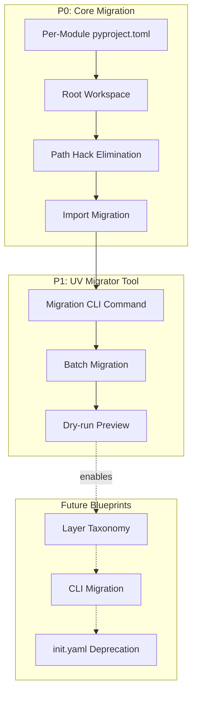

# 01 - Executive Summary

> Part of [UV Migration Blueprint](./00_index.md)

---

## 📖 The Story

### 😤 The Pain

```
Current Reality: The Path Hack Nightmare
┌─────────────────────────────────────────────────────────────────┐
│  1. THE PATH HACK (copy-pasted 100+ times)                      │
│  ┌──────────────────────────────────────────────────────────┐   │
│  │  # Every. Single. File.                                  │   │
│  │  current_dir = os.path.dirname(os.path.abspath(__file__))│   │
│  │  project_root = os.getcwd()                              │   │
│  │  sys.path.insert(0, project_root)                        │   │
│  └──────────────────────────────────────────────────────────┘   │
│  💥 Modules can't run standalone                                │
│  💥 os.getcwd() breaks if you run from different directory      │
│  💥 Boilerplate copy-pasted 100+ times across codebase          │
│                                                                 │
│  2. CUSTOM DEPENDENCY DSL                                       │
│  ┌──────────────────────────────────────────────────────────┐   │
│  │  # init.yaml                                             │   │
│  │  requirements:                                           │   │
│  │    - https://github.com/org/Logger-Util.git              │   │
│  │    - https://github.com/org/Config-Manager.git           │   │
│  └──────────────────────────────────────────────────────────┘   │
│  💥 Not pip/uv compatible                                       │
│  💥 adhd_framework.py parses + auto-clones                      │
│  💥 Can't use standard Python tooling                           │
│                                                                 │
│  3. BOOTSTRAP MAGIC                                             │
│  adhd_framework.py: "Missing module? I'll clone it for you!"    │
│  💥 Unpredictable behavior                                      │
│  💥 New contributor: "wait, it's downloading... what?"          │
└─────────────────────────────────────────────────────────────────┘
```

| Who Hurts | Pain Level | Frequency | Root Cause |
|-----------|------------|-----------|------------|
| Module developers | 🔥🔥🔥 High | Every file | Path hack pollution |
| New contributors | 🔥🔥🔥 High | Onboarding | Bootstrap magic, non-standard tooling |
| Anyone debugging | 🔥🔥 Medium | Daily | Path issues when running from wrong dir |
| CI/CD pipelines | 🔥🔥 Medium | Every build | Non-standard setup |

### ✨ The Vision

```
After UV Migration:
┌─────────────────────────────────────────────────────────────────┐
│  1. NO MORE PATH HACKS                                          │
│  ┌──────────────────────────────────────────────────────────┐   │
│  │  # Just normal Python imports                            │   │
│  │  from exceptions_core import ADHDError                   │   │
│  │  from logger_util import Logger                          │   │
│  └──────────────────────────────────────────────────────────┘   │
│  ✅ uv editable installs = modules are importable as packages   │
│  ✅ Run any file from any directory                             │
│                                                                 │
│  2. STANDARD DEPENDENCIES                                       │
│  ┌──────────────────────────────────────────────────────────┐   │
│  │  # managers/session_manager/pyproject.toml               │   │
│  │  dependencies = ["logger-util", "config-manager"]        │   │
│  └──────────────────────────────────────────────────────────┘   │
│  ✅ Standard pip/uv format                                      │
│  ✅ `uv sync` and you're done                                   │
│                                                                 │
│  3. EXPLICIT IS BETTER THAN IMPLICIT                            │
│  ✅ No auto-clone magic                                         │
│  ✅ Missing module = clear error, not silent download           │
└─────────────────────────────────────────────────────────────────┘
```

### 🎯 One-Liner

> Migrate ADHD modules to uv workspaces so they become real Python packages—eliminating path hacks and enabling standard imports.

---

## 🌟 TL;DR

ADHD modules become proper Python packages managed by **uv workspaces**. Each module gets a `pyproject.toml` for dependencies/versioning. Editable installs eliminate the path hack. Standard tooling (`uv sync`) replaces custom bootstrap magic.

---

## 🔍 Prior Art & Existing Solutions

| Library/Tool | What It Does | Decision | License | Rationale |
|--------------|--------------|----------|---------|-----------|
| [uv workspaces](https://docs.astral.sh/uv/concepts/workspaces/) | Monorepo package management | **ADOPT** | MIT | Fast, modern, editable installs eliminate path hack |
| Python editable installs | Development mode packages | **ADOPT** | N/A | Standard mechanism, key to path hack fix |
| pyproject.toml (PEP 621) | Package metadata spec | **ADOPT** | N/A | Standard Python metadata format |
| [hatchling](https://hatch.pypa.io/latest/) | Build backend | **ADOPT** | MIT | Simple, fast, no complex config needed |
| Cargo workspaces | Multi-crate package management | REFERENCE | N/A | Inspiration for monorepo structure |

---

## 🔄 Transformation Strategy

### The Anti-Pattern: Side-by-Side Mess

```
❌ WRONG: Supporting both systems indefinitely
┌────────────────────────────────────────────────────────────────┐
│  if os.path.exists("pyproject.toml"):                          │
│      # New way                                                 │
│  else:                                                         │
│      # Old way via init.yaml                                   │
│                                                                │
│  💥 Doubles testing surface                                    │
│  💥 Bug fixes need two implementations                         │
└────────────────────────────────────────────────────────────────┘
```

### The Pattern: Progressive Transformation

```
✅ RIGHT: Each phase FULLY transforms, then we move on
┌────────────────────────────────────────────────────────────────┐
│  P0: Core Migration                                            │
│      → Generate pyproject.toml for ALL modules                 │
│      → DELETE all sys.path.insert() hacks                      │
│      → Modules become real packages via editable install       │
│                                                                │
│  P1: UV Migrator Tool                                          │
│      → `adhd migrate <module>` command                         │
│      → Batch migration: `adhd migrate --all`                   │
│      → Dry-run preview before changes                          │
└────────────────────────────────────────────────────────────────┘
```

**Key Principle:** No feature flag that keeps old behavior alive. Transform all, verify all, then remove old code entirely.

---

## ❌ Non-Goals (Explicit Exclusions)

| Non-Goal | Rationale |
|----------|-----------|
| Layer taxonomy (`[tool.adhd].layer`) | Separate blueprint, builds on this foundation |
| CLI migration (`adhd` command) | Separate blueprint |
| init.yaml deprecation | Separate blueprint, final cleanup |
| Publishing modules to PyPI | Local path deps only |
| Poetry migration | uv is simpler and faster |
| Supporting Python <3.10 | uv requires modern Python |

---

## ✅ Features Overview

| Priority | Feature | Difficulty | Description |
|----------|---------|------------|-------------|
| P0 | Per-Module pyproject.toml | `[KNOWN]` | Generate pyproject.toml for each module |
| P0 | Root Workspace pyproject.toml | `[KNOWN]` | Create uv workspace with all modules as members |
| P0 | **Path Hack Elimination** | `[KNOWN]` | **Remove ALL `sys.path.insert()` via editable installs** |
| P0 | Import Path Migration | `[KNOWN]` | Change `from managers.x import` → `from x import` |
| P1 | UV Migrator Core | `[KNOWN]` | `adhd migrate` CLI command for automated conversion |
| P1 | Batch Migration | `[KNOWN]` | `adhd migrate --all` for all modules |
| P1 | Dry-run Preview | `[KNOWN]` | `adhd migrate --dry-run` to preview changes |

---

## 📊 Success Metrics

| Metric | Before | After |
|--------|--------|-------|
| `sys.path.insert()` occurrences | ❌ 100+ files | ✅ 0 |
| Standalone module execution | ❌ Fails from module dir | ✅ `python -m module` works anywhere |
| Import style | ❌ `from managers.x import` | ✅ `from x import` (package imports) |
| Onboarding steps | ❌ Clone, bootstrap, wait | ✅ Clone, `uv sync`, done |
| Dependency format | ❌ GitHub URLs in init.yaml | ✅ Package names in pyproject.toml |

---

## ⚰️ Assumption Graveyard

| Assumption | Risk Level | Validation Strategy |
|------------|------------|---------------------|
| All modules can become proper packages | 🔥 Medium | Test with 3 modules first |
| Editable installs eliminate all path issues | 🔥🔥 High | Validate before removing hacks |
| uv workspace handles 30+ local path deps | 🔥 Low | Test with current module count |
| Import path migration is mechanical | 🔥 Medium | grep + sed, but test thoroughly |

---

## 🔀 Phase Dependency Graph



---

## ✅ Executive Summary Validation Checklist

### Narrative Completeness
- [x] The Story section clearly states user problem and value
- [x] Intent is unambiguous to a non-technical reader
- [x] Scope is explicitly bounded via Non-Goals

### Technical Completeness
- [x] Prior Art section documents existing solutions
- [x] Features have difficulty labels
- [x] No `[RESEARCH]` items in P0

### Linkage
- [x] Features link to detailed feature docs
- [x] TL;DR is ≤3 sentences

---

**← Back to:** [Index](./00_index.md) | **Next:** [Architecture](./02_architecture.md)
