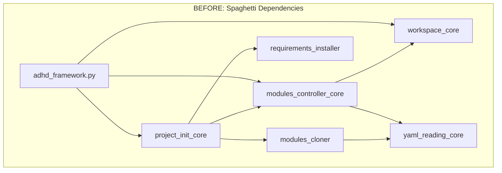
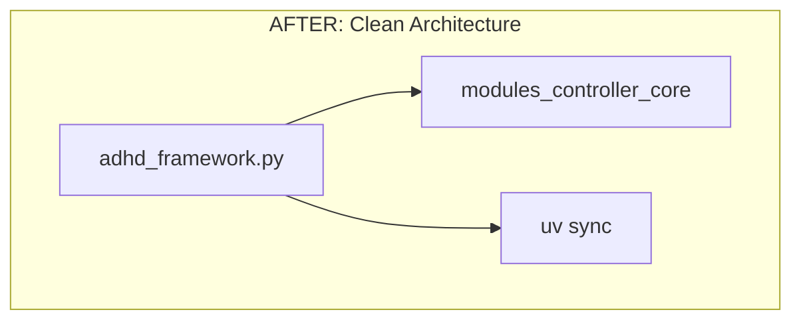

# 📊 UV Migration Impact Analysis

> *What gets simpler, what goes away, and what stays the same.*

**Document Type:** Impact Analysis  
**Version:** 1.0  
**Created:** 2026-02-01  
**Status:** ⏳ [TODO]

---

## 📖 The Story

### 😫 The Pain (Current State)

```
┌─────────────────────────────────────────────────────────────────┐
│  CURRENT: Every module bootstraps itself                        │
├─────────────────────────────────────────────────────────────────┤
│                                                                 │
│  cores/instruction_core/__init__.py:                            │
│    import sys                                                   │
│    project_root = os.getcwd()                                   │
│    if project_root not in sys.path:                             │
│        sys.path.insert(0, project_root)  ← HACK #1              │
│                                                                 │
│  cores/github_api_core/__init__.py:                             │
│    sys.path.insert(0, project_root)      ← HACK #2              │
│                                                                 │
│  managers/config_manager/config_manager.py:                     │
│    sys.path.insert(0, project_root)      ← HACK #3              │
│                                                                 │
│  ... 14 files with sys.path hacks ...    ← HACKS #4-14          │
│                                                                 │
│  adhd_framework.py (474 LOC):                                   │
│    - 120 LOC: Bootstrap logic (clone missing modules)           │
│    - 30 LOC: Tab completion venv setup                          │
│    - 50 LOC: Requirements installation                          │
│    - 274 LOC: Actual CLI commands                               │
│                                                                 │
│  modules_controller_core (576 LOC):                             │
│    - Scans folders for init.yaml                                │
│    - Parses custom requirements format                          │
│    - Generates workspace files                                  │
│                                                                 │
│  project_init_core (582 LOC):                                   │
│    - Clones modules from GitHub URLs                            │
│    - Installs per-module requirements.txt                       │
│    - Runs initializers in dependency order                      │
│                                                                 │
│  14 init.yaml files with:                                       │
│    - Custom requirements: format (GitHub URLs)                  │
│    - Workspace visibility flags                                 │
│    - Module type declarations                                   │
└─────────────────────────────────────────────────────────────────┘
```

### 🌟 The Vision (Post-UV)

```
┌─────────────────────────────────────────────────────────────────┐
│  AFTER: uv handles everything                                   │
├─────────────────────────────────────────────────────────────────┤
│                                                                 │
│  Every module:                                                  │
│    from logger_util import Logger  ← Just works                 │
│    (No sys.path hacks anywhere)                                 │
│                                                                 │
│  adhd_framework.py (~200 LOC):                                  │
│    - 0 LOC: Bootstrap logic (uv sync does this)                 │
│    - 0 LOC: Tab completion venv (uv has its own)                │
│    - 0 LOC: Requirements (uv sync does this)                    │
│    - ~200 LOC: Actual CLI commands (unchanged)                  │
│                                                                 │
│  modules_controller_core (~150 LOC):                            │
│    - Module listing (reads pyproject.toml)                      │
│    - Module refresh/init scripts                                │
│    - NO custom requirements parsing                             │
│    - NO workspace generation (VS Code native)                   │
│                                                                 │
│  project_init_core: ELIMINATED                                  │
│    - `uv sync` replaces all cloning logic                       │
│    - `uv add` replaces dependency management                    │
│                                                                 │
│  init.yaml: ELIMINATED                                          │
│    - pyproject.toml replaces all metadata                       │
│    - Standard [project.dependencies] format                     │
│                                                                 │
│  workspace_core: ELIMINATED                                     │
│    - VS Code multi-root workspace from uv workspace members     │
└─────────────────────────────────────────────────────────────────┘
```

---

## 🔧 The Spec

### 🗑️ Modules to ELIMINATE

These modules exist **solely** to work around Python's import system limitations. With UV workspaces handling imports natively, they become completely redundant.

| Module | Current LOC | Current Purpose | Why Redundant After UV | Replacement |
|--------|-------------|-----------------|------------------------|-------------|
| **project_init_core** | 582 | Clone modules from GitHub URLs, install requirements, run initializers | `uv sync` handles all dependency installation from pyproject.toml | `uv sync` command |
| **modules_cloner.py** | 226 | Parallel cloning of modules from GitHub | UV workspace automatically resolves and installs workspace members | `uv add` for new modules |
| **requirements_installer.py** | 65 | Walk directories installing requirements.txt | UV handles all dependencies through pyproject.toml | `uv sync` |
| **workspace_core** | 122 | Generate VS Code .code-workspace files | VS Code can directly use uv workspace member list OR simple static config | Static workspace file |
| **init.yaml (14 files)** | ~70 | Custom module metadata format | pyproject.toml provides all metadata in standard format | pyproject.toml |

**Total Elimination: ~1,065 LOC + 14 config files**

### ✂️ Modules to REDUCE

These modules have import-related code **mixed with** legitimate business logic. The path hack portions can be removed while preserving useful functionality.

| Module | Current LOC | Functions to Remove | Target LOC | Remaining Purpose |
|--------|-------------|---------------------|------------|-------------------|
| **adhd_framework.py** | 474 | `bootstrap()` (100 LOC), `_clone_and_install()` (30 LOC), `ensure_req_file()` (15 LOC), `configure_venv_tab_completion()` (55 LOC), `BOOTSTRAP_MODULES` dict | ~200 | Pure CLI: commands, argument parsing, command dispatch |
| **modules_controller_core** | 576 | `get_module_init_yaml()` parsing, `update_module_init_yaml()`, custom `requirements:` handling, `generate_workspace_file()` | ~150 | Module listing from pyproject.toml, refresh/init script execution |
| **module_types.py** | 112 | `shows_in_workspace` logic | ~80 | Module type definitions (may still be useful for organization) |
| **yaml_reading_core** | 156 | Remove if ONLY used for init.yaml | 0 OR 156 | Keep if used elsewhere, eliminate if only for init.yaml |

**Per-module __init__.py files (14 files):**
| File | Lines to Remove | Remaining |
|------|-----------------|-----------|
| cores/instruction_core/__init__.py | 6 lines (sys.path hack) | Exports only |
| cores/github_api_core/__init__.py | 4 lines (sys.path hack) | Exports only |
| cores/project_creator_core/__init__.py | 4 lines (sys.path hack) | Exports only |
| cores/module_creator_core/__init__.py | 4 lines (sys.path hack) | Exports only |
| cores/project_init_core/__init__.py | 4 lines (sys.path hack) | **DELETED with module** |
| managers/config_manager/*.py | 6 lines total | Normal code |
| utils/logger_util/__init__.py | 4 lines (sys.path hack) | Exports only |

**Total Reduction: ~500 LOC removed from surviving modules**

### ✅ Modules UNCHANGED

These modules contain no import hacks and perform genuine business logic unrelated to Python's import system:

| Module | LOC | Purpose | Why Unchanged |
|--------|-----|---------|---------------|
| **exceptions_core** | ~50 | Custom exception classes | Pure business logic |
| **github_api_core** (minus __init__.py hack) | ~450 | GitHub CLI wrapper | Pure API wrapper |
| **questionary_core** | ~100 | Interactive prompts wrapper | Pure UI wrapper |
| **creator_common_core** | ~150 | Shared creation utilities | Pure business logic |
| **module_creator_core** | ~300 | Module scaffolding wizard | Pure business logic |
| **project_creator_core** | ~200 | Project scaffolding wizard | Pure business logic |
| **instruction_core** | ~300 | Instructions/agents sync | Pure business logic |
| **config_manager** | ~200 | Configuration management | Pure business logic |
| **temp_files_manager** | ~100 | Temp file handling | Pure business logic |
| **logger_util** | ~150 | Logging wrapper | Pure business logic |

---

### 📋 adhd_framework.py Changes

#### Current Responsibilities (474 LOC)

```python
# BOOTSTRAP PHASE (200 LOC) - TO BE ELIMINATED
BOOTSTRAP_MODULES = { ... }           # 15 hardcoded module URLs
def _clone_and_install()              # Clone + pip install
def ensure_req_file()                 # Create requirements.txt
def bootstrap()                       # Orchestrate bootstrap
def configure_venv_tab_completion()   # Venv activation script hack

# CLI PHASE (274 LOC) - TO KEEP
class ADHDFramework:
    def create_project_proc()         # Keep
    def create_module_proc()          # Keep
    def init_project()                # SIMPLIFY: just `uv sync`
    def refresh_project()             # Keep
    def list_modules()                # SIMPLIFY: read pyproject.toml
    def show_module_info()            # SIMPLIFY: read pyproject.toml
    def install_requirements()        # ELIMINATE: `uv sync` does this
    def update_workspace()            # ELIMINATE: static file or auto
    def update_framework()            # Keep (but simplify)
```

#### Responsibilities That Move to UV

| Current Code | Lines | UV Replacement |
|--------------|-------|----------------|
| `BOOTSTRAP_MODULES` dict | 15 | pyproject.toml `[tool.uv.workspace]` |
| `_clone_and_install()` | 30 | `uv sync` |
| `ensure_req_file()` | 15 | pyproject.toml dependencies |
| `bootstrap()` | 45 | `uv sync` (one command) |
| `configure_venv_tab_completion()` | 55 | uv handles its own activation |
| `install_requirements()` command | 20 | `uv sync` |
| Custom requirements parsing | 30+ | pyproject.toml standard format |

**Total: ~210 LOC → 0 LOC (replaced by `uv sync`)**

#### Remaining Responsibilities (~200 LOC)

```python
# POST-UV adhd_framework.py
class ADHDFramework:
    def create_project_proc()         # ~30 LOC - wizard flow
    def create_module_proc()          # ~30 LOC - wizard flow
    def init_project()                # ~10 LOC - just run `uv sync`
    def refresh_project()             # ~40 LOC - run refresh.py scripts
    def list_modules()                # ~30 LOC - read pyproject.toml members
    def show_module_info()            # ~30 LOC - read pyproject.toml
    def update_framework()            # ~30 LOC - git pull or similar

def setup_parser()                    # ~50 LOC - argparse setup (keep)
```

---

### 📈 Before/After Summary

```
┌────────────────────────────────────────────────────────────────────────┐
│                    ADHD FRAMEWORK COMPLEXITY REDUCTION                 │
├────────────────────────────────────────────────────────────────────────┤
│                                                                        │
│  METRIC                          BEFORE              AFTER             │
│  ──────────────────────────────────────────────────────────────────    │
│                                                                        │
│  Total core modules              11                  8 (-27%)          │
│  Lines of code (cores)           ~3,200              ~2,100 (-34%)     │
│                                                                        │
│  adhd_framework.py               474 LOC             ~200 LOC (-58%)   │
│  modules_controller_core         576 LOC             ~150 LOC (-74%)   │
│  project_init_core               582 LOC             0 LOC (-100%)     │
│  workspace_core                  122 LOC             0 LOC (-100%)     │
│                                                                        │
│  sys.path.insert() occurrences   14 files            0 files (-100%)   │
│  init.yaml files                 14 files            0 files (-100%)   │
│  requirements.txt files          ~15 files           1 file (-93%)     │
│                                                                        │
│  Custom metadata formats         1 (init.yaml)       0 (standard)      │
│  Custom dep format (GH URLs)     Yes                 No (pip format)   │
│  Manual path management          Yes (everywhere)    No (uv handles)   │
│  Bootstrap magic                 Yes (auto-clone)    No (explicit)     │
│                                                                        │
│  ══════════════════════════════════════════════════════════════════    │
│  ESTIMATED NET REDUCTION         ~1,500 LOC + 28 config files          │
│  COMPLEXITY REDUCTION            ~45% fewer lines, 100% fewer hacks    │
└────────────────────────────────────────────────────────────────────────┘
```

### Visual: Module Dependency Simplification





---

### 🔗 Migration Dependency Graph

Which eliminations depend on which features being complete:

```mermaid
flowchart TD
    P0[P0: Core Migration<br/>pyproject.toml for each module] --> E1[Eliminate: sys.path hacks<br/>14 files]
    P0 --> E2[Eliminate: init.yaml<br/>14 files]
    P0 --> E3[Eliminate: requirements.txt<br/>per module]
    
    E1 --> R1[Reduce: adhd_framework.py<br/>474 → 200 LOC]
    E2 --> R2[Reduce: modules_controller_core<br/>576 → 150 LOC]
    E3 --> D1[Delete: project_init_core<br/>582 LOC]
    
    D1 --> D2[Delete: workspace_core<br/>122 LOC]
    R2 --> D3[Delete: yaml_reading_core<br/>156 LOC<br/>IF only used for init.yaml]

```



### Migration Order

| Order | Action | Depends On | Enables |
|-------|--------|------------|---------|
| 1 | Add pyproject.toml to each module | Nothing | Everything |
| 2 | Create root workspace pyproject.toml | Step 1 | `uv sync` working |
| 3 | Remove sys.path hacks from all modules | Step 2 working | Clean imports |
| 4 | Delete init.yaml files | pyproject.toml complete | Remove yaml_reading_core |
| 5 | Delete project_init_core | `uv sync` replaces it | Simplify adhd_framework.py |
| 6 | Delete workspace_core | Static workspace file | Fewer modules |
| 7 | Simplify modules_controller_core | init.yaml gone | 74% reduction |
| 8 | Simplify adhd_framework.py | project_init_core gone | 58% reduction |
| 9 | Evaluate yaml_reading_core | Check other usages | Delete if orphaned |

---

## 🔍 Key Insights

### 1. **project_init_core is 100% redundant after UV**

This entire module (582 LOC) exists to:
- Clone modules from GitHub URLs → `uv sync` does this
- Install requirements.txt files → `uv sync` does this  
- Run module initializers → Can be done directly

**Verdict: DELETE ENTIRELY**

### 2. **init.yaml is a custom reinvention of pyproject.toml**

Current init.yaml:
```yaml
version: 0.0.1
type: core
repo_url: https://github.com/...
requirements:
  - https://github.com/.../Logger-Util.git
```

Standard pyproject.toml:
```toml
[project]
name = "instruction_core"
version = "0.0.1"
dependencies = ["logger-util"]  # Resolved by uv workspace
```

**Verdict: ELIMINATE ALL 14 FILES**

### 3. **Bootstrap magic is dangerous and replaceable**

Current `adhd_framework.py` auto-clones missing modules at startup. This is:
- Unpredictable (network calls at import time)
- Hard to debug (silent failures)
- Non-standard (no other Python project works this way)

UV replacement:
```bash
uv sync  # Explicit, predictable, logged
```

**Verdict: DELETE 200 LOC of bootstrap logic**

### 4. **workspace_core solves a problem UV solves better**

Current: Dynamically generate `.code-workspace` based on init.yaml visibility flags.

With UV: Workspace members are defined in `pyproject.toml`. VS Code can:
- Use a static workspace file listing workspace members
- Or use multi-root workspace with the root folder

**Verdict: DELETE 122 LOC, use static config**

### 5. **yaml_reading_core needs usage audit**

This module might be used outside init.yaml parsing. Before deleting:
```bash
grep -r "yaml_reading_core\|YamlReadingCore\|YamlReader" --include="*.py" | grep -v init.yaml
```

**Verdict: AUDIT THEN DECIDE**

---

## 📊 ROI Summary

| Investment | Return |
|------------|--------|
| ~40 hours migration work | ~1,500 LOC deleted |
| Learning UV (included in primer) | Zero path hacks forever |
| One-time pyproject.toml creation | Standard Python tooling |
| Remove bootstrap code | Predictable, explicit installs |

**The UV migration doesn't just add features—it removes entire categories of problems.**

---

**Previous:** [UV Primer](./05_uv_primer.md)  
**Next:** [Implementation Tracking](./80_implementation.md)
