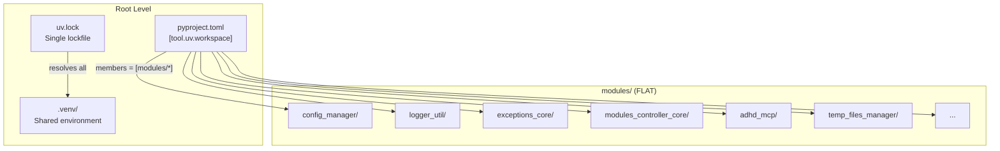
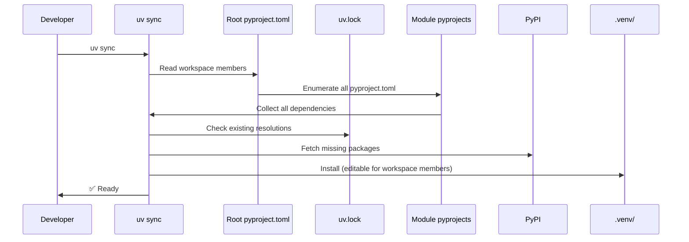

# 02 - Architecture: Target Monorepo Structure

> Part of [Workspace Monorepo Migration Blueprint](./00_index.md)
>
> **Status:** ⏳ [TODO]

---

## 📖 The Story

### 😤 The Pain

```
CURRENT STATE: Federated Polyrepo (or workspace needing explicit git URLs)
┌─────────────────────────────────────────────────────────────────┐
│                                                                 │
│  ┌──────────────┐   ┌──────────────┐   ┌──────────────┐         │
│  │ logger_util  │   │ config_mgr   │   │ except_core  │         │
│  │   repo       │   │   repo       │   │   repo       │  ...    │
│  │ pyproject    │   │ pyproject    │   │ pyproject    │         │
│  │ uv.lock      │   │ uv.lock      │   │ uv.lock      │         │
│  │ .venv        │   │ .venv        │   │ .venv        │         │
│  └──────────────┘   └──────────────┘   └──────────────┘         │
│         │                  │                  │                 │
│         └──────────────────┼──────────────────┘                 │
│                            ↓                                    │
│                   💥 N lockfiles                                │
│                   💥 N .venv folders                            │
│                   💥 N CI pipelines                             │
│                   💥 Cross-repo dependency hell                 │
│                   💥 GitHub org flooding                        │
└─────────────────────────────────────────────────────────────────┘
```

| Who Hurts | Pain Level | Frequency |
|-----------|------------|-----------|
| Framework maintainer | 🔥🔥🔥 High | Every feature |
| New contributor | 🔥🔥🔥 High | Onboarding |
| CI/CD | 🔥🔥 Medium | Every push |

### ✨ The Vision

```
TARGET STATE: UV Workspace Monorepo with Flat Structure
┌─────────────────────────────────────────────────────────────────┐
│  adhd_framework_v3/                                             │
│  ├── pyproject.toml    ← Root workspace config                  │
│  ├── uv.lock           ← ONE lockfile for ALL                   │
│  ├── .venv/            ← ONE environment                        │
│  │                                                              │
│  ├── modules/           ← FLAT: All modules in one folder       │
│  │   ├── config_manager/                                        │
│  │   │   ├── pyproject.toml  ← Module identity preserved        │
│  │   │   └── __init__.py                                        │
│  │   ├── logger_util/                                           │
│  │   ├── exceptions_core/                                       │
│  │   ├── adhd_mcp/                                              │
│  │   └── ... (all other modules)                                │
│  │                                                              │
│  ├── project/           ← User project code                     │
│  └── .github/           ← CI and instructions                   │
│                                                                 │
│  ✅ Single source of truth                                      │
│  ✅ Atomic commits across modules                               │
│  ✅ One CI pipeline                                             │
│  ✅ No more type → folder mapping debates                       │
│  ✅ Modules remain independently publishable                    │
└─────────────────────────────────────────────────────────────────┘
```

### 🎯 One-Liner

> One repo, one lockfile, one CI pipeline, but each module keeps its own identity via pyproject.toml.

### 📊 Impact

| Metric | Before (Polyrepo) | After (Monorepo) |
|--------|-------------------|------------------|
| Lockfiles | ❌ N (one per module) | ✅ 1 (root) |
| Virtual envs | ❌ N folders | ✅ 1 folder |
| CI pipelines | ❌ N workflows | ✅ 1 workflow |
| Cross-module change | ❌ N PRs | ✅ 1 PR |
| Onboarding | ❌ Clone N repos | ✅ Clone 1 repo |
| Module identity | ✅ Own pyproject | ✅ Own pyproject |

---

## 🔧 The Spec

---

## 🗺️ System Architecture



---

## 📁 Target Folder Structure

> **Note:** Flat `modules/` folder replaces the old `cores/`, `managers/`, `utils/`, `plugins/`, `mcps/` structure.
> Module identity is determined by `[tool.adhd].layer` and `mcp` flag, not folder location.

```
adhd_framework_v3/
│
├── pyproject.toml              # Root workspace manifest
├── uv.lock                     # Single lockfile (auto-generated)
├── .venv/                      # Single virtual environment
├── README.md                   # Framework overview
│
├── modules/                    # ALL modules in flat structure
│   ├── config_manager/
│   │   ├── pyproject.toml      # [project] name = "config-manager"
│   │   ├── __init__.py         # [tool.adhd] layer = "foundation"
│   │   └── config_manager.py
│   │
│   ├── logger_util/
│   │   ├── pyproject.toml      # [tool.adhd] layer = "foundation"
│   │   ├── __init__.py
│   │   └── logger.py
│   │
│   ├── exceptions_core/
│   │   ├── pyproject.toml      # [tool.adhd] layer = "foundation"
│   │   ├── __init__.py
│   │   └── adhd_exceptions.py
│   │
│   ├── modules_controller_core/
│   │   ├── pyproject.toml
│   │   └── ...
│   │
│   ├── adhd_mcp/
│   │   ├── pyproject.toml      # [tool.adhd] layer = "dev", mcp = true
│   │   └── ...
│   │
│   ├── temp_files_manager/
│   ├── workspace_core/
│   ├── instruction_core/
│   ├── questionary_core/
│   ├── project_creator_core/
│   ├── module_creator_core/
│   ├── creator_common_core/
│   ├── github_api_core/
│   ├── yaml_reading_core/
│   └── uv_migrator_core/
│
├── project/                    # User's project code (if applicable)
│
├── .github/
│   ├── workflows/
│   │   └── ci.yml              # Single CI workflow
│   └── instructions/           # Agent instruction files
│
└── .agent_plan/                # Vision & planning docs
    └── day_dream/
```

---

## 📄 Key Files Explained

### Root pyproject.toml

```toml
# adhd_framework_v3/pyproject.toml
[project]
name = "adhd-framework"
version = "3.0.0"
description = "AI-Driven Highspeed Development Framework"
requires-python = ">=3.10"

# Root doesn't list dependencies — modules do
# But you CAN have shared dev dependencies here
[project.optional-dependencies]
dev = [
    "pytest>=7.0",
    "ruff>=0.1",
]

# FLAT workspace — all modules in one folder
[tool.uv.workspace]
members = [
    "modules/*",
]

[build-system]
requires = ["hatchling"]
build-backend = "hatchling.build"
```

### Module pyproject.toml (Example: logger_util)

```toml
# modules/logger_util/pyproject.toml
[project]
name = "logger-util"
version = "0.1.0"
description = "Logging utilities for ADHD Framework"
requires-python = ">=3.10"
dependencies = []  # No external deps for logger

[tool.adhd]
layer = "foundation"    # REQUIRED: foundation/runtime/dev
# mcp = false           # OPTIONAL: only set true for MCP servers
# NOTE: type field is REMOVED — no longer used

[build-system]
requires = ["hatchling"]
build-backend = "hatchling.build"

[tool.hatch.build.targets.wheel]
packages = ["."]  # Flat layout
```

### Module pyproject.toml with Workspace Dependency

```toml
# modules/modules_controller_core/pyproject.toml
[project]
name = "modules-controller-core"
version = "0.1.0"
requires-python = ">=3.10"
dependencies = [
    "exceptions-core",    # Workspace member (by package name)
    "yaml-reading-core",  # Another workspace member
    "toml>=0.10",         # External PyPI dependency
]

[tool.adhd]
layer = "foundation"    # REQUIRED
# type = REMOVED
```

---

## 🔗 How Pieces Connect

### Dependency Resolution Flow



### Import Flow (After Setup)

```python
# In any module, e.g., modules/modules_controller_core/modules_controller.py

# Workspace members: Just import by package name
from exceptions_core import ADHDException
from logger_util import Logger

# External packages: Same as always
import toml

# ✅ No path hacks needed!
# ✅ Works because workspace members are editable-installed in .venv
```

---

## 📊 Layer Distribution

With the flat `modules/` structure, layer is determined by `[tool.adhd].layer` in each module's pyproject.toml, NOT by folder location:

| Layer | Description | Example Modules |
|-------|-------------|----------------|
| `foundation` | Core utilities, no runtime deps | exceptions_core, logger_util, config_manager, modules_controller_core, yaml_reading_core |
| `runtime` | User project runtime features | (plugin modules, if any) |
| `dev` | Development/CLI tools | adhd_mcp, instruction_core, questionary_core, project_creator_core, module_creator_core, temp_files_manager |

> **Note:** The old `cores/`, `managers/`, `utils/`, `mcps/`, `plugins/` folder structure is REMOVED.
> All modules now live in a flat `modules/` folder. Layer semantics are determined by metadata, not folder path.

---

## 🔄 Migration Touchpoints

| Component | Current State | Migration Needed |
|-----------|---------------|------------------|
| Root pyproject.toml | ✅ Exists with workspace | Update members to `modules/*` |
| Module pyprojects | ✅ Generated by uv migration | Remove `type`, ensure `layer` |
| Folder structure | ❌ cores/managers/etc | Move all to flat `modules/` |
| uv.lock | ✅ Exists | Re-lock after structure change |
| .venv | ✅ Exists | Re-sync after changes |
| CI | ❓ Unknown | Update path filters for `modules/**` |
| `adhd refresh` | ✅ Exists | Update for flat structure |

---

## ❓ Open Questions for Implementation

1. **Git history:** Do we care about preserving git history from individual repos?
2. **External consumers:** Any external projects depend on these as separate repos?
3. **CI matrix:** Do we need parallel CI jobs per module, or sequential?
4. **Publishing:** Will we publish any modules to PyPI, or internal use only?

---

**← Back to:** [Blueprint Index](./00_index.md) | **Next:** [Research: UV Workspaces](./03_research_uv_workspaces.md)
