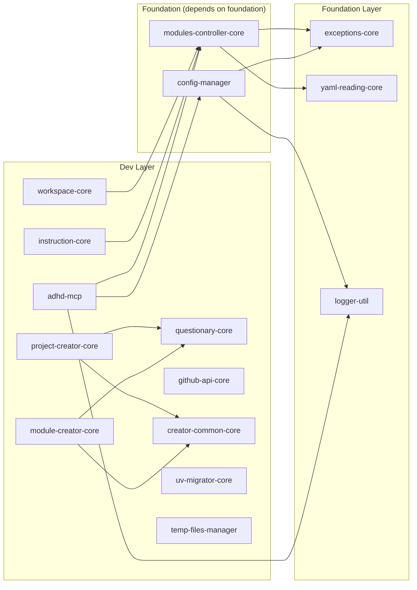

# 05 - Feature: Monorepo Structure

> Part of [Workspace Monorepo Migration Blueprint](./00_index.md)
>
> **Status:** ⏳ [TODO] | **Difficulty:** `[KNOWN]`

---

## 📖 The Story

### 😤 The Pain

```
┌─────────────────────────────────────────────────────────────────┐
│  CURRENT: Modules may have inconsistent pyproject.toml          │
│                                                                 │
│  cores/logger_util/pyproject.toml:                              │
│    dependencies = ["some-package"]                              │
│                                                                 │
│  cores/modules_controller/pyproject.toml:                       │
│    dependencies = [                                             │
│      "exceptions-core @ git+https://github.com/..."  ← OLD!     │
│    ]                                                            │
│                                                                 │
│  💥 Some deps use git URLs (standalone mode)                    │
│  💥 Some deps use workspace names (correct)                     │
│  💥 Inconsistent structure across modules                       │
└─────────────────────────────────────────────────────────────────┘
```

| Who Hurts | Pain Level | Frequency |
|-----------|------------|-----------|
| Module maintainer | 🔥🔥 Medium | Per module update |
| New contributor | 🔥🔥🔥 High | Onboarding |

### ✨ The Vision

```
┌─────────────────────────────────────────────────────────────────┐
│  AFTER: Consistent pyproject.toml patterns + flat structure     │
│                                                                 │
│  Every module follows the same pattern:                         │
│                                                                 │
│  [project]                                                      │
│  name = "module-name"                                           │
│  dependencies = [                                               │
│      "workspace-member",      ← Workspace deps by name          │
│      "external-package>=1.0", ← PyPI deps with version spec     │
│  ]                                                              │
│                                                                 │
│  [tool.adhd]                                                    │
│  layer = "foundation"         ← REQUIRED                        │
│  mcp = true                   ← OPTIONAL (for MCP servers)      │
│  # type = REMOVED                                               │
│                                                                 │
│  ✅ Consistent structure                                        │
│  ✅ Clear dependency declaration                                │
│  ✅ Workspace-native                                            │
│  ✅ No more type → folder debates                               │
└─────────────────────────────────────────────────────────────────┘
```

### 🎯 One-Liner

> Standardize all module pyproject.toml files to use workspace member names for internal deps and consistent metadata.

### 📊 Impact

| Metric | Before | After |
|--------|--------|-------|
| pyproject.toml consistency | ❌ Variable | ✅ Standardized |
| Internal dep format | ❌ Mixed (git URLs, names) | ✅ All workspace names |
| New contributor clarity | ❌ Confusing | ✅ Clear pattern |

---

## 🔧 The Spec

---

## 📁 Target Folder Structure

> **DECISION:** Flat `modules/` folder replaces the old `cores/`, `managers/`, `utils/`, `plugins/`, `mcps/` structure.
> Module classification is determined by `[tool.adhd].layer` metadata, NOT by folder path.

```
adhd_framework_v3/
│
├── pyproject.toml              # Root workspace manifest
├── uv.lock                     # Single lockfile
├── .venv/                      # Single virtual environment
├── README.md
│
├── modules/                    # ALL modules in flat structure
│   ├── config_manager/
│   │   ├── pyproject.toml      # [tool.adhd] layer = "foundation"
│   │   ├── __init__.py
│   │   ├── config_manager.py
│   │   └── README.md
│   │
│   ├── logger_util/
│   │   ├── pyproject.toml      # [tool.adhd] layer = "foundation"
│   │   ├── __init__.py
│   │   ├── logger.py
│   │   └── README.md
│   │
│   ├── exceptions_core/
│   │   ├── pyproject.toml      # [tool.adhd] layer = "foundation"
│   │   ├── __init__.py
│   │   └── adhd_exceptions.py
│   │
│   ├── adhd_mcp/
│   │   ├── pyproject.toml      # [tool.adhd] layer = "dev", mcp = true
│   │   ├── __init__.py
│   │   ├── adhd_mcp.py
│   │   └── README.md
│   │
│   ├── yaml_reading_core/
│   ├── modules_controller_core/
│   ├── workspace_core/
│   ├── instruction_core/
│   ├── questionary_core/
│   ├── project_creator_core/
│   ├── module_creator_core/
│   ├── creator_common_core/
│   ├── github_api_core/
│   ├── uv_migrator_core/
│   └── temp_files_manager/
│
├── project/                    # User project code (if applicable)
│
├── .github/
│   ├── workflows/
│   │   └── ci.yml
│   └── instructions/
│       └── (agent instruction files)
│
└── .agent_plan/
    └── day_dream/
        └── (blueprint documents)
```

---

## 📄 pyproject.toml Patterns

### Pattern 1: Root Workspace

```toml
# adhd_framework_v3/pyproject.toml

[project]
name = "adhd-framework"
version = "3.0.0"
description = "AI-Driven Highspeed Development Framework"
readme = "README.md"
requires-python = ">=3.10"

# Root can have shared dependencies (optional)
[project.optional-dependencies]
dev = [
    "pytest>=7.0",
    "ruff>=0.4",
    "mypy>=1.0",
]

# FLAT workspace configuration
[tool.uv.workspace]
members = [
    "modules/*",    # All modules in one folder
]

# Build system
[build-system]
requires = ["hatchling"]
build-backend = "hatchling.build"

# Hatch configuration for flat layout
[tool.hatch.build.targets.wheel]
packages = ["."]
```

---

### Pattern 2: Foundation Module (No Internal Deps)

```toml
# modules/exceptions_core/pyproject.toml

[project]
name = "exceptions-core"
version = "0.1.0"
description = "Exception hierarchy for ADHD Framework"
readme = "README.md"
requires-python = ">=3.10"
dependencies = []  # No dependencies - truly foundational

[tool.adhd]
layer = "foundation"    # REQUIRED: foundation/runtime/dev
# type = REMOVED - no longer used
# mcp = false is default, only set true for MCP servers

[build-system]
requires = ["hatchling"]
build-backend = "hatchling.build"

[tool.hatch.build.targets.wheel]
packages = ["."]
```

---

### Pattern 3: Module with Internal Dependencies

```toml
# modules/modules_controller_core/pyproject.toml

[project]
name = "modules-controller-core"
version = "0.1.0"
description = "Module enumeration and dependency management"
readme = "README.md"
requires-python = ">=3.10"
dependencies = [
    # Workspace members (by package name, NOT path)
    "exceptions-core",
    "yaml-reading-core",
    # External PyPI packages
    "toml>=0.10",
]

[tool.adhd]
layer = "foundation"    # REQUIRED
# type = REMOVED

[build-system]
requires = ["hatchling"]
build-backend = "hatchling.build"

[tool.hatch.build.targets.wheel]
packages = ["."]
```

---

### Pattern 4: Module with External Dependencies Only

```toml
# modules/yaml_reading_core/pyproject.toml

[project]
name = "yaml-reading-core"
version = "0.1.0"
description = "YAML file reading utilities"
readme = "README.md"
requires-python = ">=3.10"
dependencies = [
    "pyyaml>=6.0",
]

[tool.adhd]
layer = "foundation"    # REQUIRED
# type = REMOVED

[build-system]
requires = ["hatchling"]
build-backend = "hatchling.build"

[tool.hatch.build.targets.wheel]
packages = ["."]
```

---

### Pattern 5: Dev-Layer Module

```toml
# modules/questionary_core/pyproject.toml

[project]
name = "questionary-core"
version = "0.1.0"
description = "Interactive prompts for CLI wizards"
readme = "README.md"
requires-python = ">=3.10"
dependencies = [
    "questionary>=2.0",
]

[tool.adhd]
layer = "dev"    # Not needed in production
# type = REMOVED

[build-system]
requires = ["hatchling"]
build-backend = "hatchling.build"

[tool.hatch.build.targets.wheel]
packages = ["."]
```

---

### Pattern 6: MCP Server Module

```toml
# modules/adhd_mcp/pyproject.toml

[project]
name = "adhd-mcp"
version = "0.1.0"
description = "MCP server for ADHD Framework introspection"
readme = "README.md"
requires-python = ">=3.10"
dependencies = [
    # Workspace members
    "modules-controller-core",
    "config-manager",
    "logger-util",
    # External packages
    "mcp>=1.1",
    "click>=8.0",
]

# CLI entry points
[project.scripts]
adhd-mcp = "adhd_mcp.adhd_cli:main"

[tool.adhd]
layer = "dev"       # REQUIRED
mcp = true          # OPTIONAL: triggers MCP scaffolding
# type = REMOVED

[build-system]
requires = ["hatchling"]
build-backend = "hatchling.build"

[tool.hatch.build.targets.wheel]
packages = ["."]
```

---

## 📋 Naming Conventions

### Package Names

| Convention | Example | Where Used |
|------------|---------|------------|
| Hyphenated | `logger-util` | pyproject.toml `[project].name` |
| Underscored | `logger_util` | Folder name, import statement |

### Conversion Rules

```
Folder name:      logger_util
Package name:     logger-util     (hyphens)
Import:           from logger_util import ...  (underscores)
Dependency:       "logger-util"   (use package name)
```

### Why This Matters

When listing dependencies, use the **package name** (with hyphens), not the folder name:

```toml
# ✅ CORRECT
dependencies = ["exceptions-core", "yaml-reading-core"]

# ❌ WRONG (folder names)
dependencies = ["exceptions_core", "yaml_reading_core"]

# ❌ WRONG (paths)
dependencies = ["./cores/exceptions_core"]
```

---

## 🔗 Module Dependency Graph



---

## ✅ Validation Checklist

For each module, verify:

| Check | What to Verify |
|-------|----------------|
| ☐ Package name | Uses hyphens, matches pattern |
| ☐ Version | Present and valid semver |
| ☐ Dependencies | Use package names (not paths/URLs) |
| ☐ `[tool.adhd].layer` | REQUIRED: foundation/runtime/dev |
| ☐ `[tool.adhd].mcp` | OPTIONAL: only `true` for MCP servers |
| ☐ `[tool.adhd]` | NO `type` field (removed) |
| ☐ `[build-system]` | Uses hatchling |
| ☐ `[tool.hatch.build]` | Has `packages = ["."]` for flat layout |

---

## 🛠️ Migration Script Concept

```python
# Conceptual script for validating/fixing pyproject.toml files

def validate_module(path: Path) -> list[str]:
    """Validate a module's pyproject.toml."""
    issues = []
    
    pyproject = toml.load(path / "pyproject.toml")
    project = pyproject.get("project", {})
    
    # Check package name format
    name = project.get("name", "")
    if "_" in name:
        issues.append(f"Package name should use hyphens: {name}")
    
    # Check dependencies don't use git URLs
    deps = project.get("dependencies", [])
    for dep in deps:
        if "git+" in dep or "@" in dep:
            issues.append(f"Dependency should use package name: {dep}")
    
    # Check [tool.adhd] exists
    adhd = pyproject.get("tool", {}).get("adhd", {})
    if "layer" not in adhd:
        issues.append("Missing [tool.adhd].layer")
    
    return issues
```

---

**← Back to:** [Blueprint Index](./00_index.md) | **Next:** [Feature: Tooling Migration](./06_feature_tooling_migration.md)
