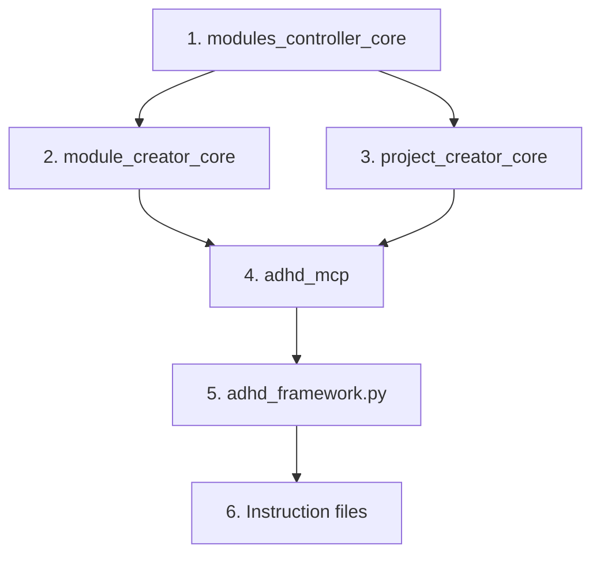
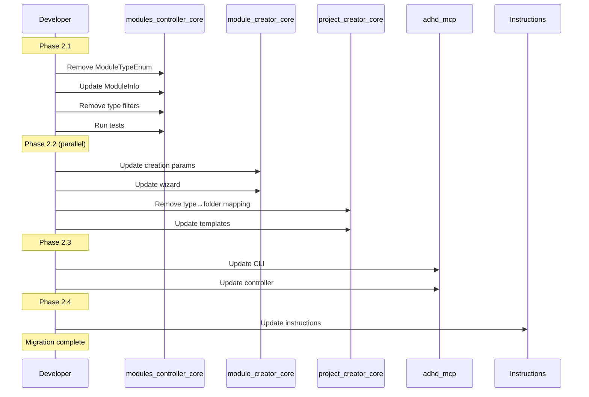

# 08 - Feature: Module Type Removal Migration

> Part of [Workspace Monorepo Migration Blueprint](./00_index.md)
>
> **Status:** ⏳ [TODO] | **Difficulty:** `[KNOWN]`

---

## 📖 The Story

### 😤 The Pain

```
┌─────────────────────────────────────────────────────────────────┐
│  CURRENT: Module "type" (core/manager/util/plugin/mcp) creates  │
│  confusion and technical debt                                   │
│                                                                 │
│  Pain Points:                                                   │
│    - "Is logger_util a util or core?" → Endless debate          │
│    - config_manager IS core functionality, misnamed             │
│    - Manager vs Util distinction NOT enforced anywhere          │
│    - Type creates stale metadata during agile dev               │
│    - ~150 import rewrites if we restructure                     │
│                                                                 │
│  💥 Type creates debt, not prevents it                          │
│  💥 "What type?" debates slow development                       │
│  💥 Historical naming problems become permanent                 │
└─────────────────────────────────────────────────────────────────┘
```

| Who Hurts | Pain Level | Frequency |
|-----------|------------|-----------|
| Module creator | 🔥🔥🔥 High | Per new module |
| Code reviewer | 🔥🔥 Medium | Per type discussion |
| Tooling maintainer | 🔥🔥 Medium | Per type-related bug |

### ✨ The Vision

```
┌─────────────────────────────────────────────────────────────────┐
│  AFTER: Minimal taxonomy — layer + mcp flag                     │
│                                                                 │
│  [tool.adhd]                                                    │
│  layer = "foundation"     # REQUIRED — dependency ordering      │
│  mcp = true               # OPTIONAL — triggers MCP scaffolding │
│  # type = REMOVED                                               │
│                                                                 │
│  ✅ No more "util or manager?" debates                          │
│  ✅ Historical naming debt becomes fixable                      │
│  ✅ ~200-300 lines of code deleted                              │
│  ✅ Simpler mental model                                        │
└─────────────────────────────────────────────────────────────────┘
```

### 🎯 One-Liner

> Remove `type` field entirely, keep only `layer` (required) and `mcp` (optional flag) for minimal taxonomy.

### 📊 Impact Summary

| Impact Area | Code Locations | Complexity |
|-------------|----------------|------------|
| modules_controller_core | 26 | HIGH |
| module_creator_core | 15 | HIGH |
| project_creator_core | 15 | HIGH |
| adhd_mcp + adhd_framework | 19 | MEDIUM |
| Instruction files | 17 | LOW |
| **Total** | **~92** | — |

---

## 🔧 The Spec

---

## 🔑 Key Migration Decisions

### Decision 1: Folder Structure

**Options:**

| Option | Description | Pros | Cons |
|--------|-------------|------|------|
| A) Flat `modules/` | All modules in single folder | Simplest, no type encoding in filesystem | Lose `ls cores/` browsing |
| B) Keep folders as "organization" | Keep `cores/`, `managers/`, etc. | Familiar, gradual migration | Still encodes type in path |

**✅ DECISION:** Option A — Flat `modules/` folder.

**Rationale:** Type removal eliminates the semantic meaning of folder names. Moving to flat `modules/` simplifies the codebase further and eliminates any temptation to derive meaning from folder paths. Module classification is entirely determined by `[tool.adhd].layer` metadata.

---

### Decision 2: ModuleTypeEnum Fate

**Options:**

| Option | Description | Impact |
|--------|-------------|--------|
| A) DELETE entirely | Remove enum, class, all references | ~200-300 lines deleted |
| B) Keep as "folder registry" | Enum exists only to map folder names | Smaller change, some cruft remains |

**Recommendation:** Option A — DELETE entirely.

**Rationale:** If type has no semantic meaning, the enum creates confusion. Folder names are just strings.

---

### Decision 3: ModuleInfo.module_type Field

**Options:**

| Option | Description | Impact |
|--------|-------------|--------|
| A) Rename to `folder` | Field indicates discovery origin folder | Preserves backward compat for display |
| B) Delete entirely | Infer from path when needed | Cleanest, but breaks more code |

**Recommendation:** Option A — Rename to `folder` (or `origin_folder`) in Phase 1.

**Rationale:** Some display code uses this field. Renaming makes intent clear. Can delete in Phase 2.

---

### Decision 4: Type-Layer Validation

**Current:** "cores cannot be runtime layer" validation exists.

**Options:**

| Option | Description | Impact |
|--------|-------------|--------|
| A) Remove entirely | No folder-layer coupling | Simplest |
| B) Path-based check | Check if path contains `/cores/` | Preserves intent without `type` |

**Recommendation:** Option A — Remove entirely.

**Rationale:** If we're removing type semantics, validating "cores can't be runtime" based on folder name is arbitrary. Layer is the enforcement axis.

---

### Decision 5: Filtering Capabilities

**Current:** `adhd list -r manager` filters by type.

**After:** Remove type filtering, keep layer and mcp filtering.

**New API:**
```bash
adhd list                    # All modules
adhd list --layer foundation # Filter by layer
adhd list --mcp              # Only MCP modules
```

---

## 📋 File-by-File Change List

### Priority Order



> **⚠️ modules_controller_core MUST change first** — all other modules depend on it.

---

### 1. modules_controller_core (26 findings) — CRITICAL

**Estimated Effort:** 4-6 hours

| File | Change | Lines | Difficulty |
|------|--------|-------|------------|
| `module_types.py` | DELETE `ModuleTypeEnum` enum | ~50 | `[KNOWN]` |
| `module_types.py` | DELETE `ModuleTypes` class | ~30 | `[KNOWN]` |
| `module_types.py` | Keep folder name constants if needed | ~10 | `[KNOWN]` |
| `module_filter.py` | Remove `TYPE` dimension | ~40 | `[KNOWN]` |
| `module_filter.py` | Remove `add_type()` method | ~20 | `[KNOWN]` |
| `module_filter.py` | Remove `_type_filters` attribute | ~10 | `[KNOWN]` |
| `modules_controller.py` | Remove type-based validation | ~20 | `[KNOWN]` |
| `modules_controller.py` | Update `ModuleInfo` dataclass | ~15 | `[KNOWN]` |
| `modules_controller.py` | Remove type from `REQUIRED_INIT_KEYS` | ~5 | `[KNOWN]` |

**Key Changes:**

```python
# BEFORE: module_types.py
class ModuleTypeEnum(Enum):
    CORE = "core"
    MANAGER = "manager"
    UTIL = "util"
    PLUGIN = "plugin"
    MCP = "mcp"

# AFTER: DELETE entire file or keep minimal folder constants
KNOWN_FOLDERS = ["cores", "managers", "utils", "plugins", "mcps"]
```

```python
# BEFORE: ModuleInfo
@dataclass
class ModuleInfo:
    name: str
    module_type: ModuleTypeEnum  # ← DELETE
    layer: str
    path: Path
    # ...

# AFTER: ModuleInfo
@dataclass
class ModuleInfo:
    name: str
    layer: str                   # REQUIRED
    mcp: bool = False            # OPTIONAL
    folder: str = ""             # Discovery origin (optional)
    path: Path
    # ...
```

---

### 2. module_creator_core (15 findings) — CRITICAL

**Estimated Effort:** 3-4 hours

| File | Change | Lines | Difficulty |
|------|--------|-------|------------|
| `module_creator.py` | Remove `ModuleCreationParams.module_type` | ~20 | `[KNOWN]` |
| `module_creator.py` | Add `layer` + `mcp` params | ~15 | `[KNOWN]` |
| `module_creator.py` | Update type→folder routing | ~30 | `[KNOWN]` |
| `module_creation_wizard.py` | Remove "what type?" question | ~40 | `[KNOWN]` |
| `module_creation_wizard.py` | Add layer selection question | ~30 | `[KNOWN]` |
| `module_creation_wizard.py` | Add MCP checkbox | ~15 | `[KNOWN]` |
| Templates | Remove `{module_type}` placeholders | ~20 | `[KNOWN]` |

**Key Changes:**

```python
# BEFORE: Wizard flow
"What type of module?" → [core, manager, util, plugin, mcp]
# Derives: folder, layer defaults

# AFTER: Wizard flow
"What layer?" → [foundation, runtime, dev]
"Is this an MCP server?" → [yes, no]
# Folder selection: fixed (e.g., modules/) or ask explicitly
```

```python
# BEFORE
if module_type == "mcp":
    generate_mcp_scaffold()

# AFTER
if mcp:
    generate_mcp_scaffold()
```

---

### 3. project_creator_core (15 findings) — CRITICAL

**Estimated Effort:** 3-4 hours

| File | Change | Lines | Difficulty |
|------|--------|-------|------------|
| `project_creator.py` | DELETE `MODULE_TYPE_TO_DIR` dict | ~15 | `[KNOWN]` |
| `project_creator.py` | Update `PROJECT_DIRECTORIES` | ~20 | `[KNOWN]` |
| `project_creator.py` | Remove type from `_extract_module_metadata()` | ~25 | `[KNOWN]` |
| `preload_sets.py` | Remove type references | ~15 | `[KNOWN]` |
| Templates | Update pyproject.toml.template | ~20 | `[KNOWN]` |

**Key Changes:**

```python
# BEFORE
MODULE_TYPE_TO_DIR = {
    "core": "cores",
    "manager": "managers",
    "util": "utils",
    "plugin": "plugins",
    "mcp": "mcps",
}

# AFTER: DELETE or replace with flat structure
DEFAULT_MODULE_FOLDER = "modules"  # Or keep existing folders as cosmetic
```

---

### 4. adhd_mcp + adhd_controller (19 findings) — HIGH

**Estimated Effort:** 2-3 hours

| File | Change | Lines | Difficulty |
|------|--------|-------|------------|
| `adhd_mcp.py` | Remove `list_modules(types=[...])` param | ~10 | `[KNOWN]` |
| `adhd_cli.py` | Remove `--types` argument | ~15 | `[KNOWN]` |
| `adhd_controller.py` | Remove type filtering logic | ~20 | `[KNOWN]` |
| `adhd_controller.py` | Update `create_module()` API | ~25 | `[KNOWN]` |
| Display code | Remove `module.module_type.name` | ~10 | `[KNOWN]` |

**Key Changes:**

```python
# BEFORE
def list_modules(types: list[str] = None) -> list[ModuleInfo]:
    ...

# AFTER
def list_modules(layers: list[str] = None, mcp_only: bool = False) -> list[ModuleInfo]:
    ...
```

```bash
# BEFORE
adhd list -r manager

# AFTER (removed)
adhd list --layer foundation
adhd list --mcp
```

---

### 5. adhd_framework.py (part of adhd_mcp findings) — HIGH

**Estimated Effort:** 1 hour

| File | Change | Lines | Difficulty |
|------|--------|-------|------------|
| `adhd_framework.py` | Update module creation flow | ~20 | `[KNOWN]` |
| `adhd_framework.py` | Update display formatting | ~10 | `[KNOWN]` |

---

### 6. Instruction Files (17 findings) — MEDIUM

**Estimated Effort:** 1-2 hours

| File | Change | Type |
|------|--------|------|
| `adhd_framework_context.instructions.md` | DELETE Module Types table | Content |
| `adhd_framework_context.instructions.md` | Remove type decision tree | Content |
| `adhd_framework_context.instructions.md` | Update naming conventions | Content |
| `mcp_development.instructions.md` | Update pyproject.toml example | Content |
| `module_development.instructions.md` | Update metadata examples | Content |

**Key Changes:**

```markdown
<!-- BEFORE: adhd_framework_context.instructions.md -->
## Module Types

| Type | Directory | Purpose |
|------|-----------|---------|
| core | cores/ | Infrastructure |
| manager | managers/ | State management |
| ...

<!-- AFTER: DELETE entire section, replace with: -->
## Module Taxonomy

Modules have two metadata fields:

- `layer` (REQUIRED): foundation | runtime | dev
- `mcp` (OPTIONAL): true if MCP server

Name suffixes (_core, _manager, _util, _mcp) are human convention only.
```

---

## 🔍 Safe Zones (No Changes Needed)

| Module | Reason |
|--------|--------|
| `workspace_core` | Type-agnostic, uses paths only |
| `dependency_walker.py` | Uses layer only |
| `exceptions_core` | No type references |
| `yaml_reading_core` | No type references |
| `github_api_core` | No type references |

---

## ⚠️ Breaking Changes for External Consumers

### API Changes

| Change | Migration Path |
|--------|----------------|
| `ModuleTypeEnum` deleted | Use string literals or remove type checks |
| `ModuleInfo.module_type` removed | Use `module.layer` or `module.folder` |
| `list_modules(types=[])` removed | Use `list_modules(layers=[])` |
| CLI `--types` removed | Use `--layer` or `--mcp` |

### Backward Compatibility Period

**Recommendation:** No deprecation period. This is internal tooling, not public API.

If needed, add temporary shims:
```python
# Temporary backward compat (remove in 2 weeks)
@property
def module_type(self):
    import warnings
    warnings.warn("module_type is deprecated, use layer", DeprecationWarning)
    return self.folder
```

---

## 📊 Effort Summary

| Component | Hours | Phase |
|-----------|-------|-------|
| modules_controller_core | 4-6 | P2.1 |
| module_creator_core | 3-4 | P2.2 |
| project_creator_core | 3-4 | P2.2 |
| adhd_mcp + controller | 2-3 | P2.3 |
| adhd_framework.py | 1 | P2.3 |
| Instruction files | 1-2 | P2.4 |
| **Total** | **14-20 hours** | ~3 days |

---

## 🔄 Migration Sequence



---

## ✅ Verification Checklist

### After modules_controller_core

| What to Try | Expected Result |
|-------------|-----------------|
| `grep -r "ModuleTypeEnum" --include="*.py"` | No matches outside tests |
| `grep -r "module_type" --include="*.py"` | Only in migration shims or tests |
| Import `ModuleInfo` | No `module_type` attribute |
| `adhd list` | Works without type column |

### After module_creator_core

| What to Try | Expected Result |
|-------------|-----------------|
| Run module creation wizard | No "what type?" question |
| Create foundation module | Uses layer, no type |
| Create MCP module | Uses `mcp = true` flag |

### After adhd_mcp

| What to Try | Expected Result |
|-------------|-----------------|
| `adhd list --help` | No `--types` option |
| `adhd list --layer foundation` | Filters correctly |
| `adhd list --mcp` | Shows only MCPs |

### After Instructions

| What to Try | Expected Result |
|-------------|-----------------|
| Read framework context | No Module Types table |
| Read MCP development | Updated pyproject.toml example |

---

## 📚 References

- [Discussion Record](../../discussion/2026-02-03_module_management_architecture.md) — Consensus reached
- [Production Time Module Cut - Layer Taxonomy](../production_time_module_cut/04_feature_layer_taxonomy.md)
- [DEC-003: Type Removal](./90_decision_log.md#dec-003-type-removal)

---

**← Back to:** [Blueprint Index](./00_index.md) | **Next:** [Implementation](./80_implementation.md)
