# 82 - P5 Comprehensive Testing — Report

> Part of [Workspace Monorepo Migration Blueprint](./00_index.md)

---

## Execution Summary

| Field | Value |
|-------|-------|
| **Date** | 2026-02-03 |
| **Protocol** | San/Red/Arch Testing Loop (per orch_testing_preset) |
| **Phases** | PLAN → SPEC-TEST → ATTACK → FINAL |

---

## Phase Results

| Phase | Agent | Cycles | Status |
|-------|-------|--------|--------|
| PLAN | HyperSan | 1 | ✅ Approved |
| SPEC-TEST | HyperArch | 2 | ✅ 129 tests pass |
| ATTACK | HyperRed | 2 | ✅ BLOCKER resolved |
| FINAL | HyperSan | 1 | ✅ Approved (conditional) |

---

## Test Coverage Created

| Module | Test File | Tests |
|--------|-----------|-------|
| modules_controller_core | test_module_discovery.py | 13 |
| modules_controller_core | test_module_filter.py | 22 |
| modules_controller_core | test_module_info_schema.py | 32 |
| cli_manager | test_cli_registry.py | 27 |
| adhd_mcp | test_mcp_tools.py | 19 |
| integration | test_refresh_integration.py | 16 |
| **TOTAL** | | **129** |

---

## BLOCKER Found and Fixed

| ID | Module | Issue | Fix Applied |
|----|--------|-------|-------------|
| BLOCKER-001 | cli_manager | Race condition in command registry | Added fcntl file locking + threading.Lock + double-check singleton pattern |

**Verification:** 8/8 aggressive concurrency tests passed after fix

---

## Remaining WARNINGs (Deferred to P6)

| ID | Module | Issue | Severity |
|----|--------|-------|----------|
| WARNING-001 | modules_controller_core | Misleading issue code for missing [tool.adhd] | LOW |
| WARNING-002 | adhd_mcp | Whitespace module names not validated | LOW |
| WARNING-003 | adhd_mcp | Empty init.yaml treated as valid | LOW |
| WARNING-004 | cli_manager | Singleton thread safety | FIXED |

---

## HyperRed Attack Summary

| Metric | Value |
|--------|-------|
| **Total attacks** | 30 |
| **BLOCKERs found** | 1 (resolved) |
| **WARNINGs** | 4 (3 deferred, 1 fixed) |
| **INFO** | 9 (documented) |

---

## Attack Scripts Created

| Script Path | Purpose |
|-------------|---------|
| `.agent_plan/red_team/p5_migration/test_modules_controller_edge_cases.py` | Module discovery edge cases |
| `.agent_plan/red_team/p5_migration/test_cli_manager_adversarial.py` | CLI registry stress tests |
| `.agent_plan/red_team/p5_migration/test_adhd_mcp_adversarial.py` | MCP tool adversarial inputs |
| `.agent_plan/red_team/p5_migration/test_adhd_refresh_edge_cases.py` | Refresh command edge cases |
| `.agent_plan/red_team/p5_migration/findings/BLOCKER-001_cli_manager_race.md` | Race condition analysis |

---

## Production Readiness

### Status: ✅ APPROVED (Conditional)

**Conditions for user:**

1. Run `uv run pytest -v` to confirm all tests pass
2. Run `adhd refresh` to confirm E2E functionality

---

## Key Validations Confirmed

| Validation | Status |
|------------|--------|
| Folder-based discovery works correctly | ✅ |
| ModuleInfo has `is_mcp` + `folder` fields | ✅ |
| ModuleInfo does NOT have `module_type` field | ✅ |
| cli_manager race condition resolved | ✅ |
| adhd_mcp tools work with new schema | ✅ |
| adhd refresh integration works | ✅ |

---

## Testing Loop Summary

```mermaid
flowchart TD
    A[🔍 San: PLAN] -->|Approved| B[🏗️ Arch: SPEC-TEST Cycle 1]
    B -->|80 tests| C[🔴 Red: ATTACK Cycle 1]
    C -->|BLOCKER-001 found| D[🏗️ Arch: Fix race condition]
    D --> E[🏗️ Arch: SPEC-TEST Cycle 2]
    E -->|+49 tests| F[🔴 Red: ATTACK Cycle 2]
    F -->|8/8 concurrency pass| G[🔍 San: FINAL]
    G -->|Approved| H[✅ P5 Complete]
```

---

**← Back to:** [Blueprint Index](./00_index.md) | [Implementation Plan](./80_implementation.md)
