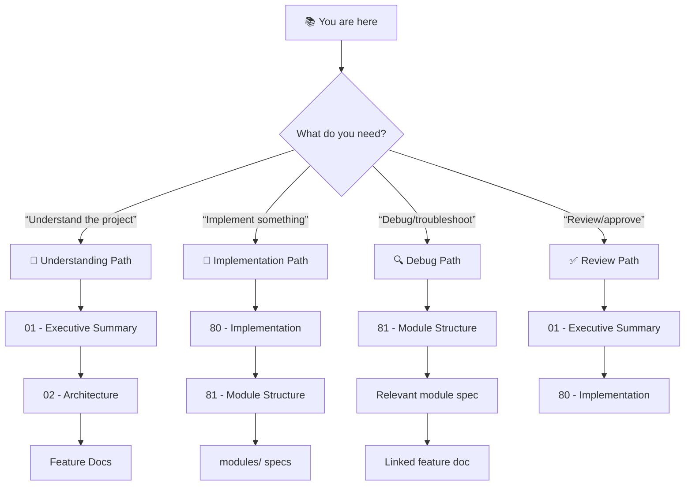
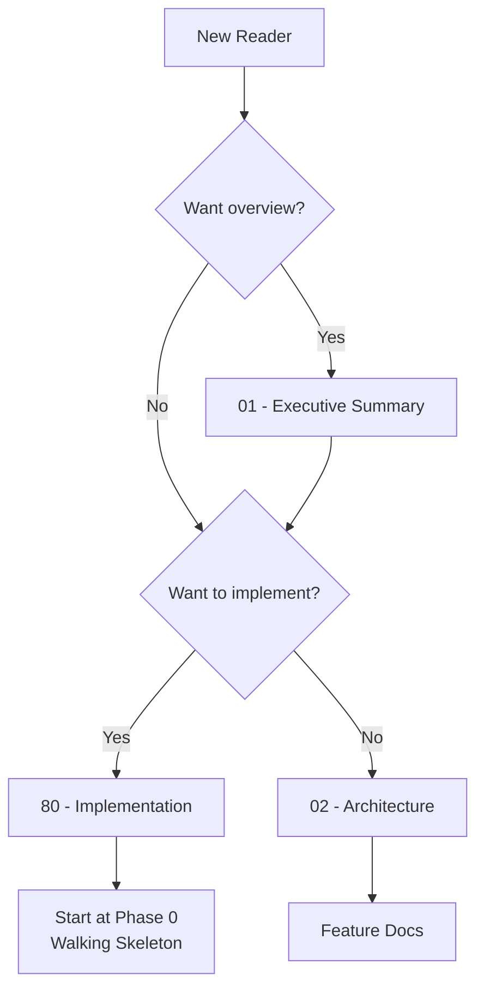

# 🎯 {Project Name}: Project Blueprint

> *{Vision statement — one emotional sentence capturing the project's soul}*

**Document Type:** Technical Design Document / Project Blueprint  
**Version:** 1.0  
**Created:** {YYYY-MM-DD}  
**Status:** 📐 Planning | 🚧 In Progress | ✅ Complete

---

## 📊 Progress Overview

| Phase | Status | Notes |
|-------|--------|-------|
| P0: Walking Skeleton | ⏳ | {Brief status note} |
| P1: {Phase Name} | ⏳ | {Brief status note} |
| P2: {Phase Name} | ⏳ | {Brief status note} |

### Status Legend

| Icon | Meaning |
|------|---------|
| ⏳ | TODO |
| 🔄 | WIP |
| ✅ | DONE |
| 🚫 | CUT |

---

## 📐 Planning Standards

This blueprint follows **HyperDream phasing rules**:

| Principle | Meaning |
|-----------|---------|
| **Walking Skeleton First** | Phase 0 proves plumbing works with hardcoded stubs |
| **Difficulty Honesty** | Each item labeled `[KNOWN]`, `[EXPERIMENTAL]`, or `[RESEARCH]` |
| **Research ≠ Foundation** | `[RESEARCH]` items never in Phase 0 |
| **Incremental Value** | Each phase delivers usable functionality |

---

## 📑 Document Index

| # | Document | Required | Purpose (When to Read) |
|---|----------|----------|------------------------|
| 00 | [Index](./00_index.md) | ✓ | **Navigation hub** — Start here if lost |
| 01 | [Executive Summary](./01_executive_summary.md) | ✓ | **Vision & scope** — Read to understand what/why |
| 02 | [Architecture](./02_architecture.md) | ✓ | **System design** — Read to understand how pieces fit |
| 03 | [Feature: {Name}](./03_feature_{name}.md) | | **Feature detail** — Read before implementing feature |
| 04 | [Feature: {Name}](./04_feature_{name}.md) | | **Feature detail** — Read before implementing feature |
| 80 | [Implementation](./80_implementation.md) | ✓ | **Task tracking** — Read to start/track work |
| 81 | [Module Structure](./81_module_structure.md) | ✓ | **Code organization** — Read to find where code lives |
| 82 | [CLI Commands](./82_cli_commands.md) | | **CLI reference** — Read if exposing commands |
| 99 | [References](./99_references.md) | | **Links** — External docs, prior art |

<!-- 
REQUIRED documents: 00, 01, 02, 80, 81 (5 minimum)
OPTIONAL documents: Feature docs (03-79), CLI Commands (82), References (99)

Add/remove feature docs as needed. 80/99 prefix = fixed bottom sorting.
Typical ordering: features 03-79, implementation 80, structure 81, cli 82, references 99
-->

---

## 💭 Vision Statement

> *"{Expanded vision — 2-3 sentences describing what this project is, who it's for, and why it matters. This should make someone excited to read more.}"*

---

## 🧭 How to Navigate This Blueprint

<!-- MANDATORY: Reduces cognitive overload by providing clear reading paths. -->

### Reading Order Decision Tree

### Document Purpose Quick Reference

| Doc | When to Read | One-Line Purpose |
|-----|--------------|------------------|
| **00 - Index** | First visit, lost | Navigation hub, project overview |
| **01 - Exec Summary** | Deciding whether to work on this | Goals, non-goals, scope, success metrics |
| **02 - Architecture** | Understanding system design | Components, data flow, boundaries |
| **03-79 - Features** | Deep-diving into specific capability | User stories, acceptance criteria, edge cases |
| **80 - Implementation** | Starting work, tracking progress | Phased tasks, verification steps |
| **81 - Module Structure** | Understanding code organization | Which module does what |
| **82 - CLI Commands** | Exposing CLI interface | Command reference |
| **modules/*.md** | Implementing specific module | Technical spec, dependencies, API |

---

<!-- ═══════════════════════════════════════════════════════════════════════ -->
<!-- FREE ZONE START - Add custom sections below using "## [Custom] 🎨 Title"-->
<!--                                                                         -->
<!-- Maximum 5 custom sections. This is YOUR space for thinking that doesn't -->
<!-- fit standard templates. Be creative. Be honest. Be useful.              -->
<!--                                                                         -->
<!-- 📐 STRUCTURAL EXAMPLES:                                                 -->
<!--   ## [Custom] 📊 Performance Benchmarks                                 -->
<!--   ## [Custom] 🔄 Migration Strategy                                     -->
<!--   ## [Custom] 🧪 A/B Testing Plan                                       -->
<!--   ## [Custom] 📈 Success Metrics                                        -->
<!--   ## [Custom] 🔐 Security Considerations                                -->
<!--                                                                         -->
<!-- 🧠 THINKING TOOLS (for complex decisions):                              -->
<!--   ## [Custom] ⚖️ Philosophical Tensions — Contradictions you're         -->
<!--        navigating (speed vs accuracy, simplicity vs power)              -->
<!--   ## [Custom] ⚰️ Assumption Graveyard — Risky bets that could kill      -->
<!--        the feature if wrong (with early validation strategy)            -->
<!--   ## [Custom] 🎭 Metaphor Map — Analogies that explain the system       -->
<!--        to different audiences (devs, users, stakeholders)               -->
<!--   ## [Custom] 🔮 Future Regret Analysis — "What will we wish we had     -->
<!--        done differently in 6 months?"                                   -->
<!--   ## [Custom] 🐘 Uncomfortable Questions — Things nobody wants to       -->
<!--        ask but everyone should (scaling, maintenance burden, etc.)      -->
<!--   ## [Custom] 📜 Decision Log — Key choices made and WHY (not just what)-->
<!--                                                                         -->
<!-- 🎯 SCOPE & BOUNDARIES:                                                  -->
<!--   ## [Custom] 🚧 Scope Fences — Hard lines that prevent scope creep     -->
<!--   ## [Custom] 🎰 Feature Lottery — Ideas we're NOT doing (but could)    -->
<!--   ## [Custom] ⏰ Time Bombs — Technical debt we're knowingly creating   -->
<!--                                                                         -->
<!-- See: templates/examples/free_zone_*.example.md for real examples        -->
<!-- ═══════════════════════════════════════════════════════════════════════ -->

<!-- ═══════════════════════════════════════════════════════════════════════ -->
<!-- FREE ZONE END                                                           -->
<!-- ═══════════════════════════════════════════════════════════════════════ -->

---

## 🔗 Quick Links

- **Start Here:** [Executive Summary](./01_executive_summary.md)
- **Technical Deep Dive:** [Architecture](./02_architecture.md)
- **Module Structure:** [81_module_structure.md](./81_module_structure.md)
- **Implementation:** [Roadmap](./80_implementation.md)

---

## 🏁 Where to Start

---

## ✅ Index Validation Checklist

<!-- MANDATORY: Keep this document accurate as the project evolves. -->

### Navigation
- [ ] **Progress Overview** matches actual phase status
- [ ] **Document Index** links are all valid
- [ ] **Decision tree** paths lead to existing documents

### Required Documents
- [ ] 00_index.md exists (this file)
- [ ] 01_executive_summary.md exists and linked
- [ ] 02_architecture.md exists and linked
- [ ] 80_implementation.md exists and linked
- [ ] 81_module_structure.md exists and linked

---

**Last Updated:** {YYYY-MM-DD}

---

**← Back to:** [Templates Index](../00_index.md)
