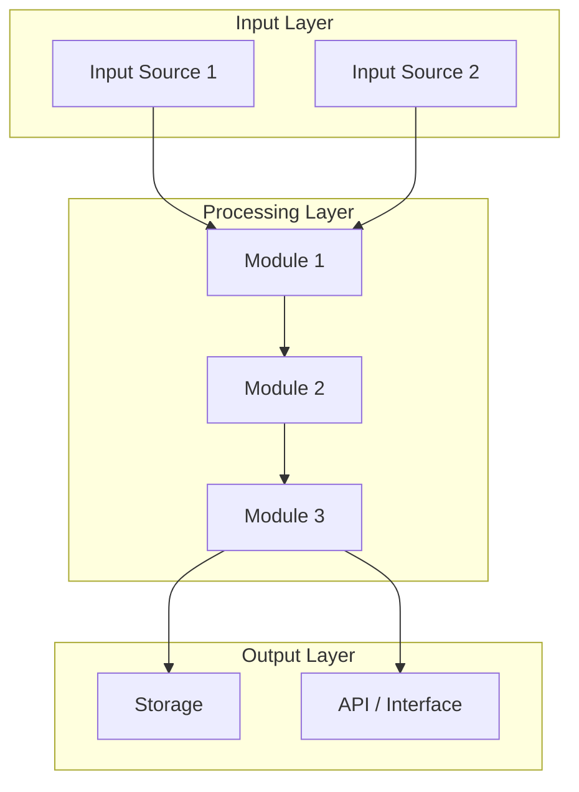
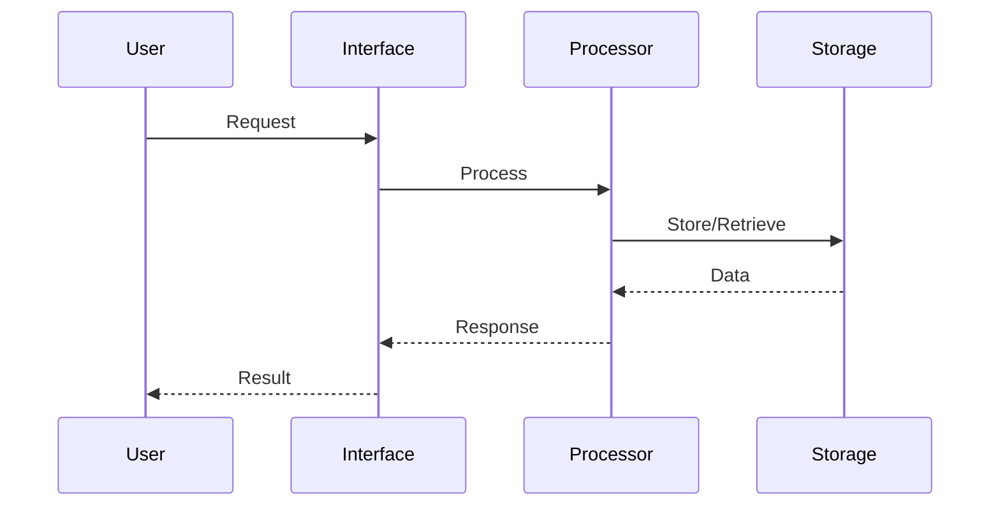

# 02 - Architecture

> Part of [{Project Name} Blueprint](./00_index.md)

<!-- 
TEMPLATE USAGE: This template includes extensive guidance comments.
DELETE all <!-- comment --> blocks before finalizing your document.
The line limit (≤200 lines) applies to the FINAL document, not this template.
-->

---

## 📖 The Story

<!--
REQUIRED: Visual, scannable narrative — NOT a text wall.
Use ASCII boxes, tables, and emoji anchors. A PM should grasp the problem/solution in 10 seconds.
If you can't draw the pain and vision, you don't understand the feature.
-->

### 😤 The Pain

<!-- What's broken? Who hurts? Show it visually! -->

```
Current Reality:
┌─────────────────────────────────────────┐
│  User wants {X}  ──────►  💥 BLOCKED 💥 │
│                                         │
│  Because: {root cause}                  │
└─────────────────────────────────────────┘
```

| Who Hurts | Pain Level | Frequency |
|-----------|------------|-----------|
| {persona} | 🔥🔥🔥 High | Daily |
| {persona} | 🔥🔥 Medium | Weekly |

### ✨ The Vision

<!-- What does success look like? Show the transformation! -->

```
After This Feature:
┌─────────────────────────────────────────┐
│  User wants {X}  ──────►  ✅ SUCCESS    │
│                                         │
│  Flow: {step} → {step} → {result}       │
└─────────────────────────────────────────┘
```

### 🎯 One-Liner

> {The elevator pitch in ONE sentence — what we're building and why it matters}

---

## 🔧 The Spec

<!-- Technical specification begins here -->

---

## 🏗️ System Overview

<!-- 
CONSTRAINT: Must include at least 2 Mermaid diagrams:
1. High-level component diagram
2. Data flow or sequence diagram
-->

### High-Level Architecture



---

## 📊 Data Flow

<!-- Second required diagram: show how data moves through the system -->



### Stage Details

| Stage | Input | Transformation | Output | Owner |
|-------|-------|----------------|--------|-------|
| {Stage name} | {Input format} | {What happens} | {Output format} | `{module}` |
| {Stage name} | {Input format} | {What happens} | {Output format} | `{module}` |

---

## 🧩 Logical Components

<!-- 
One block per logical component. Focus on WHAT it does, not HOW.
-->

### {Component Name}

| Attribute | Value |
|-----------|-------|
| **Purpose** | {What this component does in one sentence} |
| **Boundary** | {What it owns / what it does NOT touch} |
| **Implemented By** | `{module/}`, `{module/}` |
| **Depends On** | `{module/}`, `{external}` |
| **Exposes** | {Public API / CLI / Events / Files} |

---

### {Component Name}

| Attribute | Value |
|-----------|-------|
| **Purpose** | {One sentence} |
| **Boundary** | {Scope limits} |
| **Implemented By** | `{module/}` |
| **Depends On** | `{module/}` |
| **Exposes** | {Interface type} |

---

## 🔑 Key Design Principles

| # | Principle | Implication |
|---|-----------|-------------|
| 1 | {Principle name} | {What this means for implementation} |
| 2 | {Principle name} | {What this means for implementation} |
| 3 | {Principle name} | {What this means for implementation} |

<!-- Add up to 5 principles. If you need more, reconsider scope. -->

---

## 📁 Project Structure

<!-- 
Target end-state folder tree. Max 2 levels deep.
Annotate with phase: (P0), (P1), (P2), (CUT)
-->

```
{project_root}/
├── managers/
│   └── {manager_name}/           (P0)
├── utils/
│   └── {util_name}/              (P0)
├── plugins/
│   └── {plugin_name}/            (P1)
├── mcps/
│   └── {mcp_name}/               (P2)
├── data/                         (P0)
└── tests/                        (P1)
```

---

## 🔌 Integration Points

### External APIs

| Service | Purpose | Auth Method | Rate Limits |
|---------|---------|-------------|-------------|
| {Service name} | {Why we use it} | {API key/OAuth/etc} | {Limits if any} |

### File Formats

| Format | Used For | Schema Location |
|--------|----------|-----------------|
| {Format} | {Purpose} | {Link or path} |

---

## 🚧 Module Boundaries

> Standard ADHD boundaries apply. List exceptions only.

| Exception | Justification |
|-----------|---------------|
| {module A → module B} | {Why this non-standard dependency exists} |

<!-- 
Default rules (DO NOT repeat here):
- Managers → utils, plugins ✓
- Plugins → utils ✓  
- Utils → nothing ✓
- MCPs → managers, utils ✓
-->

---

## 💾 State Management

| State | Storage | Lifetime | Owner |
|-------|---------|----------|-------|
| {State type} | {Where stored} | {Session/Persistent/Cache} | `{module}` |

---

## ⚠️ Error Philosophy

<!-- 
One paragraph describing error handling approach.
Detailed error types and recovery → implementation.md
-->

This project follows a **{fail-fast | graceful-degradation}** philosophy. 
{Explain: When do we crash vs. recover? What's the user experience on error? 
Example: "API failures retry 3x then surface to user. Invalid data logs warning and skips row."}

---

## ✅ Architecture Validation Checklist

### Diagram Completeness
- [ ] **High-level diagram** shows all major components
- [ ] **Data flow diagram** traces primary use case
- [ ] Diagrams fit on one screen (no horizontal scroll)

### Component Definition
- [ ] Each **Logical Component** has Purpose, Boundary, Implemented By
- [ ] **Module Boundaries** exceptions are justified
- [ ] **Key Design Principles** ≤5 and each has implementation implication

### Integration
- [ ] **External APIs** documented with auth method
- [ ] **File Formats** have schema location
- [ ] **Error Philosophy** stated (fail-fast vs graceful-degradation)

---

**Prev:** [Executive Summary](./01_executive_summary.md) | **Next:** [Feature Docs](./03_feature_{name}.md)

---

**← Back to:** [Index](./00_index.md)
