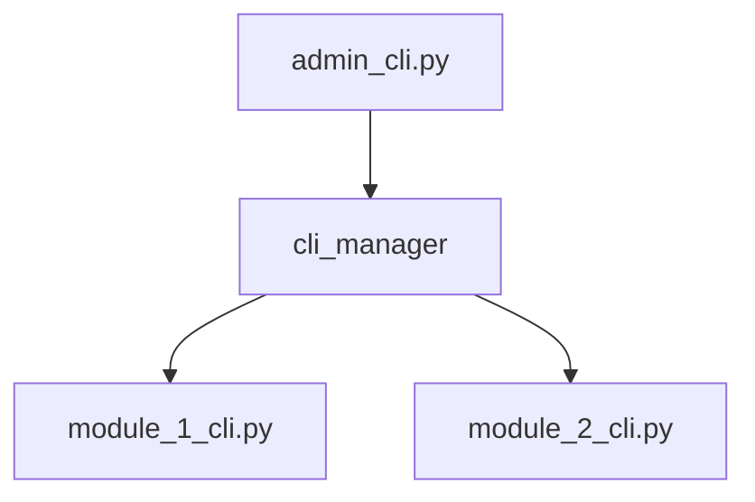

<!-- ═══════════════════════════════════════════════════════════════════
     ADHD-MANAGED — DO NOT EDIT DIRECTLY
     Source: modules/dev/instruction_core/data/.agent_plan/day_dream/_templates/blueprint/82_cli_commands.template.md
     Refresh: adhd r -f
═══════════════════════════════════════════════════════════════════ -->

# 82 - CLI Commands

> Part of [{Project Name} Blueprint](./00_index.md)

---

<!-- 
MANDATORY SKELETON: Always include in blueprint. 
Write "N/A — No CLI interface" if project has no CLI.
-->

<!-- If no CLI, use this section: -->
<!--
## ⌨️ CLI Status

N/A — This project does not expose a command-line interface. 
All interaction occurs via [API/Web UI/Library imports].
-->

<!-- If CLI exists, fill sections below: -->

## ⌨️ Command Line Interface

### 🏗️ CLI Pattern

### 🛠️ Admin Commands
<!-- Commands for setup, maintenance, or internal tools -->

| Command | Arguments | Description |
|---------|-----------|-------------|
| `{command}` | `{args}` | {What it does} |

### 🚀 User Commands
<!-- Commands for the primary end-user -->

| Command | Arguments | Description |
|---------|-----------|-------------|
| `{command}` | `{args}` | {What it does} |

---

**Next**: [Implementation](./80_implementation.md)
