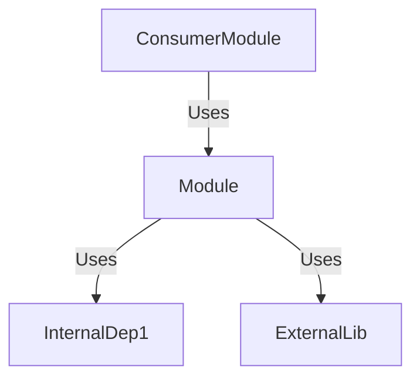
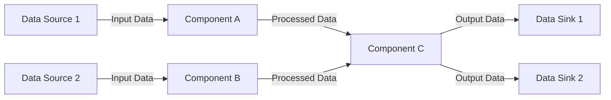

# Module Specification: {Module Name}

> Part of [{Project Name} Blueprint](../00_index.md)

---

## 📖 The Story

<!--
REQUIRED: Visual, scannable narrative — NOT a text wall.
Use ASCII boxes, tables, and emoji anchors. A PM should grasp the problem/solution in 10 seconds.
If you can't draw the pain and vision, you don't understand the feature.
-->

### 😤 The Pain

<!-- What's broken? Who hurts? Show it visually! -->

```
Current Reality:
┌─────────────────────────────────────────┐
│  User wants {X}  ──────►  💥 BLOCKED 💥 │
│                                         │
│  Because: {root cause}                  │
└─────────────────────────────────────────┘
```

| Who Hurts | Pain Level | Frequency |
|-----------|------------|-----------|
| {persona} | 🔥🔥🔥 High | Daily |
| {persona} | 🔥🔥 Medium | Weekly |

### ✨ The Vision

<!-- What does success look like? Show the transformation! -->

```
After This Feature:
┌─────────────────────────────────────────┐
│  User wants {X}  ──────►  ✅ SUCCESS    │
│                                         │
│  Flow: {step} → {step} → {result}       │
└─────────────────────────────────────────┘
```

### 🎯 One-Liner

> {The elevator pitch in ONE sentence — what we're building and why it matters}

---

## 📝 Overview
<!-- MANDATED: High-level purpose of the module. Why does it exist? -->
{Describe the core mission of this module in 1-2 sentences.}

### 🎯 Responsibilities
<!-- MANDATED: What this module is responsible for and, crucially, what it is NOT responsible for. -->
- **✅ DO**: {Responsibility 1}
- **✅ DO**: {Responsibility 2}
- **❌ DON'T**: {What should be handled by other modules}

### 📚 External Dependence

<!-- MANDATED: Any external systems, APIs, or services this module relies on. -->
| Dependency | Type | Purpose |
|------------|------|---------|
| `{ExternalService}` | API/Service | {What functionality is borrowed?} |
| `{ExternalLibrary}` | Library/Framework | {Why is this library needed?} |

---
## 🔗 Implements Features

<!-- 
MANDATORY: Bidirectional traceability. This module exists to serve these features.
If a module doesn't implement any features, question whether it should exist.
-->

| Feature | Blueprint | What This Module Provides |
|---------|-----------|---------------------------|
| {Feature Name} | [NN_{feature}.md](../NN_{feature}.md) | {Specific responsibility within feature} |
| {Feature Name} | [NN_{feature}.md](../NN_{feature}.md) | {Specific responsibility within feature} |

<!-- If truly utility-only: -->
<!-- N/A — Utility module providing cross-cutting {capability} to multiple features. -->

---
## 📂 Folder Structure
<!-- MANDATED: Full details of the module's internal organization. -->

```text
{module_name}/
├── __init__.py             # Module entry point
├── {module_name}.py        # Primary logic/orchestrator
├── models.py               # Data structures/schemas (Optional)
├── utils.py                # Internal helpers (Optional)
├── data/                   # Static assets or templates (Optional)
└── tests/                  # Module-specific tests
```

---

## ⚙️ Implementation Details
<!-- MANDATED: Specific technical details on how the module achieves its goals. -->

### Key Components
| Component | Type | Description |
|-----------|------|-------------|
| `{ClassName}` | Class | {Role in the module} |
| `{function_name}` | Function | {Primary utility} |

### Public API / Interfaces
<!-- How other modules interact with this one. -->
{Provide examples of public methods, endpoints, or interfaces. Use the language-appropriate syntax for the project.}

Example (Generic):
```
function {public_method}(arg1: type) -> return_type
```

---

## 🔌 Architecture & Dependencies
<!-- MANDATED: How this module fits into the larger system. -->

### 📊 Dependency Diagram
<!-- MANDATED: Mermaid diagram showing relationships. -->


### 🔗 Dependency Details
<!-- MANDATED: Table describing each dependency in detail. -->
| Dependency | Type | Purpose |
|------------|------|---------|
| `{InternalDep}` | Internal | {What functionality is borrowed?} |
| `{ExternalLib}` | External | {Why is this library needed?} |

### 📊 Dataflow Diagram
<!-- MANDATED: Mermaid diagram showing data flow within and between internal and external components. -->



### 📝 Data Information
<!-- MANDATED: Data description, formats, schemas, and storage mechanisms used by this module. -->

| Data Sources | Description | Format/Schema | Storage Mechanism |
|-----------|-------------|---------------|-------------------|
| `{DataSource1}` | {What this data represents} | {e.g., JSON, XML, dataclass, Custom Model} | {e.g., Database, In-Memory, File} |
| `{DataSource2}` | {What this data represents} | {e.g., JSON, XML, dataclass, Custom Model} | {e.g., Database, In-Memory, File} |

### ⌨️ CLI Registration
<!-- If using cli_manager, describe the commands here. -->
- **Command**: `{cmd}`
- **Alias**: `{alias}`

---

## 🧪 Quality Assurance (Optional)
<!-- How to verify this module works correctly. -->
- **Unit Tests**: {Focus areas}
- **Integration Tests**: {Interaction points}

---

## ✅ Module Validation Checklist

<!-- MANDATORY: Complete before implementation. -->

### Traceability
- [ ] **Implements Features** section links to ≥1 feature OR explicitly marked as utility
- [ ] All linked features have backlinks to this module spec

### Completeness
- [ ] **Responsibilities** clearly state DO and DON'T
- [ ] **Dependency Diagram** shows all internal/external dependencies
- [ ] **Public API** section defines interface contract
- [ ] **Folder Structure** matches ADHD conventions

---

**Back to:** [Module Structure](../81_module_structure.md) | [Implementation Plan](../80_implementation.md)
